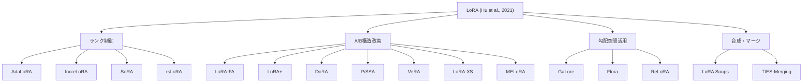
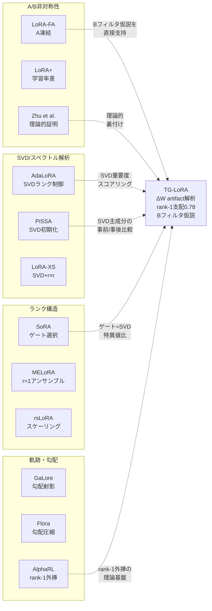

# LoRA 変種の層別解析・適応ランク割り当て・A/B行列構造解析：先行研究調査

> **調査日**: 2026-06-09
> **目的**: TG-LoRA の ΔW artifact 後処理解析（r=2 LoRA の A/B 層別モード解析、rank-1 支配 0.78、B フィルタ仮説）に関連する先行研究を網羅的に調査し、ポジショニングを明確にする。

---

## 目次

1. [概要と分類](#1-概要と分類)
2. [AdaLoRA — SVDベース適応ランク割り当て](#2-adalora)
3. [LoRA-FA — A凍結・Bのみ学習](#3-lora-fa)
4. [DoRA — 重み分解（大きさと方向）](#4-dora)
5. [PiSSA — 主成分SVD初期化](#5-pissa)
6. [LoRA+ — A/B異なる学習率](#6-lora-plus)
7. [GaLore — 勾配の低ランク射影](#7-galore)
8. [LoRA-XS — 極小ランク適応](#8-lora-xs)
9. [Flora — ランダム射影ベースLoRA](#9-flora)
10. [ReLoRA — 漸進的ランク拡大](#10-relora)
11. [IncreLoRA — 漸進的ランク割り当て](#11-increlora)
12. [SoRA — スパース最適化LoRA](#12-sora)
13. [MELoRA — ミニアンサンブルLoRA](#13-melora)
14. [rsLoRA — ランク安定化スケーリング](#14-rslora)
15. [VeRA — ベクトルベースランダム行列適応](#15-vera)
16. [LoRA Soups / LoRA Merging](#16-lora-soups)
17. [補足：A/B非対称性の理論的研究](#17-ab-asymmetry)
18. [補足：層別重要度の実証研究（LISA等）](#18-layer-importance)
19. [補足：Rank-1 支配と軌跡外挿（AlphaRL/RELEX）](#19-rank1-dominance)
20. [我々の研究との関連性まとめ](#20-relevance-summary)

---

## 1. 概要と分類

LoRA 変種は以下の軸で分類できる：

| 分類軸 | 手法 |
|--------|------|
| **適応ランク割り当て** | AdaLoRA, IncreLoRA, SoRA |
| **A/B行列の非対称扱い** | LoRA-FA, LoRA+, DoRA, Asymmetry (Zhu+) |
| **SVD/スペクトル初期化** | PiSSA, LoRA-XS, AdaLoRA |
| **勾配空間の低ランク性活用** | GaLore, Flora |
| **ランク拡大・累積** | ReLoRA, IncreLoRA |
| **パラメータ極小化** | VeRA, LoRA-XS, MELoRA |
| **スケーリング理論** | rsLoRA, LoRA+ |
| **マージ・合成** | LoRA Soups, TIES-Merging, DARE |



---

## 2. AdaLoRA

**"Adaptive Budget Allocation for Parameter-Efficient Fine-Tuning"**

| 項目 | 内容 |
|------|------|
| **著者** | Qingru Zhang, Minshuo Chen, Alexander Bukharin, Nikos Karampatziakis, Pengcheng He, Yu Cheng, Weizhu Chen, Tuo Zhao |
| **年/会議** | 2023 / ICLR 2023 |
| **arXiv** | [2303.10512](https://arxiv.org/abs/2303.10512) |

### 手法の概要

- 標準 LoRA の $\Delta W = BA$ を **SVD パラメータ化** $\Delta W = P \Lambda Q$ に置き換え
  - $P$ : 左特異ベクトル行列（$d \times r$）
  - $\Lambda$ : 対角行列（特異値）
  - $Q$ : 右特異ベクトル行列（$r \times k$）
- 各 triplet $(p_i, \lambda_i, q_i)$ に**重要度スコア**を計算し、スコアの低い triplet を pruning

### A/B行列の扱い

- 標準の A/B 分解ではなく、P/Λ/Q の三体構造を採用
- 特異値 $\lambda_i$ を直接操作することで、ランクの増減が滑らかに制御可能
- **直交性正則化**: $P$ と $Q$ が直交行列に近づくようロス関数にペナルティ項を追加

### 重要度スコアの詳細

```
S(i) = s(λ_i) + s(p_i) + s(q_i)
```

ここで $s(\cdot)$ は以下の組み合わせ：
- **感度（sensitivity）**: パラメータに関する損失の勾配の大きさ
- **不確実性（uncertainty）**: スコアの移動平均を維持し、ノイズの多い勾配更新による早期 pruning を防止
- 特異値の**絶対値** $|\lambda_i|$ も考慮

### ランク割り当ての基準

- グローバルパラメータ予算を設定し、重要度の低い triplet を pruning → 解放された予算を重要な層に再割り当て
- 学習中に動的にランクが変化：重要な層は高ランク、不重要な層は低ランク

### 我々の研究との関連

> [!IMPORTANT]
> AdaLoRA の SVD パラメータ化は、我々の ΔW の SVD 後処理解析と直接対応する。
> 我々が発見した **rank-1 支配（σ₁/Σσ = 0.78）** は、AdaLoRA の重要度スコアリングが実効的にどの特異値を残すかの判断と等価。
> 違い：AdaLoRA は学習中に動的制御するが、我々は学習後の artifact 解析で構造を発見する点。

---

## 3. LoRA-FA

**"LoRA-FA: Memory-efficient Low-rank Adaptation for Large Language Models Fine-tuning"**

| 項目 | 内容 |
|------|------|
| **著者** | Longteng Zhang, Lin Zhang, Shaohuai Shi, Xiaowen Chu, Bo Li |
| **年/会議** | 2023 / arXiv:2308.03303 |

### 手法の概要

- **A行列（down-projection）を凍結**し、**B行列（up-projection）のみを学習**
- A を凍結することで、フルランク入力活性化の保存が不要になり、メモリ効率が大幅向上
- 閉形式の**勾配補正**を導出し、低ランク勾配とフルランク勾配の乖離を最小化

### A/B行列の扱い

| 行列 | 初期化 | 学習 |
|------|--------|------|
| A（down-projection） | ランダム（Kaiming） | **凍結** |
| B（up-projection） | ゼロ初期化 | **学習** |

### 理論的根拠

- ΔW = BA の更新は**単層線形回帰**として解釈可能
- A はランダムな特徴射影（Johnson-Lindenstrauss 的な次元削減）として機能
- B がタスク適応の実質的な学習を担う

### 我々の研究との関連

> [!IMPORTANT]
> **Bフィルタ仮説との直接的対応**：LoRA-FA は「A は特徴抽出、B はタスク適応」という仮説を実装レベルで検証。
> 我々の解析で B 行列がモード選択フィルタとして機能するという発見は、LoRA-FA の理論的根拠と整合する。
> LoRA-FA が A 凍結でも性能維持できることは、r=2 での A 行列がランダム射影で十分であることを示唆。

---

## 4. DoRA

**"DoRA: Weight-Decomposed Low-Rank Adaptation"**

| 項目 | 内容 |
|------|------|
| **著者** | Shih-Yang Liu, Chien-Yi Wang, Hongxu Yin, Pavlo Molchanov, Yu-Chiang Frank Wang, Kwang-Ting Cheng, Min-Hung Chen |
| **年/会議** | 2024 / ICML 2024 |
| **arXiv** | [2402.09353](https://arxiv.org/abs/2402.09353) |

### 手法の概要

- 事前学習重み $W$ を **大きさ（magnitude）** $m$ と **方向（direction）** $V$ に分解
  - $W = m \cdot \frac{V}{\|V\|_c}$ （列方向ノルム正規化）
- $m$ は学習可能ベクトル、$V$ の更新に LoRA を使用

### A/B行列の扱い

- 標準 LoRA の A/B 構造を方向成分の更新に限定使用
- 大きさ $m$ は独立したベクトルパラメータとして学習
- 推論時は LoRA 重みをマージ可能（追加推論コストなし）

### スペクトル解析との関連

- DoRA の分析で、FT（フル微調整）と LoRA の学習パターンの違いを発見：
  - FT: 大きさと方向を適度にバランスよく更新
  - LoRA: 方向に偏った更新になりがち → 性能ギャップの原因
- DoRA はこの不均衡を補正

### 我々の研究との関連

> [!NOTE]
> DoRA の magnitude/direction 分解は、我々の SVD 後の特異値（≈magnitude）と特異ベクトル（≈direction）の解析に概念的に類似。
> rank-1 支配の発見は、方向成分が 1 つの主要方向に集中していることを示唆し、DoRA の方向更新理論の特殊ケースと見なせる可能性がある。

---

## 5. PiSSA

**"PiSSA: Principal Singular Values and Singular Vectors Adaptation of Large Language Models"**

| 項目 | 内容 |
|------|------|
| **著者** | Fanxu Meng, Zhaohui Wang, Muhan Zhang |
| **年/会議** | 2024 / NeurIPS 2024 |
| **arXiv** | [2404.02948](https://arxiv.org/abs/2404.02948) |

### 手法の概要

- 事前学習重み $W$ に **SVD** を適用：$W = U \Sigma V^T$
- 上位 $r$ 個の主成分を LoRA アダプタの初期値に使用
  - $A = \Sigma_r^{1/2} V_r^T$ （主特異値・右特異ベクトル）
  - $B = U_r \Sigma_r^{1/2}$ （左特異ベクトル・主特異値）
- 残差 $W^{res} = W - BA$ を凍結

### A/B行列の扱い

| 行列 | 初期化 | 学習 |
|------|--------|------|
| A | $\Sigma_r^{1/2} V_r^T$（SVD主成分） | 学習 |
| B | $U_r \Sigma_r^{1/2}$（SVD主成分） | 学習 |
| $W^{res}$ | $W - BA$ | **凍結** |

### SVD活用の詳細

- 高速 SVD で初期化コストは数秒
- 主成分で初期化することで、ランダム初期化より高速に収束
- 量子化との相性が良い：主成分を分離することで量子化誤差が低減

### 我々の研究との関連

> [!IMPORTANT]
> **極めて強い関連性**。PiSSA は学習前に SVD で A/B を初期化するが、我々は学習後の ΔW を SVD で解析する。
> rank-1 支配 0.78 の発見は、PiSSA の「主成分がタスク適応の本質」という仮説の学習後検証に相当。
> PiSSA が r=2 で良好な性能を示すかの検証は、我々の解析の予測テストになる。

---

## 6. LoRA+

**"LoRA+: Efficient Low Rank Adaptation of Large Models"**

| 項目 | 内容 |
|------|------|
| **著者** | Soufiane Hayou, Nikhil Ghosh, Bin Yu |
| **年/会議** | 2024 / ICML 2024 |
| **arXiv** | [2402.12354](https://arxiv.org/abs/2402.12354) |

### 手法の概要

- A と B に**異なる学習率**を割り当て
- スケーリング引数：モデル幅が増大するとき、均一学習率では特徴学習が非効率になることを理論的に証明
- 学習率比 $\lambda = \eta_B / \eta_A$ を導入（通常 $\lambda > 1$、B の方が大きな学習率）

### A/B行列の扱い

| 行列 | 学習率 | 理論的役割 |
|------|--------|-----------|
| A | $\eta_A$（低い） | 特徴抽出空間の定義 |
| B | $\eta_B = \lambda \cdot \eta_A$（高い） | タスク適応出力の生成 |

### 理論的基盤

- μP（maximal update parameterization）理論に基づく
- 同一学習率では B の更新が不十分 → 最適な $\lambda$ でこれを補正
- 追加の計算・メモリコストはゼロ（optimizer の設定変更のみ）

### 我々の研究との関連

> [!NOTE]
> LoRA+ の「B の方がより積極的な学習が必要」という知見は、B フィルタ仮説と整合。
> B が学習後により大きな変化を蓄積しているなら、SVD での B 行列のモード構造がより情報量を持つという我々の発見を支持。

---

## 7. GaLore

**"GaLore: Memory-Efficient LLM Training by Gradient Low-Rank Projection"**

| 項目 | 内容 |
|------|------|
| **著者** | Jiawei Zhao, Zhenyu Zhang, Beidi Chen, Zhangyang Wang, Anima Anandkumar, Yuandong Tian |
| **年/会議** | 2024 / ICML 2024（Oral） |
| **arXiv** | [2403.03507](https://arxiv.org/abs/2403.03507) |

### 手法の概要

- LoRA とは異なり、**全パラメータ学習**を維持
- **勾配**を低ランク部分空間に射影し、optimizer state のメモリを最大 65.5% 削減
- 定期的に（$T$ ステップごとに）SVD で射影行列を更新

### LoRA との根本的違い

| 特徴 | LoRA | GaLore |
|------|------|--------|
| パラメータ空間 | 低ランクに制約 | フルランク |
| メモリ削減対象 | パラメータ数 | optimizer state |
| 部分空間の固定性 | 固定 | 動的（$T$ ステップごと更新）|

### SVD活用の詳細

- $T$ ステップごとに勾配行列 $G_t$ の SVD を実行
- 上位 $r$ 個の左/右特異ベクトルで新しい射影行列を構成
- $T = 50 \sim 1000$ が実用的（計算オーバーヘッド < 10%）

### 我々の研究との関連

> [!NOTE]
> GaLore の「勾配の低ランク性」は、我々の TG-LoRA の方向微分・低次元部分空間学習と概念的に近い。
> GaLore の部分空間切り替え（$T$ ステップごとの SVD）は、TG-LoRA の velocity 方向更新と類似のメカニズム。
> ただし GaLore はフルパラメータ学習、TG-LoRA は LoRA 上の追加最適化という点で異なる。

---

## 8. LoRA-XS

**"LoRA-XS: Low-Rank Adaptation with Extremely Small Number of Parameters"**

| 項目 | 内容 |
|------|------|
| **著者** | Klaudia Bałazy, Mohammadreza Banaei, Karl Aberer, Jacek Tabor |
| **年/会議** | 2024 / ECAI 2024 |
| **arXiv** | [2405.17604](https://arxiv.org/abs/2405.17604) |

### 手法の概要

- SVD で事前学習重みから低ランク行列を導出し、**凍結**
- 凍結行列の間に小さな **$r \times r$ 学習可能行列** を挿入
- パラメータ数をモデルサイズから切り離し（decouple）

### A/B行列の扱い

```
ΔW = B · R · A
```

- $A$ : SVD 由来、凍結（$r \times d_{in}$）
- $B$ : SVD 由来、凍結（$d_{out} \times r$）
- $R$ : **唯一の学習可能パラメータ**（$r \times r$）

### SVD活用の詳細

- 事前学習重みの SVD で $A$ と $B$ を初期化
- 標準 LoRA の 100 倍以上のパラメータ削減（7B モデル）
- 収束速度は SVD 初期化により改善

### 我々の研究との関連

> [!NOTE]
> LoRA-XS の $r \times r$ 行列のみ学習というアプローチは、我々の r=2 での ΔW 解析において、実効的に $2 \times 2$ の係数行列が学習の本質を捕捉しているか検証するヒントになる。
> SVD 由来の A/B 凍結は、PiSSA とは逆に「主成分を凍結して微調整のみ学習」というアプローチ。

---

## 9. Flora

**"Flora: Low-Rank Adapters Are Secretly Gradient Compressors"**

| 項目 | 内容 |
|------|------|
| **著者** | Yongchang Hao, Yanshuai Cao, Lili Mou |
| **年/会議** | 2024 / ICML 2024 |
| **arXiv** | [2402.03293](https://arxiv.org/abs/2402.03293) |

### 手法の概要

- LoRA のダイナミクスが数学的に**ランダム射影**として近似できることを発見
- 射影行列を毎ステップ**リサンプリング**し、高ランク更新を実現
- optimizer state の低ランク圧縮でサブリニアメモリ計算量を達成

### A/B行列の扱い

- A 行列を毎ステップランダムに再生成（固定構造を持たない）
- B は勾配の射影先として機能
- LoRA の A/B 構造を「勾配圧縮器」として再解釈

### 我々の研究との関連

> [!NOTE]
> Flora の「LoRA は勾配圧縮器」という洞察は、我々の velocity ベースの方向追跡と組み合わせ可能。
> A のリサンプリングは、TG-LoRA の方向ベクトル更新と並行する概念。

---

## 10. ReLoRA

**"Stack More Layers Differently: High-Rank Training Through Low-Rank Updates"**

| 項目 | 内容 |
|------|------|
| **著者** | Vladislav Lialin, Namrata Shivagunde, Sherin Muckatira, Anna Rumshisky |
| **年/会議** | 2023 / arXiv:2307.05695 |

### 手法の概要

- 低ランク更新を**周期的にマージ**して、累積的に高ランク更新を達成
- サイクル：LoRA 学習 → メイン重みにマージ → LoRA 再初期化 → optimizer リセット

### ランク拡大のメカニズム

1. 低ランク LoRA で $T$ ステップ学習
2. $\Delta W = BA$ をメイン重みにマージ：$W \leftarrow W + BA$
3. A/B を再初期化
4. optimizer state を部分リセット（学習安定性のため）
5. 鋸歯状（jagged）コサイン学習率スケジュールで warm-up

### 我々の研究との関連

> [!NOTE]
> ReLoRA の「周期的マージ + 再初期化」は、TG-LoRA の velocity 追跡と組み合わせ可能。
> 各サイクルの ΔW を SVD 解析すると、ランクの累積過程が観察できる可能性がある。
> rank-1 支配が各サイクルでどう変化するかは興味深い研究課題。

---

## 11. IncreLoRA

**"IncreLoRA: Incremental Parameter Allocation Method for Parameter-Efficient Fine-tuning"**

| 項目 | 内容 |
|------|------|
| **著者** | Feiyu Zhang, Liangzhi Li, Junhao Chen, Zhouqiang Jiang, Bowen Wang, Yiming Qian |
| **年/会議** | 2023 / arXiv:2308.12043 |

### 手法の概要

- AdaLoRA が pruning（高ランクから削減）するのに対し、IncreLoRA は**低ランクから漸進的に追加**
- 各モジュールの重要度スコアに基づき、学習中に動的にパラメータを追加

### ランク割り当ての基準

- 重要度スコアを各モジュール（層×タイプ）ごとに計算
- スコアの高いモジュールに優先的にランクを追加
- 初期ランク上限に制約されない

### 我々の研究との関連

> [!NOTE]
> IncreLoRA の「漸進的追加」アプローチは、rank-1 支配の発見と補完的。
> r=2 で rank-1 が支配的なら、r=1 から開始して必要な層のみ r=2 に拡大する戦略が効率的かもしれない。

---

## 12. SoRA

**"Sparse Low-rank Adaptation of Pre-trained Language Models"**

| 項目 | 内容 |
|------|------|
| **著者** | Ning Ding, Xingtai Lv, Qiaosen Wang, Yulin Chen, Bowen Zhou, Zhiyuan Liu, Maosong Sun |
| **年/会議** | 2023 / EMNLP 2023 |
| **arXiv** | [2311.11696](https://arxiv.org/abs/2311.11696) |

### 手法の概要

- A と B の間に**ゲートベクトル** $g \in \mathbb{R}^r$ を挿入：$\Delta W = B \cdot \text{diag}(g) \cdot A$
- **近接勾配法（proximal gradient）** でゲートのスパース性を促進
- 学習後、ゼロゲートの次元を pruning → 最適ランクの標準 LoRA に圧縮

### ランク制御メカニズム

```
ΔW = B · diag(g) · A
```

- 高い初期ランクで開始（情報捕捉能力を確保）
- ゲート $g_i \to 0$ により不要な次元を自動除去
- 最終的に各層で異なるランクに収束

### 我々の研究との関連

> [!IMPORTANT]
> SoRA のゲートメカニズムは、我々の SVD 解析で発見した rank-1 支配と直接対応。
> r=2 で SoRA を適用すると、一方のゲートが支配的（≈ 0.78）でもう一方が小さいという結果が予測される。
> SoRA の事後 pruning ≈ 我々の SVD 事後解析、アプローチは異なるが同じ構造を捉えている。

---

## 13. MELoRA

**"MELoRA: Mini-Ensemble Low-Rank Adapters for Parameter-Efficient Fine-Tuning"**

| 項目 | 内容 |
|------|------|
| **著者** | Pengjie Ren, Chengshun Shi, Shiguang Wu, Mengqi Zhang, Zhaochun Ren, Maarten de Rijke, Zhumin Chen, Jiahuan Pei |
| **年/会議** | 2024 / ACL 2024 |
| **arXiv** | [2402.17263](https://arxiv.org/abs/2402.17263) |

### 手法の概要

- 単一の低ランクアダプタの代わりに、**複数のミニ LoRA** を並列に配置
- 各ミニ LoRA は非常に小さなランク（例：r=1）
- スタッキングにより実効ランクを維持しつつ、パラメータ数を削減
- アンサンブルの多様性で汎化性能を向上

### A/B行列の扱い

- 各ミニ LoRA が独立した A/B ペアを持つ
- ミニ LoRA 間の多様性が重要（異なる部分空間を捕捉）

### 我々の研究との関連

> [!NOTE]
> MELoRA の r=1 ミニ LoRA のスタッキングは、rank-1 支配の発見と関連。
> rank-1 が支配的なら、少数の rank-1 アダプタのアンサンブルで十分な表現力を確保できる可能性。

---

## 14. rsLoRA

**"A Rank Stabilization Scaling Factor for Fine-Tuning with LoRA"**

| 項目 | 内容 |
|------|------|
| **著者** | Damjan Kalajdzievski |
| **年/会議** | 2023 / arXiv:2312.03732 |

### 手法の概要

- 標準 LoRA のスケーリング $\alpha/r$ が高ランクで**勾配崩壊**を引き起こすことを理論的に証明
- **$\alpha/\sqrt{r}$** スケーリングを提案（ランク安定化）

### スケーリングファクターの比較

| 手法 | スケーリング | ランク増加時の勾配 |
|------|-------------|-------------------|
| 標準 LoRA | $\alpha/r$ | 縮小（勾配崩壊）|
| rsLoRA | $\alpha/\sqrt{r}$ | 安定（$\Theta(1)$）|

### 理論的基盤

- 順伝播活性化と逆伝播勾配が $\Theta(1)$ スケールを維持する条件を導出
- $\sqrt{r}$ スケーリングにより、高ランクでの追加的な表現力を活用可能に

### 我々の研究との関連

> [!NOTE]
> rsLoRA のスケーリング分析は、r=2 での ΔW の特異値分布の理解に寄与。
> r=2 でのスケーリングファクターは $\alpha/\sqrt{2}$ vs $\alpha/2$ の違い → 勾配の安定性に影響。
> TG-LoRA の velocity 追跡において、スケーリングの影響を考慮すべき。

---

## 15. VeRA

**"VeRA: Vector-based Random Matrix Adaptation"**

| 項目 | 内容 |
|------|------|
| **著者** | Dawid J. Kopiczko, Tijmen Blankevoort, Yuki M. Asano |
| **年/会議** | 2024 / ICLR 2024 |
| **arXiv** | [2310.11454](https://arxiv.org/abs/2310.11454) |

### 手法の概要

- **全層で共有**されるランダム行列ペア（凍結）を使用
- 各層固有の**スケーリングベクトル**（対角行列）のみを学習
- LoRA の 10 倍のパラメータ削減

### A/B行列の扱い

```
ΔW = B · diag(d) · A    (層固有の d のみ学習)
```

| 要素 | 初期化 | 学習 | 共有 |
|------|--------|------|------|
| A | Kaiming（ランダム） | **凍結** | 全層共有 |
| B | Kaiming（ランダム） | **凍結** | 全層共有 |
| $d$ | ゼロ | **学習** | 層ごと固有 |

### 我々の研究との関連

> [!NOTE]
> VeRA の「ランダム行列を共有し、スケーリングのみ学習」は、我々の解析が示す「A 行列はランダム射影で十分」という発見と整合。
> VeRA のスケーリングベクトル $d$ は、各 rank 成分の重要度を直接表現 → rank-1 支配の場合、$d$ の一成分が支配的になることが予測される。

---

## 16. LoRA Soups / LoRA Merging

**"LoRA Soups: Merging LoRAs for Practical Skill Composition Tasks"**

| 項目 | 内容 |
|------|------|
| **著者** | Minghao Yang, Jianzhao Huang, An Zhang, Jiahui Gao, Xinlan Wen, Hang Xu |
| **年/会議** | 2024 / arXiv:2410.13025 |

### 関連手法群

| 手法 | 概要 |
|------|------|
| **LoRA Soups (CAT)** | 学習可能な連結（重み付き平均）でマージ |
| **TIES-Merging** | パラメータ干渉を解決するトリミング+符号選択 |
| **DARE** | ランダムに小さなパラメータをドロップしてマージ |
| **MoLE** | ゲーティングネットワークで動的に重み付け |
| **Task Arithmetic** | ΔW の線形結合でタスク合成 |

### マージの基本原理

```
W_merged = W_base + Σ αᵢ · ΔWᵢ
```

各 $\Delta W_i = B_i A_i$ は独立に学習されたアダプタ。

### 我々の研究との関連

> [!NOTE]
> LoRA マージにおいて、各 ΔW の SVD 構造（特に rank-1 支配度）は、マージ時の干渉予測に活用できる。
> rank-1 支配的な ΔW 同士は、主要方向が直交していればマージ品質が高いと予測可能。

---

## 17. 補足：A/B 非対称性の理論的研究

**"Asymmetry in Low-Rank Adapters of Foundation Models"**

| 項目 | 内容 |
|------|------|
| **著者** | Jiacheng Zhu, Kristjan Greenewald, Kimia Ghobadi, Mikhail Khodak |
| **年/会議** | 2024 / ICML 2024 |
| **arXiv** | [2402.16842](https://arxiv.org/abs/2402.16842) |

### 主要な発見

1. **A 行列 = 特徴抽出器**: 入力をランダムに低次元空間に射影。ランダム初期化（固定）で十分
2. **B 行列 = 出力射影器**: タスク固有の変換を学習。学習が本質的に重要
3. **A と B の役割は交換不可能**: B を A として使うと性能が大幅に低下
4. **アーキテクチャ横断的**: RoBERTa, BART-Large, LLaMA-2, ViT で確認

### 理論的分析

- ランダム直交 A + 学習 B の汎化界（generalization bound）は、両方学習する場合と同等
- A の列空間はタスク非依存、B の列空間がタスク適応を担う

### 我々の研究との関連

> [!IMPORTANT]
> **B フィルタ仮説の理論的裏付け**: Zhu et al. の発見は、我々の B 行列がモード選択フィルタとして機能するという仮説を強力に支持。
> 我々の r=2 SVD 解析で A 行列のモード構造が相対的に単純（ランダム射影的）で B 行列がタスク適応の情報を持つなら、この理論と完全に整合する。

---

## 18. 補足：層別重要度の実証研究

### LISA: Layerwise Importance Sampling for Memory-Efficient LLM Fine-Tuning

| 項目 | 内容 |
|------|------|
| **著者** | Rui Pan, Xiang Liu, Shizhe Diao, Renjie Pi, Jipeng Zhang, Chi Han, Tong Zhang |
| **年/会議** | 2024 / arXiv:2403.17919 |

#### 主要な発見

- LoRA 微調整中の重みノルムが**層間で予想外の歪み**を示す
  - 入力層と出力層に近い層のノルム変化が大きい
  - 中間層は変化が小さい
- ランダムに大部分の中間層を凍結し、選択された層のみ更新する戦略
- LoRA を 10-37% 上回る性能（MT-Bench, MMLU）

### 層別重要度の一般的知見

| 層の位置 | 重要度 | 推奨LoRA対象 |
|----------|--------|-------------|
| 入力近傍（初期層） | 高い | attention + MLP |
| 中間層 | 低い～中程度 | 選択的適用可 |
| 出力近傍（最終層） | 高い | attention + MLP |
| attention q, v | 高い | 優先的に適用 |
| MLP layers | 中～高 | FFN も含めると効果的 |

### 我々の研究との関連

> [!NOTE]
> LISA の層間重要度の歪みは、我々の層別 SVD 解析で観察される rank-1 支配度の層間変動と対応する可能性がある。
> 重要度の高い層ほど rank-1 支配度が高い（効率的な適応）のか、それとも多ランクが必要（複雑な適応）なのかは検証が必要。

---

## 19. 補足：Rank-1 支配と軌跡外挿

### AlphaRL / RELEX

| 論文 | 概要 |
|------|------|
| **AlphaRL** (Cai et al., 2026) | RL学習でのパラメータ更新の 99% 以上が rank-1 部分空間に集中 |
| **RELEX** (2025) | rank-1 SVD 射影 + 線形回帰でチェックポイント外挿 |
| **NExt** (2025) | rank-1 を超える非線形軌跡モデリング |

### 主要な知見

1. **rank-1 線形ダイナミクス**: RL 学習の支配的部分空間は rank-1 で、ほぼ線形に進化
2. **ノイズ除去効果**: rank-1 射影が確率的最適化ノイズを除去
3. **外挿による加速**: 短い初期学習窓からチェックポイントを予測（最大 2.5× 加速）

### 我々の研究との関連

> [!IMPORTANT]
> **TG-LoRA の核心的理論基盤**。
> - 我々の rank-1 支配 0.78 は、AlphaRL/RELEX の発見と整合
> - TG-LoRA の velocity 外挿は、rank-1 線形ダイナミクスの具体的実装
> - ΔW の主方向が線形に進化するなら、velocity ベースの外挿は理論的に正当化
> - RELEX のノイズ除去効果は、TG-LoRA の外挿が「意味のある」方向のみを追跡していることを示唆

---

## 20. 我々の研究との関連性まとめ

### TG-LoRA ΔW Artifact 解析の先行研究上の位置づけ



### 論文での差別化ポイント

| 観点 | 既存研究 | 我々のアプローチ | 差別化 |
|------|---------|----------------|--------|
| **A/B非対称性** | 学習中の凍結/学習率制御 | 学習後 artifact の SVD 構造解析 | 事後解析による構造発見 |
| **ランク選択** | 学習中の動的制御 | 学習後の SVD で実効ランクを測定 | rank-1 支配度の定量化 |
| **SVD利用** | 初期化 or 動的pruning | 学習済み ΔW の事後分解 | A/B 個別のモード解析 |
| **外挿** | チェックポイント間の外挿 | velocity ベースのステップ間外挿 | 微視的タイムスケールでの予測 |

### 具体的な引用すべき先行研究の優先度

| 優先度 | 論文 | 引用理由 |
|--------|------|---------|
| ⭐⭐⭐ | AdaLoRA | SVDベースの構造解析・ランク制御の先行 |
| ⭐⭐⭐ | LoRA-FA / Zhu et al. | Bフィルタ仮説の理論的先行 |
| ⭐⭐⭐ | PiSSA | SVD主成分初期化 → 我々は事後解析 |
| ⭐⭐⭐ | AlphaRL/RELEX | rank-1 支配・軌跡外挿の理論基盤 |
| ⭐⭐ | DoRA | magnitude/direction 分解の概念的先行 |
| ⭐⭐ | SoRA | ゲート≈SVD特異値の選択メカニズム |
| ⭐⭐ | LoRA+ | A/B 学習率差 → 非対称性の実践的知見 |
| ⭐⭐ | rsLoRA | スケーリング理論 → r=2 の分析に必要 |
| ⭐ | GaLore/Flora | 勾配の低ランク性（概念的関連） |
| ⭐ | ReLoRA | 累積ランク拡大（TG-LoRA の視点と補完的） |
| ⭐ | VeRA/LoRA-XS/MELoRA | パラメータ効率（関連するが方向性が異なる） |

---

## 21. 2026年6月 最新動向アップデート

> **更新日**: 2026-06-09 / **出典**: 下記 arXiv を Web 調査。捏造を避けるため abstract / 公開本文に基づき記述し、未確認箇所は明示する。

本プロジェクトの実験事実（rank-1 支配 0.78、A/B 非対称、velocity 外挿）に対して、2025 後半〜2026 にかけて出現した新しい先行研究を「**ADA（適応ランク割り当て）**」と「**軌跡外挿**」の2軸で整理する。

### 21.1 ADA 系の進化 — 離散 pruning から連続・微分可能な動的ランクへ

| 手法 | 年/arXiv | 核心 | AdaLoRA との差分 |
|------|----------|------|------------------|
| **ARD-LoRA** (Adaptive Rank Dynamic LoRA) | 2025-06 / [2506.18267](https://arxiv.org/abs/2506.18267) | **学習可能スケーリング係数**で per-head ランクを連続・微分可能に割り当て。メタ目的（性能×効率）を最適化し、$\ell_1$ スパース性（最小ランク化）＋ **Total Variation 正則化**（ランク遷移の安定化）を併用 | AdaLoRA の SVD ベース重要度スコア＋ヒューリスティックな予算再配分を、勾配学習可能な連続パラメータに置換 |
| **LoRA-DA** | 2025-10 / [2510.24561](https://arxiv.org/abs/2510.24561) | **漸近解析（MLEの漸近正規性）に基づくデータ考慮初期化**。パラメータ空間の異方性（anisotropy）とサンプリング分散を考慮 | LoRA-GA / LoRA-One の「勾配のみ初期化」が等方性仮定に依存し1ステップ性能が vanilla LoRA に劣る点を批判し、理論的に補強 |
| **MiLoRA** (Wang et al., 2025) | 2025 | 事前学習重みの **マイナー（小）特異成分**で初期化（PiSSA の逆）。主成分の知識を保持しつつ微調整 | PiSSA が主成分を使うのに対し、MiLoRA は小特異成分を使い破滅的忘却を抑制 |
| **NormAL LoRA** | EMNLP 2025 Findings | LoRA 行の **L2 ノルム**に基づき層ごとに最適ランクを事後決定 | ノルム閾値による per-layer ランクサイジング |

> **ARD-LoRA の実績**: LLaMA-3.1-70B / PaliGemma-2 で **フル微調整の 99.3% を学習パラメータ 0.32% で達成**し、DoRA・AdaLoRA を上回る。マルチモーダル適応メモリを 41% 削減。

#### TG-LoRA との関連

> [!IMPORTANT]
> ARD-LoRA の「**per-head の異質な学習ダイナミクス**を連続ランクで吸収する」という主張は、本プロジェクトの **層別・モジュール別の非整列性**（out_proj が安定、MLP が不安定）の観測と同根の問題意識を持つ。
> TG-LoRA が velocity の安定性で外挿対象を選ぶのに対し、ARD-LoRA は学習可能スケーリングでランクそのものを動かす。**「外挿強度」を学習可能スケーリング係数として定式化し TV 正則化で時間方向に滑らかにする**という設計は、TG-LoRA の N スケーリング不安定問題（GOAL.md §2.3）への直接的な処方箋になりうる。

### 21.2 軌跡外挿（rank-1）の最新 — 線形性仮説への反証が登場

§19 で挙げた AlphaRL / RELEX / NExt について、2026 の正式版で arXiv 番号と知見が更新された。

| 論文 | 年/arXiv | 知見 |
|------|----------|------|
| **RELEX** ("You Only Need Minimal RLVR Training") | 2026 / [2605.21468](https://arxiv.org/abs/2605.21468) | **軌跡レベル SVD + rank-1 の閉形式線形フィット**で、短い初期学習からチェックポイントを外挿 |
| **低ランク軌跡モデリング**（非線形予測器を提案。NExt との同一性は **[UNVERIFIED]**） | 2026 / [2604.11446](https://arxiv.org/abs/2604.11446) | 実証的に **rank-1 部分空間は線形に進化せず**、支配度も時間変化することを発見 → 非線形予測器を提案 |

> [!WARNING]
> **TG-LoRA の線形外挿仮説に対する重要な反証**。[2604.11446](https://arxiv.org/abs/2604.11446) は RLVR 文脈ながら「rank-1 部分空間が線形進化しない／支配度が時間変化する」と報告しており、本プロジェクトで観測された **cycle 6 の方向反転・ノルム半減（Phase 遷移）** と整合する可能性が高い。
> TG-LoRA の局所線形外挿は「線形性が成り立つ窓」でのみ妥当であり、Phase 遷移境界では RELEX 的な区分線形 or NExt 的な非線形モデリングへ切り替える設計が、最新動向と整合する方向性である。

---

## 参考文献一覧

1. Zhang, Q., et al. (2023). "Adaptive Budget Allocation for Parameter-Efficient Fine-Tuning." ICLR 2023. arXiv:2303.10512
2. Zhang, L., et al. (2023). "LoRA-FA: Memory-efficient Low-rank Adaptation for Large Language Models Fine-tuning." arXiv:2308.03303
3. Liu, S.-Y., et al. (2024). "DoRA: Weight-Decomposed Low-Rank Adaptation." ICML 2024. arXiv:2402.09353
4. Meng, F., et al. (2024). "PiSSA: Principal Singular Values and Singular Vectors Adaptation of Large Language Models." NeurIPS 2024. arXiv:2404.02948
5. Hayou, S., et al. (2024). "LoRA+: Efficient Low Rank Adaptation of Large Models." ICML 2024. arXiv:2402.12354
6. Zhao, J., et al. (2024). "GaLore: Memory-Efficient LLM Training by Gradient Low-Rank Projection." ICML 2024 (Oral). arXiv:2403.03507
7. Bałazy, K., et al. (2024). "LoRA-XS: Low-Rank Adaptation with Extremely Small Number of Parameters." ECAI 2024. arXiv:2405.17604
8. Hao, Y., et al. (2024). "Flora: Low-Rank Adapters Are Secretly Gradient Compressors." ICML 2024. arXiv:2402.03293
9. Lialin, V., et al. (2023). "Stack More Layers Differently: High-Rank Training Through Low-Rank Updates." arXiv:2307.05695
10. Zhang, F., et al. (2023). "IncreLoRA: Incremental Parameter Allocation Method for Parameter-Efficient Fine-tuning." arXiv:2308.12043
11. Ding, N., et al. (2023). "Sparse Low-rank Adaptation of Pre-trained Language Models." EMNLP 2023. arXiv:2311.11696
12. Ren, P., et al. (2024). "MELoRA: Mini-Ensemble Low-Rank Adapters for Parameter-Efficient Fine-Tuning." ACL 2024. arXiv:2402.17263
13. Kalajdzievski, D. (2023). "A Rank Stabilization Scaling Factor for Fine-Tuning with LoRA." arXiv:2312.03732
14. Kopiczko, D.J., et al. (2024). "VeRA: Vector-based Random Matrix Adaptation." ICLR 2024. arXiv:2310.11454
15. Yang, M., et al. (2024). "LoRA Soups: Merging LoRAs for Practical Skill Composition Tasks." arXiv:2410.13025
16. Zhu, J., et al. (2024). "Asymmetry in Low-Rank Adapters of Foundation Models." ICML 2024. arXiv:2402.16842
17. Pan, R., et al. (2024). "LISA: Layerwise Importance Sampling for Memory-Efficient Large Language Model Fine-Tuning." arXiv:2403.17919
18. Cai, et al. (2026). "On Predictability of Reinforcement Learning Dynamics for Large Language Models." (AlphaRL)
19. Hu, E.J., et al. (2021). "LoRA: Low-Rank Adaptation of Large Language Models." ICLR 2022. arXiv:2106.09685

### 2026年6月 最新動向アップデート分（§21）
20. (ARD-LoRA) (2025). "ARD-LoRA: Dynamic Rank Allocation for Parameter-Efficient Fine-Tuning of Foundation Models with Heterogeneous Adaptation Needs." arXiv:2506.18267
21. (LoRA-DA) (2025). "LoRA-DA: Data-Aware Initialization for Low-Rank Adaptation via Asymptotic Analysis." arXiv:2510.24561
22. Wang, et al. (2025). "MiLoRA: Harnessing Minor Singular Components for Parameter-Efficient LLM Finetuning." (data-agnostic init)
23. (NormAL LoRA) (2025). "NormAL LoRA: What is the perfect size?" EMNLP 2025 Findings.
24. (RELEX) (2026). "You Only Need Minimal RLVR Training: Extrapolating LLMs via Rank-1 Subspace." arXiv:2605.21468
25. (NExt / 低ランク軌跡モデリング) (2026). "Low-rank Optimization Trajectories Modeling for LLM RLVR Acceleration." arXiv:2604.11446
