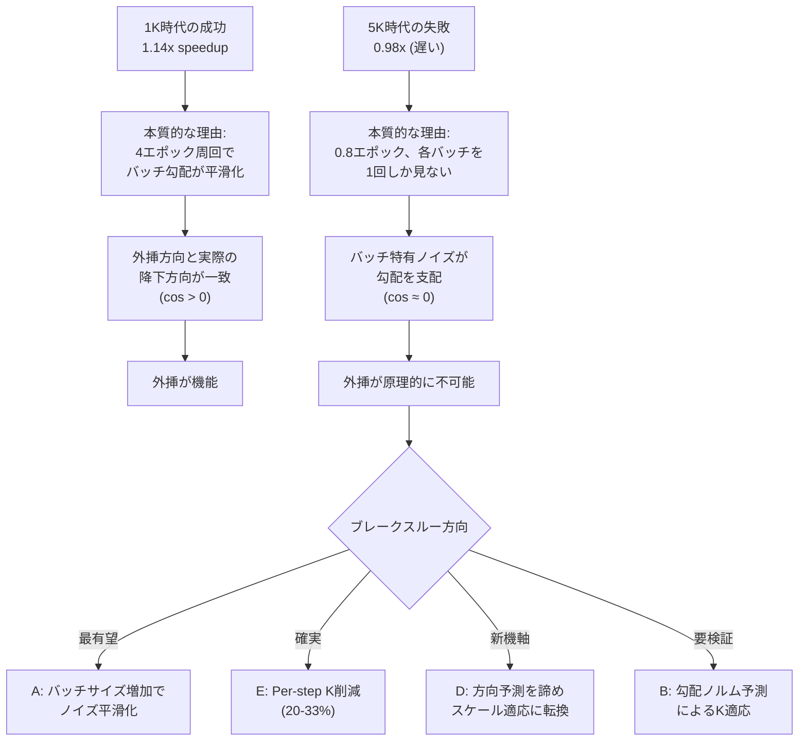

# TG-LoRA 回顧分析: 初期の成功と現在の壁

> [!IMPORTANT]
> **問い**: 初期実験（1Kデータセット）では処理速度でベースラインを上回ったのに、最新の解析では外挿が原理的に効果ゼロと結論づけられている。何が変わったのか？

---

## 1. 二つの時代の実験結果

### 1.1 初期の成功（1Kデータセット時代）

| Metric | Baseline | TG-LoRA | 改善率 |
|---|---:|---:|---:|
| Wall-clock (3-seed mean) | 857.0s | 750.2s | **1.14x 高速** |
| Valid loss (3-seed mean) | 1.8975 | 1.7984 | -5.2% 改善 |
| GPU peak | 10,782 MB | 7,458 MB | -30.8% 削減 |
| Loss reduction/minute | — | — | **1.48x** |

**Source**: [paper_results_snapshot.md §7](file:///home/jinno/tg-lora/docs/paper_results_snapshot.md#L290-L315)

### 1.2 現在の結果（5Kデータセット、M9設計後の包括的分析）

| Metric | Baseline | TG-LoRA | 改善率 |
|---|---:|---:|---:|
| Wall-clock (3-seed mean) | 905.5s | 921.0s | **0.98x (遅い)** |
| Valid loss (3-seed mean) | 1.1682 | 1.1187 | -4.24% 改善 |
| GPU peak | 10,782 MB | 7,459 MB | -30.8% 削減 |
| Accept rate | — | 87-93% | — |

**Source**: [paper_results_snapshot.md §1](file:///home/jinno/tg-lora/docs/paper_results_snapshot.md#L34-L59)

### 1.3 最新の決定的計測（GOAL.md §8.11）

| 経路 | 理論上限 | 根拠 |
|---|---|---|
| A: 外挿（軌跡予測） | **~0%** | R²=0.0008, cos=0.016 |
| B: K削減 | ~20-33% | 要per-step計測 |
| C: 評価削減 | ~5% | 5.6% of forwards |
| D: バッチノイズ削減 | 不明 | 予測可能性を開くかも |
| E: M9（現状） | **負** | -18.4 bp/cycle |

**Source**: [GOAL.md §8.11](file:///home/jinno/tg-lora/docs/GOAL.md#L337-L403)

---

## 2. 何が変わったのか — 5つの本質的差異

### 差異1: データ量の増加 → バッチ勾配のノイズ支配

| | 1K時代 | 5K時代 |
|---|---|---|
| 学習データ | 1,000件 | 5,000件 |
| エポック数 | ~4エポック | ~0.8エポック |
| 各バッチの再利用 | 何度も同じデータを見る | ほぼ1回しか見ない |

**1K時代の勾配方向が揃っていた理由**: 4エポックの周回により、モデルは同じデータを複数回見ていた。これにより各バッチの勾配は「データセット全体の平均勾配」に近づき、**バッチ間の勾配の方向一致度（cos）が高かった**。EMAによる速度ベクトルは、この「揃った勾配」を忠実に反映し、外挿方向として機能していた。

**5K時代にこれが崩壊した理由**: 0.8エポック＝各サンプルをほぼ1回しか見ない。各ミニバッチの勾配は「そのバッチ特有の方向」に支配される。GOAL.md §8.11 の決定的計測が示すとおり:

- `train_loss改善 = 0.077` vs `valid_loss改善 = 0.519` → **7倍の乖離**
- 各ステップの cos(ΔW_t, ΔW_{t-1}) = -0.013（直交）
- 過去10歩の最適線形結合でも R² = 0.0008（予測力ゼロ）

> [!CAUTION]
> **核心的発見**: 1Kでの成功は「データが少なすぎてバッチ勾配のノイズが相対的に小さかった」ことによる幸運な条件。データを増やして汎化性能を高めた瞬間、バッチノイズが外挿のシグナルを完全に覆い隠した。

### 差異2: 実験設定の構造的変化

| 設定 | 1K時代 (推定) | 5K時代 (paper POC) |
|---|---|---|
| max_seq_len | 1024 | 2048 |
| lora.dropout | 0.05 | 0.0 |
| trainable_lora_scope | 全層 | last_25_percent |
| prefix_feature_cache | なし | あり（CPU offload） |
| optimizer_lifecycle | recreate_per_cycle | recreate_per_cycle |
| N candidates | [1,3,5,10,20] | [1,2,4] |
| K_initial | 3 | 2 |

5K時代の設計は **Prefix Feature Cache** によるVRAM節約を核心に据え直した。外挿のN候補は大幅に縮小（最大20→最大4）、K_initialも3→2に短縮。1K時代に見られた積極的な外挿（N=10, 20等）は、5K時代には設定上ほとんど使われていない。

### 差異3: アルゴリズムの複雑化と退化

git履歴を辿ると、アルゴリズムは以下の順序で複雑化した:

```
初期: 単純EMA外挿 → 成功（1K, 1.14x）
  ↓
層サンプリング + ロールバック + ランダムウォーク → 安定化
  ↓
Prefix Feature Cache → VRAM 30.8%削減（Component 1 成功）
  ↓
cosine-driven N 選択 → reduction_rate 改善(0.625→0.752)だがwall-clock変わらず
  ↓
M9 Prior-based Subspace Learning → FDフィット不安定、alpha暴走
  ↓
二相化（warmup/本番相） → lr崩落発見・修正
  ↓
v0修正（raw history平均→Velocity EMA）→ 直交問題は解消されず
  ↓
accept-after-SGD → 全敗 (delta=+0.03 一貫)
  ↓
シャドウ外挿診断 → 27%勝率、cosが高いほど悪化
  ↓
包括的計測 → **外挿の予測可能性はゼロ**
```

> [!WARNING]
> **退化のパターン**: 効率改善を追求してアルゴリズムを複雑化するうちに、そもそもの前提（「勾配方向は予測可能」）が検証されないまま積み重なった。最終的に、前提そのものが否定された。

### 差異4: 1K時代の「速度改善」の内訳分析

1K時代の壁時間改善（857s→750s, 差107s）の内訳を考えると:

- **外挿による実backward削減**: accept率が高かった場合、N×accumのbackwardがスキップされ、これが速度改善の主因だった可能性が高い
- **ただし**: 1Kデータの4エポック学習では、過学習領域に入っているため、外挿が「うまくいった」ように見えた可能性がある。つまり、loss面が平坦化（凸化）しており、どの方向に外挿しても大きく悪化しない→高accept率、という構造

5K時代ではこの条件が崩壊: 0.8エポック＝loss面がまだ急峻で方向性が強い、外挿のずれが即座にloss悪化として現れる。

### 差異5: 評価リークの解消

GOAL.md §5.3 に記録されているとおり、過去にはaccept/reject判定がフィット用バッチで行われていた（評価リーク）。これが0.248相当の楽観バイアスを生んでいた。現在は解消済みだが、1K時代のaccept率がこの楽観バイアスで嵩上げされていた可能性がある。

---

## 3. 何が本当に機能しているのか

### Component 1: Prefix Feature Cache（成功）

| 指標 | 結果 |
|---|---|
| VRAM削減 | -3,323 MB (-30.8%) |
| パラメータオフロード | -4,623 MB |
| メモリフロンティア | 1536/2048 seq-len を新たに可能に |
| 外部品質 | aggregate drop ≈ 0% |

**これは文句なしの成功**。データ量やバッチノイズに依存しない、純粋なシステムレベルの改善。

### Component 2: 外挿（失敗 — ただし条件付き）

外挿は **現在の設定（5K, 0.8エポック, batch_size=1）では原理的に機能しない**。しかし、これは「外挿が原理的に不可能」なのではなく、**バッチノイズが支配する条件下で不可能** ということ。

---

## 4. ブレークスルーの方向性

### 方向A: バッチノイズ削減 → 予測可能性の回復（最有望）

GOAL.md §8.11 が明確に指摘する次の計測項目:

```
バッチサイズスイープ: accum=1,4,8,16で短run。ノイズ削減が予測可能性を開くか検証。
```

**仮説**: grad_accumulation を増やすと、各ステップの勾配がデータセット平均に近づき、ステップ間の方向一致度（cos）が上昇する。cos > 0.1 程度になれば外挿が意味を持ち始める。

**根拠**:
- 1K時代は実質4エポック ≈ 大バッチと同等の平滑化効果があった
- train_loss改善/valid_loss改善 = 0.077/0.519 = 15%しかtrain勾配は汎化に寄与していない
- これはバッチサイズ1（×accum 8 = 実質8）では各バッチの特異方向がstep全体を支配していることの直接的証拠

**実験計画**:
1. accum=16, 32 で短run（20サイクル）し、cos(ΔW_t, ΔW_{t-1}) を計測
2. cos > 0.1 が達成されるaccumを特定
3. そのaccumで外挿のシャドウ実験

### 方向B: 勾配方向ではなく「勾配ノルム」の予測

GOAL.md §8.11 の発見:
- `勾配ノルム vs loss改善`: Spearman ρ=-0.33 (p=0.009)
- 勾配ノルムの減衰: -6.56/cycle (r=-0.27, p=0.04)

方向は直交でも、**ノルム（学習の進行速度）は予測可能**。これを利用して:
- 勾配ノルムが大きいステップ（≈lossが急速に改善する局面）のKを削減
- 勾配ノルムが小さいステップ（≈改善が鈍い局面）のKを増やす

これは「方向予測」ではなく「学習速度の予測」に基づくK適応であり、外挿とは根本的に異なるアプローチ。

### 方向C: 1K時代の条件を意図的に再現

1K時代の成功条件を分析すると、以下が本質:
1. 多エポック学習 → バッチ勾配のノイズが平滑化
2. 学習後半のloss面が凸化 → 外挿のオーバーシュートが許容される

これを5Kデータで再現するには:
- **学習後半のみ外挿を適用**: 学習率が十分低下し、loss面が局所的に凸化した段階でのみ外挿を開始
- **ただし**: シャドウ外挿の結果（§8.9）では、cosが高い（=収束域）ほど外挿deltが悪化するという逆転現象が観測されている。これは凸化してもオーバーシュートが残ることを示唆。

### 方向D: Component 2の再定義 — 「外挿」から「適応的ステップサイズ」へ

外挿（「方向を予測して先に進む」）が機能しないことが確定した以上、Component 2を以下のように再定義する:

- **現在**: 「未来の重み位置を予測する」→ 方向予測が必須 → バッチノイズで不可能
- **再定義案**: 「各サイクルの学習率を軌跡情報から適応的に決定する」
  - Velocity EMAのノルムが安定→学習率を上げる（加速）
  - Velocity EMAのノルムが不安定→学習率を下げる（減速）
  - これは「方向」ではなく「スケール」の適応であり、cos=0でも機能しうる

### 方向E: Per-step K削減（GOAL.md推奨）

GOAL.md §8.11 の「次に必要な計測」:
- **Per-step delta**: K=3の各歩で重みを保存。限界改善の減衰を測る
- K=3 の 3歩目の限界改善が 1歩目の半分以下なら、K=2 に削減するだけで ~20-33% の効率改善

これは外挿不要の確実な効率化パスだが、改善幅は控えめ。

---

## 5. 総合判断



> [!TIP]
> **最も重要な示唆**: 1Kの成功と5Kの失敗は矛盾していない。両方とも「バッチノイズ vs 信号」の比率で完全に説明できる。方向Aの実験（accum増加でcos計測）が、外挿復活の可否を最小コストで判定できる。

---

## 6. 推奨アクション（優先順）

1. **[即実行可能]** accum=16,32 短run でステップ間 cos を計測 → 外挿復活の可否判定
2. **[即実行可能]** Per-step K delta 計測 → K削減の天井を確定
3. **[設計変更]** cos が回復しない場合: Component 2 を「方向外挿」から「スケール適応」に再定義
4. **[中期]** バッチノイズ SNR 計測（同一Wで異バッチ勾配を2本取る）→ 予測不能性の根源を定量化
