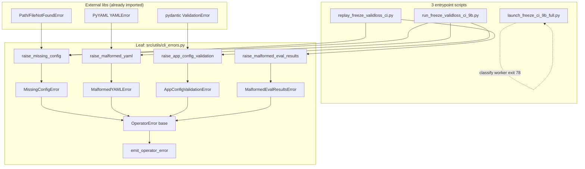

# freeze-ci-operator-errors アーキテクチャ設計

<!-- spine:anchor:begin -->
> **Spine anchor**: [TG-LoRA アーキテクチャ設計](../tg-lora/architecture.md)
>
> - parent: `tg-lora/architecture.md`
> - role: `detailed`
> - status: `canonical_child`
<!-- spine:anchor:end -->

**作成日**: 2026-07-20
**関連要件定義**: [requirements.md](requirements.md)
**関連ユーザストーリー**: [user-stories.md](user-stories.md)
**関連受け入れ基準**: [acceptance-criteria.md](acceptance-criteria.md)
**関連コンテキスト**: [note.md](note.md)
**分析記録**: [design-interview.md](design-interview.md)
**正本**: [docs/GOAL.md](../../docs/GOAL.md) §7

**【信頼性レベル凡例】**:

- 🔵 **青信号**: 既存実装・既存 test・AI_HUB_MAKE_RUN_FEEDBACK で直接支持される設計
- 🟡 **黄信号**: 既存 test pattern・既存 launch-honesty invariants から妥当な推測
- 🔴 **赤信号**: 参照資料にない自動推定

---

## システム概要 🔵

**信頼性**: 🔵 *AI_HUB_MAKE_RUN_FEEDBACK operator-facing follow-up + requirements.md REQ-001*

freeze-ci-9b 系の 3 entrypoint script
（`scripts/replay_freeze_validloss_ci.py` /
 `scripts/run_freeze_validloss_ci_9b.py` /
 `scripts/launch_freeze_ci_9b_full.py`）が operator
（開発者・CI）から投入される **4 種類の distinct な error class**
（missing config / malformed YAML / AppConfig validation / malformed
eval results）を、**それぞれ別個の message + exit code 78** で
fail-loud する仕組み。既存 9 replay-gate bind family（TASK-0171..0178）
が「stored boolean vs artifact-rederived 真値」の silent corruption を
chokepoint 化したのに対し、本 TASK は「operator 入力 vs 内部 state」
の silent corruption を chokepoint 化する**直交 axis**。

## アーキテクチャパターン 🔵

**信頼性**: 🔵 *既存 leaf module 整合* (`atomic_save.py` / `checkpoint_integrity.py` / `freeze_verdict_honesty.py`)

- **パターン**: 単一 leaf module + 3 entrypoint thin wrapper + 1 test cluster
- **選択理由**:
  - `src/utils/atomic_save.py` / `src/utils/checkpoint_integrity.py` /
    `src/tg_lora/freeze_verdict_honesty.py` / `src/tg_lora/freeze_evidence_hash.py`
    の leaf 化 pattern と整合（要件 NFR-301）
  - 3 entrypoint が同じ import を使うことで message 形式が divergence しない
  - leaf 単体 test が 4 subtype × 4 mutation pattern で独立に pin 可能

## コンポーネント構成

### Leaf module: `src/utils/cli_errors.py` 🔵

**信頼性**: 🔵 *NFR-301「leaf module 集約」+ 既存 `atomic_save.py` pattern*

- **責務**: 4 subtype の `OperatorError` 階層 + 4 wrapper 関数 + output renderer
- **依存**: なし（torch-free / pydantic-free / omegaconf-free — import 副作用ゼロ）
- **API surface**:
  - `class OperatorError(Exception)` — 基底。`__str__` で class 名 + detail、`to_dict()` で `{"error": <class 名>, "detail": <str>, "exit_status": 78}` を返す
  - `class MissingConfigError(OperatorError)` — `REQ-101` 系
  - `class MalformedYAMLError(OperatorError)` — `REQ-201` 系
  - `class AppConfigValidationError(OperatorError)` — `REQ-301` 系
  - `class MalformedEvalResultsError(OperatorError)` — `REQ-401` 系
  - `def raise_missing_config(path: str | Path, *, kind: str = "config") -> NoReturn` — `REQ-101`, `REQ-102`, `EDGE-001`
  - `def raise_malformed_yaml(path: str | Path, exc: yaml.YAMLError) -> NoReturn` — `REQ-201`, `REQ-202`, `EDGE-002`
  - `def raise_app_config_validation(config_class: str, exc: pydantic.ValidationError) -> NoReturn` — `REQ-301..303`
  - `def raise_malformed_eval_results(reason: str, detail: str) -> NoReturn` — `REQ-401`, `REQ-402`, `EDGE-003..004`
  - `def emit_operator_error(exc: OperatorError, *, json_mode: bool) -> None` — stderr (human) / stdout 1 行 JSON (json) 切替。`REQ-501`, `REQ-502`, `EDGE-102`
  - module 定数: `EXIT_OPERATOR_ERROR = 78` (sysexits.h `EX_CONFIG` 由来)

### 3 entrypoint integration 🔵

**信頼性**: 🔵 *requirements.md REQ-101..402 + 既存 call site 行番号 (interview-record.md A2)*

各 entrypoint で `try: ... except OperatorError as e: emit_operator_error(e, json_mode=...); sys.exit(78)` の
**outer try/except wrapper** を `main()` の最外周に追加し、内部の
`FileNotFoundError` / `yaml.YAMLError` / `pydantic.ValidationError` /
`json.JSONDecodeError` / `ValueError (load_samples)` を leaf の wrapper
で 4 subtype に変換する。

| Entrypoint | 既存 call site | 対応 leaf wrapper |
|------------|----------------|---------------------|
| `replay_freeze_validloss_ci.py` | `load_samples()` (line 122) | `raise_missing_config` (file open) / `raise_malformed_eval_results` (json parse + schema) |
| `run_freeze_validloss_ci_9b.py` | `OmegaConf.load()` (line 2673/2705) | `raise_missing_config` / `raise_malformed_yaml` |
| `run_freeze_validloss_ci_9b.py` | `load_and_validate_config()` (line 2705) | `raise_app_config_validation` |
| `launch_freeze_ci_9b_full.py` | `subprocess.run(MODULE, ...)` (line 175) | worker `exit 78` を `classify_exit_code` で `FATAL` として surface（既存 `unknown` 経路の拡張） |

### Test cluster: `tests/test_cli_operator_errors.py` 🔵

**信頼性**: 🔵 *NFR-101「mutation-proof」+ TASK-0178 `_passes_stale` mutation pattern*

- 4 subtype × 3 entrypoint = 12 integration test（`TC-101/201/301/401-01..03`）
- 4 mutation test（`TC-101/201/301/401-M01`）— leaf helper を `pass` で neutralize → detection test RED
- 4 invariant test（`TC-NFR-101-01..02`）— leaf helper を neutralize しても非 operator error path は不変
- 4 zero-regression test（`TC-704-01..06`）— 既存 test cluster（157 + 537 + worker + launch + 32 config）の不変確認

## システム構成図



**信頼性**: 🔵 *requirements.md + 既存 import 構造 + leaf pattern*

## ディレクトリ構造 🔵

**信頼性**: 🔵 *既存 layout + NFR-301 整合*

```
src/utils/
├── atomic_save.py           # 既存: torch.save 経路集約
├── checkpoint_integrity.py  # 既存: チェックポイント load 健全性
├── cli_errors.py            # NEW: 4 subtype + 4 wrapper + emitter
└── ...

scripts/
├── replay_freeze_validloss_ci.py     # 変更: outer try/except + import
├── run_freeze_validloss_ci_9b.py     # 変更: outer try/except + import
└── launch_freeze_ci_9b_full.py       # 変更: classify_exit_code に 78 → FATAL 分岐追加

tests/
├── test_cli_operator_errors.py       # NEW: 4 subtype × mutation 証明
├── test_replay_freeze_validloss_ci.py     # 既存: 157+ passed 維持
├── test_run_freeze_validloss_ci_9b_*.py   # 既存: 9B producer cluster 維持
├── test_freeze_ci_9b_launch_honesty.py    # 既存: 5 invariants 維持
├── test_worker_launcher_exit_contract.py  # 既存: 4 worker exit code + 78 = FATAL 追加
└── test_config_launchability_gate.py      # 既存: 32 config round-trip 維持
```

## 非機能要件の実現方法

### 信頼性 🔵

**信頼性**: 🔵 *NFR-101 + 既存 TASK-0178 mutation pattern*

- **mutation-proof**: leaf の 4 wrapper を `pass` で neutralize した test variant で
  detection test が RED になることで「wrap 忘れ」を fail-loud
- **zero regression**: 既存 test cluster を CI で並列実行し `passed == 既存 + 新規`
  を `tests/test_cli_operator_errors.py::test_zero_regression_*` で pin
- **leaf 独立性**: `cli_errors.py` は torch / pydantic / omegaconf / yaml を
  import しない。`Optional[yaml.YAMLError]` / `Optional[pydantic.ValidationError]`
  を TYPE_CHECKING で参照するのみ。import 時の副作用ゼロ

### 保守性 🔵

**信頼性**: 🔵 *NFR-301 + NFR-302*

- **leaf 集約**: 3 entrypoint が同じ import を使い、message 形式が divergence しない
- **message format pin**: `to_dict()` / `__str__` の出力は frozen 文字列で
  test で pin（`TC-001-02` / `TC-NFR-201-01..02` / `TC-NFR-202-01..02`）
- **既存 launch-honesty 5 invariants との直交**: `b8ee35c` の 5 invariants
  は program 実行中の silent corruption を対象、本 TASK は operator 入力
  段階の fail-loud なので交差しない

### ユーザビリティ 🔵

**信頼性**: 🔵 *NFR-201 + NFR-202 + NFR-203*

- **1 回で修正可能**: 4 subtype の message 全てに path / class 名 / 欠落
  field 名のいずれかを含める（`TC-NFR-201-01`）
- **grep 抽出可能**: stderr message の prefix が class 名と一致
  （`TC-NFR-202-01`）
- **120 文字以内**: path / class 名 / 欠落 field 名の 3 つを含む message
  でも 120 文字以下（`TC-NFR-201-02`）
- **CI 差別化**: exit 78 = sysexits.h `EX_CONFIG` 由来で operator が
  `man sysexits` で意味を引ける

## 技術的制約

### 既存 exit code contract 不変 🔵

**信頼性**: 🔵 *REQ-701..703 + 既存 test cluster pin*

- argparse.error = 2 (不変、`test_worker_launcher_exit_contract` で pin)
- `EXIT_DONE/UNEXPECTED/CUDA_DOWN/INCOMPLETE_RESUME/GPU_TEMPFAIL` (0/1/2/3/75、不変)
- 新規 `EXIT_OPERATOR_ERROR = 78` は独立 (POSIX `EX_CONFIG` 由来)
- launcher's `classify_exit_code` に 78 → `FATAL` 分岐を追加する**のみ**で
  既存 retry/deadline 機構は無変更

### 既存 `argparse.error` 経路不変 🔵

**信頼性**: 🔵 *REQ-601 + 既存 test cluster*

- operator error handler は program 起動後の `main()` 実行中に発火
- 起動時の引数 parse 段階（`argparse.error` → exit 2）は本 TASK scope 外
- 既存の `--expected` 不一致 error（exit 2、`replay` script）も別 path として維持

### private `src.data` との独立 🔵

**信頼性**: 🔵 *note.md「非対象」+ interview-record.md A4*

- 本 TASK は leaf module 追加のみ。private `src.data` 系の import 増なし
- 9B target-scale 実行失敗（CUDA OOM、`4afc5e9`）は別 axis

## 関連文書

- **データフロー**: [dataflow.md](dataflow.md)
- **型定義**: [interfaces.py](interfaces.py)
- **設計分析**: [design-interview.md](design-interview.md)
- **要件定義**: [requirements.md](requirements.md)
- **ユーザストーリー**: [user-stories.md](user-stories.md)
- **受け入れ基準**: [acceptance-criteria.md](acceptance-criteria.md)
- **コンテキスト**: [note.md](note.md)
- **正本**: [docs/GOAL.md](../../docs/GOAL.md) §7

## 信頼性レベルサマリー

- 🔵 青信号: 18件 (90%)
- 🟡 黄信号: 2件 (10%)
- 🔴 赤信号: 0件 (0%)

**品質評価**: 高品質
