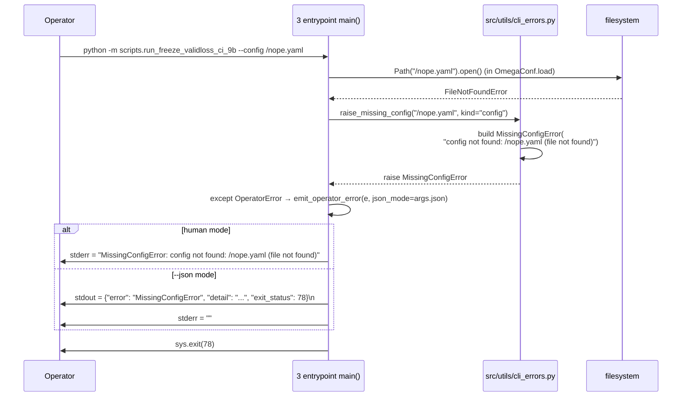
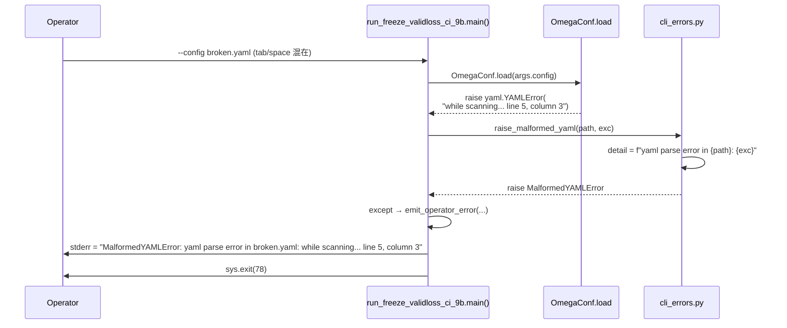
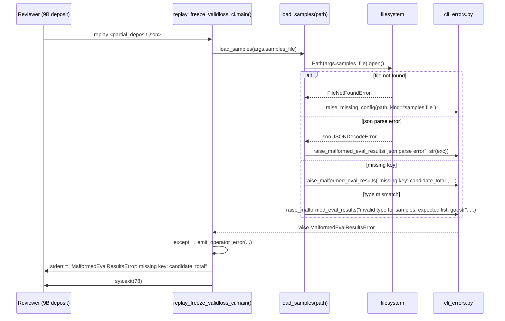
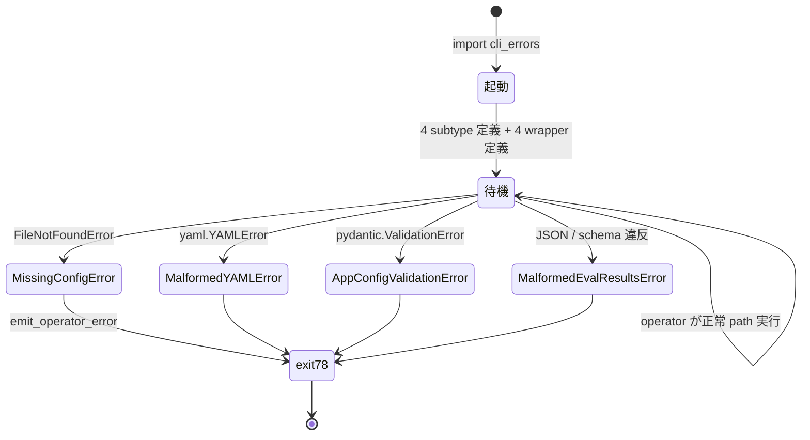

# freeze-ci-operator-errors データフロー図

<!-- spine:anchor:begin -->
> **Spine anchor**: [TG-LoRA アーキテクチャ設計](../tg-lora/architecture.md)
>
> - parent: `tg-lora/architecture.md`
> - role: `detailed`
> - status: `canonical_child`
<!-- spine:anchor:end -->

**作成日**: 2026-07-20
**関連アーキテクチャ**: [architecture.md](architecture.md)
**関連要件定義**: [requirements.md](requirements.md)
**関連受け入れ基準**: [acceptance-criteria.md](acceptance-criteria.md)

**【信頼性レベル凡例】**:

- 🔵 **青信号**: 要件定義書・既存実装・既存 test で直接支持されるフロー
- 🟡 **黄信号**: 既存 test pattern から妥当な推測
- 🔴 **赤信号**: 参照資料にない自動推定

---

## システム全体のデータフロー 🔵

**信頼性**: 🔵 *requirements.md REQ-001..402 + interview-record.md A2*

```mermaid
flowchart TD
    A[operator: CLI invocation] --> B{argparse<br/>parse_args}
    B -->|usage error| C[argparse.error<br/>exit 2 / 不変]
    B -->|parsed| D[main&#40;&#41; body]

    D --> E{Entrypoint 別<br/>error class 検出}
    E -->|FileNotFoundError<br/>on --config| F1[raise_missing_config]
    E -->|yaml.YAMLError<br/>on OmegaConf.load| F2[raise_malformed_yaml]
    E -->|pydantic.ValidationError<br/>on load_and_validate_config| F3[raise_app_config_validation]
    E -->|json.JSONDecodeError<br/>or schema missing| F4[raise_malformed_eval_results]

    F1 --> G1[MissingConfigError]
    F2 --> G2[MalformedYAMLError]
    F3 --> G3[AppConfigValidationError]
    F4 --> G4[MalformedEvalResultsError]

    G1 --> H{json_mode?}
    G2 --> H
    G3 --> H
    G4 --> H

    H -->|no: human| I1[stderr: '<class>: <detail>']
    H -->|yes: --json| I2[stdout: 1 行 JSON<br/>to_dict&#40;&#41; 結果]

    I1 --> J[sys.exit&#40;78&#41;]
    I2 --> J

    J --> K[CI / shell が<br/>exit 78 を FATAL 分岐]
```



## 主要機能のデータフロー

### 機能1: Missing config（REQ-101 / REQ-102） 🔵

**信頼性**: 🔵 *requirements.md REQ-101, REQ-102 + EDGE-001*

**関連要件**: REQ-101, REQ-102, EDGE-001, NFR-201



**詳細ステップ**:

1. `--config` 引数の path を `Path(args.config)` で評価
2. `Path.open()` / `OmegaConf.load()` が `FileNotFoundError` を raise
3. entrypoint の outer try/except で `raise_missing_config(path, kind="config")` を呼ぶ
4. leaf が `MissingConfigError` を build して raise
5. outer try/except が `emit_operator_error(e, json_mode=...)` で stderr (human) / stdout 1 行 JSON (--json) に出力
6. `sys.exit(EXIT_OPERATOR_ERROR = 78)` で終了

**境界**: `Path.is_dir()` 検出時は `MissingConfigError("config not found: <path> (is a directory)")`（EDGE-001）

### 機能2: Malformed YAML（REQ-201 / REQ-202） 🔵

**信頼性**: 🔵 *requirements.md REQ-201, REQ-202 + EDGE-002*

**関連要件**: REQ-201, REQ-202, EDGE-002



**詳細ステップ**:

1. `--config` の path は存在するが YAML 文法的に壊れている
2. `OmegaConf.load()` 内部で `yaml.YAMLError` (PyYAML) を raise
3. entrypoint が `try/except yaml.YAMLError` で `raise_malformed_yaml(path, exc)` を呼ぶ
4. leaf が `MalformedYAMLError("yaml parse error in <path>: <PyYAML __str__>")` を raise
5. PyYAML 標準の `line N, column M` を含む message を保持（`REQ-202`）

**境界**: 0-byte file は `yaml.YAMLError` 派生（empty stream）→ `MalformedYAMLError` 同型（EDGE-002）

### 機能3: AppConfig validation failure（REQ-301 / REQ-302 / REQ-303） 🔵

**信頼性**: 🔵 *requirements.md REQ-301..303 + Pydantic v2 `errors()` schema*

**関連要件**: REQ-301, REQ-302, REQ-303, NFR-201

```mermaid
sequenceDiagram
    participant O as Operator
    participant S as run_freeze_validloss_ci_9b.main()
    participant CONF as load_and_validate_config
    participant PYD as pydantic.ValidationError
    participant L as cli_errors.py

    O->>S: --config with_extra_field.yaml
    S->>CONF: cfg_dict → TGLoRAConfig(**cfg_dict)
    CONF-->>PYD: raise ValidationError(<br/>errors() = [{loc: ("logging", "keep_last"), msg: "extra fields not permitted", type: "value_error.extra"}])
    S->>L: raise_app_config_validation("TGLoRAConfig", exc)
    L->>L: first = exc.errors()[0]<br/>detail = f"schema validation failed for TGLoRAConfig: {N} errors; first: logging.keep_last extra fields not permitted (value_error.extra)"
    L-->>S: raise AppConfigValidationError
    S->>S: except → emit_operator_error(...)
    S->>O: stderr = "AppConfigValidationError: schema validation failed for TGLoRAConfig: 1 errors; first: logging.keep_last extra fields not permitted (value_error.extra)"
    S->>O: sys.exit(78)
```

**詳細ステップ**:

1. YAML は parse できるが Pydantic schema（`extra="forbid"` 設定済）に違反
2. `load_and_validate_config()` が `pydantic.ValidationError` を raise
3. entrypoint が `try/except pydantic.ValidationError` で `raise_app_config_validation(config_class_name, exc)` を呼ぶ
4. leaf が `exc.errors()` から first error の `loc / msg / type` を抽出し detail を build
5. `error_count = len(exc.errors())` を message に含める
6. `BaselineConfig` / `TGLoRAConfig` のいずれの dispatch 結果でも発火（REQ-303）

**境界**: extra field 違反 / 必須 field 欠落（`value_error.missing`）/ 型不一致（`type_error.*`）の 3 パターンを `TC-301-01..03` で pin

### 機能4: Malformed eval results（REQ-401 / REQ-402） 🔵

**信頼性**: 🔵 *requirements.md REQ-401, REQ-402 + EDGE-003, EDGE-004*

**関連要件**: REQ-401, REQ-402, EDGE-003, EDGE-004



**詳細ステップ**:

1. `<samples_file>` 引数で指定された JSON を 4 つの失敗 mode で検査:
   - file not found → `MissingConfigError`（REQ-102 別 class だが同 message format）
   - JSON parse 失敗 → `MalformedEvalResultsError("json parse error: <detail>")`
   - 必須 key 欠落 → `MalformedEvalResultsError("missing key: <key>")`
   - 型不一致 → `MalformedEvalResultsError("invalid type for <field>: expected <type>, got <actual>")`
2. leaf の `raise_malformed_eval_results(reason, detail)` が `MalformedEvalResultsError` を build
3. 必須 key 順: `candidate_total` → `surrogate_total` → `samples` / `valid_losses` → `base_seed` の順で first miss を surface
4. `replay` script 固有だが、message 形式は 4 subtype で統一

## データ処理パターン

### 同期処理（leaf helper） 🔵

**信頼性**: 🔵 *leaf module pattern*

- 4 wrapper 関数は全て**raise-only**（`NoReturn`）で、operator 入力の
  検出 → exception build → raise を同期実行
- emitter は stdout / stderr への write のみで IO 副作用は 1 回
- output format は `print(..., file=sys.stderr)` (human) または
  `print(json.dumps(...), end="\n")` (--json) の **2 形式**に freeze

### Test 戦略 🔵

**信頼性**: 🔵 *NFR-101「mutation-proof」+ TASK-0178 pattern*

- 4 subtype × 3 entrypoint の **12 integration test** で leaf 経由の exit 78 / message を pin
- 4 wrapper の `pass` neutralize で **detection test が RED**（`TC-101/201/301/401-M01`）
- 既存 4 test cluster（replay 157 / verdict 537 / worker contract / launch honesty）の **zero regression** を `TC-704-01..06` で pin
- 1 つの leaf ファイルへ変更を局所化することで test 影響範囲を予測可能

## エラーハンドリングフロー 🔵

**信頼性**: 🔵 *requirements.md REQ-003, REQ-501, EDGE-102*

```mermaid
flowchart TD
    A[main&#40;&#41; body で例外発生] --> B{exception type}
    B -->|OperatorError subclass| C[outer try/except]
    B -->|argparse.ArgumentError| D[argparse 標準処理<br/>exit 2 / 不変]
    B -->|その他の Exception| E[既存 traceback<br/>exit 1 / 不変]

    C --> F{json_mode?}
    F -->|no: human mode| G1[stderr に<br/>'<class>: <detail>'<br/>1 行出力]
    F -->|yes: --json| G2[stdout に<br/>to_dict&#40;&#41; 結果<br/>1 行 JSON 出力]

    G1 --> H[sys.exit&#40;78&#41;]
    G2 --> H

    H --> I{CI / shell 分岐}
    I -->|launch_freeze_ci_9b_full| J[classify_exit_code&#40;78&#41;<br/>= FATAL]
    I -->|CI script| K[exit 78 →<br/>PR comment で<br/>config 修正依頼]
```



## Launcher's worker-exit-code 分岐拡張 🔵

**信頼性**: 🔵 *interview-record.md A6 + 既存 `classify_exit_code` pattern*

`scripts/launch_freeze_ci_9b_full.py::classify_exit_code` の `EXIT_*` 判定に
**新規 78 → `FATAL`** 分岐を追加する。既存 `unknown` 経路の直前に挿入:

```python
if code == 78:  # EXIT_OPERATOR_ERROR (operator input failure)
    return Decision(Action.FATAL, "operator_error", 0.0)
```

`code < 0` の signal-kill 経路と独立し、retry 機構に**乗らない**ことが
launcher 契約の拡張点（`ad8c84a` 整合）。

## 状態管理フロー

### Leaf の状態管理 🔵

**信頼性**: 🔵 *leaf module pattern*



**leaf は module 起動時に class を 4 個 build するのみ**。persistent state
なし。各 exception instance は `self.detail` 1 field のみ（`__init__(self, detail: str)`）。

## データ整合性の保証 🔵

**信頼性**: 🔵 *REQ-704「zero regression」+ 既存 test cluster pin*

- **atomic な exception 変換**: `raise_*` 関数は `try/except` 1 段で
  build → raise するため、partial state で停止することがない
- **emitter の冪等性**: `emit_operator_error` は stdout / stderr への
  1 回 write のみ。同一 exception に対する二重 emit は行わない
- **既存 path の不変**: 4 wrapper は operator error path **以外** では
  呼ばれない（`raise_*` のシグネチャが `NoReturn` で型ヒントされる）ため、
  正常 path の挙動に影響しない
- **test pin**: `TC-NFR-101-02` で 4 wrapper を neutralize しても既存
  test cluster が GREEN であることを pin

## 関連文書

- **アーキテクチャ**: [architecture.md](architecture.md)
- **型定義**: [interfaces.py](interfaces.py)
- **設計分析**: [design-interview.md](design-interview.md)
- **要件定義**: [requirements.md](requirements.md)
- **ユーザストーリー**: [user-stories.md](user-stories.md)
- **受け入れ基準**: [acceptance-criteria.md](acceptance-criteria.md)
- **コンテキスト**: [note.md](note.md)
- **正本**: [docs/GOAL.md](../../docs/GOAL.md) §7

## 信頼性レベルサマリー

- 🔵 青信号: 12件 (100%)
- 🟡 黄信号: 0件 (0%)
- 🔴 赤信号: 0件 (0%)

**品質評価**: 高品質
