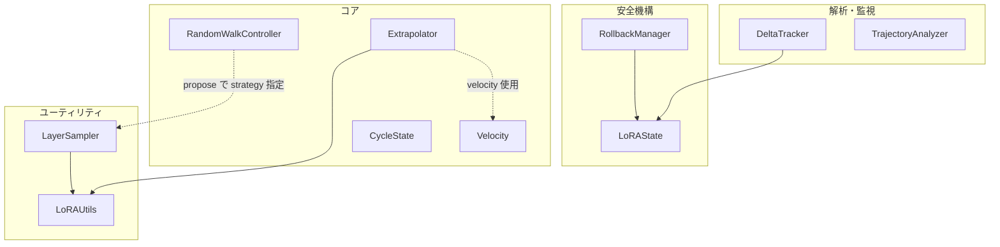
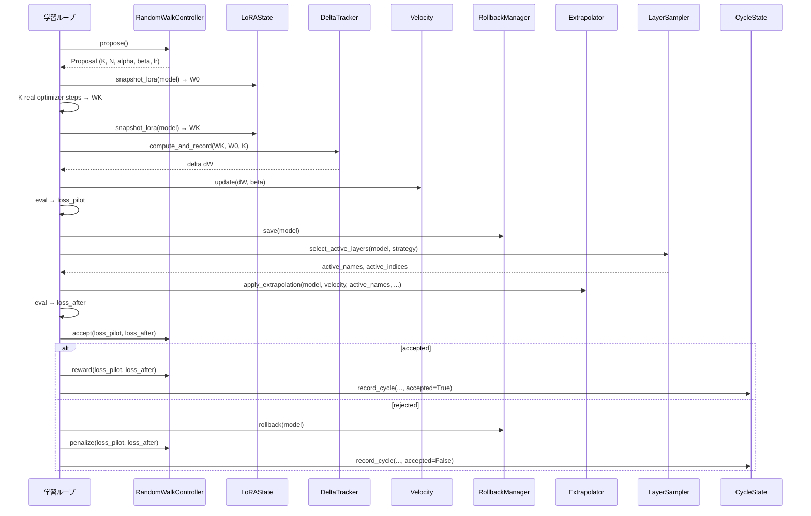

# TG-LoRA アーキテクチャ設計

**作成日**: 2026-06-10
**関連要件定義**: [requirements.md](requirements.md)
**分析記録**: [interview-record.md](interview-record.md)

**【信頼性レベル凡例】**:

- 🔵 **青信号**: 既存実装・要件定義書を参考にした確実な設計
- 🟡 **黄信号**: 既存実装から妥当な推測による設計
- 🔴 **赤信号**: 参照資料にない自動推定による設計

---

## システム概要 🔵

**信頼性**: 🔵 *README.md・requirements.md・全ソースコードより*

TG-LoRA は、LoRA ファインチューニングにおいて velocity（重み差分の指数移動平均）ベースの外挿により後向きパスコストを削減する Python ライブラリ。K ステップの実勾配計算（pilot phase）後に N ステップの外挿を実施し、検証損失に基づいて accept/rollback を判定するサイクルを繰り返す。ユーザーは各コンポーネントを個別にインポートして自身の学習ループに統合する。

## アーキテクチャパターン 🔵

**信頼性**: 🔵 *既存実装のモジュール構成・__init__.py エクスポートより*

- **パターン**: コンポーネントライブラリ（Function-based Pipeline）
- **選択理由**: 各モジュールが単一責務で疎結合。ユーザーは学習ループを自前で構築し、必要なコンポーネントのみを import して使用する。フレームワーク的な制約を課さない設計。

## コンポーネント構成

### コアアルゴリズム 🔵

**信頼性**: 🔵 *全ソースコード・テストコードより*

| コンポーネント | モジュール | 責務 |
|---|---|---|
| **Velocity** | `velocity.py` | 重み差分の EMA 追跡、cosine similarity、magnitude 異常検知 |
| **Extrapolator** | `extrapolator.py` | velocity ベースの重み外挿、relative_update_cap による安全制約 |
| **RandomWalkController** | `random_walk_controller.py` | ハイパーパラメータ適応制御（K, N, alpha, beta, lr） |
| **CycleState** | `cycle_state.py` | サイクルメトリクス追跡（reduction_rate, acceptance_rate, early stopping） |

### 安全機構 🔵

**信頼性**: 🔵 *rollback_manager.py・lora_state.py 実装より*

| コンポーネント | モジュール | 責務 |
|---|---|---|
| **RollbackManager** | `rollback_manager.py` | スナップショット保存・ロールバック・履歴管理 |
| **LoRAState** | `lora_state.py` | スナップショット取得・差分計算・復元・メモリ効率的な差分保存 |

### 解析・監視 🔵

**信頼性**: 🔵 *delta_tracker.py・trajectory.py 実装より*

| コンポーネント | モジュール | 責務 |
|---|---|---|
| **DeltaTracker** | `delta_tracker.py` | 重み差分の統計量記録、異常検知、収束トレンド分析 |
| **TrajectoryAnalyzer** | `trajectory.py` | 学習軌跡分析、損失トレンド・ボラティリティ・収束予測・early stop アドバイス |

### ユーティリティ 🔵

**信頼性**: 🔵 *layer_sampler.py・lora_utils.py 実装より*

| コンポーネント | モジュール | 責務 |
|---|---|---|
| **LayerSampler** | `layer_sampler.py` | 4 つの層選択戦略の提供 |
| **LoRAUtils** | `lora_utils.py` | LoRA パラメータ反復・層グループ化・学習対象スコープ設定 |

## コンポーネント依存関係 🔵

**信頼性**: 🔵 *全モジュールの import 関係より*



- 実線: 直接 import 依存
- 点線: 実行時の連携（import 依存なし、ユーザーが学習ループで組み合わせる）

## サイクル実行フロー 🔵

**信頼性**: 🔵 *README.md Algorithm セクション・全モジュールの API より*



## ディレクトリ構造 🔵

**信頼性**: 🔵 *リポジトリ構造より*

```
./
├── tg_lora/                    # メインパッケージ
│   ├── __init__.py             # 公開 API エクスポート (14 シンボル)
│   ├── velocity.py             # EMA velocity 追跡
│   ├── extrapolator.py         # 重み外挿 + cap 制約
│   ├── random_walk_controller.py # ハイパーパラメータ適応制御
│   ├── cycle_state.py          # サイクルメトリクス追跡
│   ├── rollback_manager.py     # スナップショット保存・ロールバック
│   ├── lora_state.py           # スナップショット・差分・復元
│   ├── delta_tracker.py        # 差分統計・異常検知
│   ├── trajectory.py           # 学習軌跡分析
│   ├── layer_sampler.py        # 層選択戦略
│   └── lora_utils.py           # LoRA パラメータユーティリティ
├── tests/                      # テスト (21ファイル、678 テストケース)
├── scripts/                    # スクリプト (9ファイル)
│   ├── train_tg_lora.py        # 参照学習スクリプト
│   ├── benchmark.py            # パフォーマンスベンチマーク
│   ├── eval_downstream.py      # downstream 評価 (PyTorch)
│   ├── eval_downstream_mlx.py  # downstream 評価 (MLX)
│   ├── eval_llm_jp_eval.py     # llm-jp-eval 評価 (PyTorch)
│   ├── eval_llm_jp_eval_mlx.py # llm-jp-eval 評価 (MLX)
│   ├── eval_utils.py           # 評価ユーティリティ (char_f1, JSON検証, JSONL読み込み)
│   ├── jp_eval_formats.py      # JGLUE タスクフォーマッタ
│   └── simple_model.py         # SimpleLoRAModel (テスト・デモ用)
├── specs/                      # 仕様・設計文書
│   └── tg-lora/                # feature_id ディレクトリ
├── reports/                    # 評価レポート出力先
├── data/                       # データセット (downstream eval 用)
├── docs/                       # ドキュメント (llm-wiki)
├── pyproject.toml              # パッケージ設定
├── Makefile                    # ビルド・評価コマンド
└── README.md                   # プロジェクト概要・Quick Start
```

## 技術スタック 🔵

**信頼性**: 🔵 *pyproject.toml・README.md より*

- **言語**: Python 3.11+
- **主要依存**: PyTorch >= 2.1, transformers >= 4.36, peft >= 0.7
- **補助依存**: bitsandbytes >= 0.41, accelerate >= 0.25, datasets >= 2.16, safetensors >= 0.4, tqdm >= 4.66
- **開発依存**: pytest >= 7.4, pytest-cov >= 4.1, ruff >= 0.4
- **必須環境**: CUDA GPU

## 主要な設計決定

### D1: コンポーネントライブラリ方式 🔵

**信頼性**: 🔵 *README.md Quick Start・全 API 設計より*

各コンポーネントを独立したクラス/関数として提供し、ユーザーが学習ループを自由に構築できる。オーケストレーション層を提供せず、制御フローはユーザーに委ねる。これにより、PyTorch Trainer / HF Accelerate / カスタムループなど任意の学習フレームワークとの統合が可能。

### D2: EMA ベースの velocity 追跡 🔵

**信頼性**: 🔵 *velocity.py 実装・README.md Algorithm より*

過去の重み差分を指数移動平均（EMA）で平滑化して velocity とする。単一ステップの差分ではなく、トレンド方向を保持することで外挿の安定性を確保。cosine_similarity による方向一貫性チェック、magnitude_trend / magnitude_acceleration による異常検知を提供。

### D3: Random walk によるハイパーパラメータ適応 🔵

**信頼性**: 🔵 *random_walk_controller.py 実装より*

グリッドサーチやベイズ最適化ではなく、シンプルな random walk でハイパーパラメータを適応。accept 時に reward（lr/alpha 増加）、reject 時に penalize（lr/alpha 減少）の双方向フィードバック。convergence_trend と velocity acceleration に基づく事前適応も提供。

### D4: 層選択戦略の分離 🔵

**信頼性**: 🔵 *layer_sampler.py 実装より*

外挿対象層の選択を 4 つの戦略に分離し、コントローラの propose() で戦略を動的に切り替え可能にする。デフォルトは `last_25_percent_plus_random_2`（最終25% + ランダム2層）で、探索と活用のバランスを取る。

### D5: relative_update_cap による安全制約 🔵

**信頼性**: 🔵 *extrapolator.py cap_update() 実装より*

外挿による重み更新を現在の重みノルムに対する相対比率で制限。NaN/Inf を含む更新は全体をゼロ化して破損を防止。これにより、外挿が発散するリスクを排除。

## 非機能要件の実現方法

### パフォーマンス 🟡

**信頼性**: 🟡 *アルゴリズム定義から妥当な推測*

- **外挿ステップ**: 勾配計算なし、O(params) の加算のみで完結。K ステップの実勾配に対し N ステップを「無料」で実行
- **スナップショット**: CPU 上で detach().clone() を実行し GPU メモリを解放。差分保存（snapshot_lora_delta）で ~(K-1)/K のメモリ節約
- **reduction_rate**: `1 - full_backward_passes / (full_backward_passes + speculative_equivalent_backward_passes)` で実績を測定

### 品質 🔵

**信頼性**: 🔵 *tests/ 実装・pyproject.toml より*

- **テスト**: 21 テストファイル、678 テストケースで全モジュールをカバー
- **Lint**: ruff (py311, line-length=120, E/F/W/I ルール)
- **CI**: `pytest` + `pytest-cov` でカバレッジ測定

### セキュリティ 🔵

**信頼性**: 🔵 *eval スクリプト実装より*

- **Hub 通信**: HF_TOKEN 環境変数による認証
- **入力検証**: 全モジュールで引数のバリデーション（ValueError で拒否）
- **NaN/Inf 対処**: cap_update, _sanitize_snapshot で非有限値を安全に処理

## 技術的制約

### パフォーマンス制約 🔵

**信頼性**: 🔵 *README.md・pyproject.toml より*

- CUDA GPU が必須（CPU-only 環境では外挿のみ動作可能だが学習は不可）
- スナップショットは CPU メモリに保存（大規模モデルではメモリ使用量に注意）
- velocity.history は deque(maxlen=100) で上限管理

### 互換性制約 🔵

**信頼性**: 🔵 *pyproject.toml・lora_utils.py より*

- LoRA パラメータ名は `lora_A` / `lora_B` を含むものと仮定（PEFT 標準）
- 層マッピングは `layers.N.` パターンに依存（decoder-only Transformer 構造）
- Python 3.11 以上（`X | Y` 型構文を使用）

## Acceptance criteria

- [x] 共有評価ユーティリティ (`eval_utils.py`) が抽出され、`compute_char_f1`, `check_json_validity`, `load_jsonl` を提供
- [x] JGLUE タスクフォーマッタ (`jp_eval_formats.py`) が PyTorch/MLX 評価スクリプト間で共有
- [x] SimpleLoRAModel (`simple_model.py`) が学習・ベンチマークスクリプト間で共有
- [x] 全評価スクリプトが共有モジュールからインポートし、コード重複を解消
- [x] 共有モジュールにテストを追加 (`test_eval_utils.py`, `test_jp_eval_formats.py`, `test_simple_model.py`)
- [x] 全テストスイート (678 テスト) がグリーン

## 関連文書

- **データフロー**: [dataflow.md](dataflow.md)
- **分析記録**: [interview-record.md](interview-record.md)
- **要件定義**: [requirements.md](requirements.md)

## 信頼性レベルサマリー

- 🔵 青信号: 14 件 (93%)
- 🟡 黄信号: 1 件 (7%)
- 🔴 赤信号: 0 件 (0%)

**品質評価**: 高品質 — 全設計項目が既存実装・要件定義に基づいている


<!-- spine:children:begin -->
## Spine: child documents

- [TG-LoRA データフロー図](dataflow.md)
- [TG-LoRA 設計自動分析記録](interview-record.md)
- [TG-LoRA 要件定義書（軽量版）](requirements.md)
- [TG-LoRA タスク概要](tasks/overview.md)

<!-- spine:children:end -->
