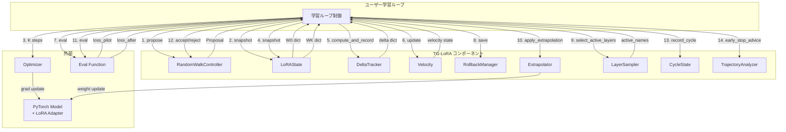
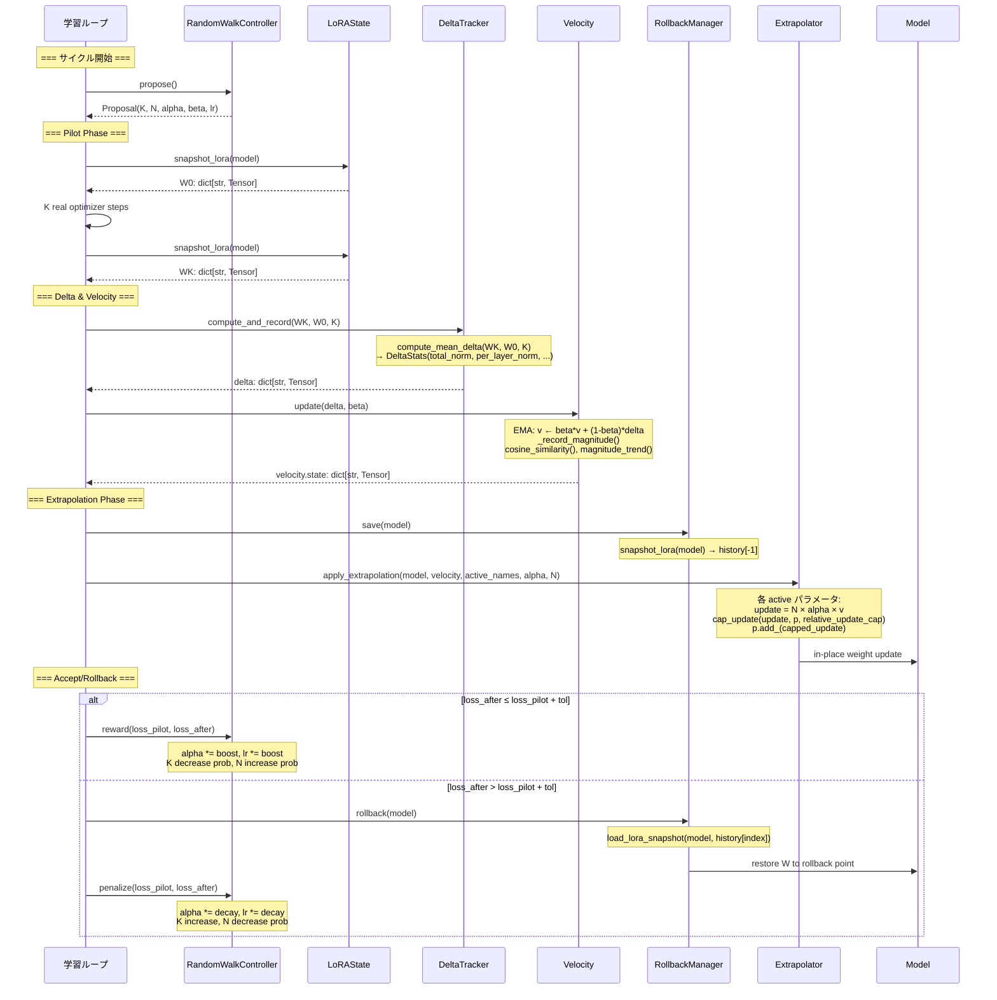
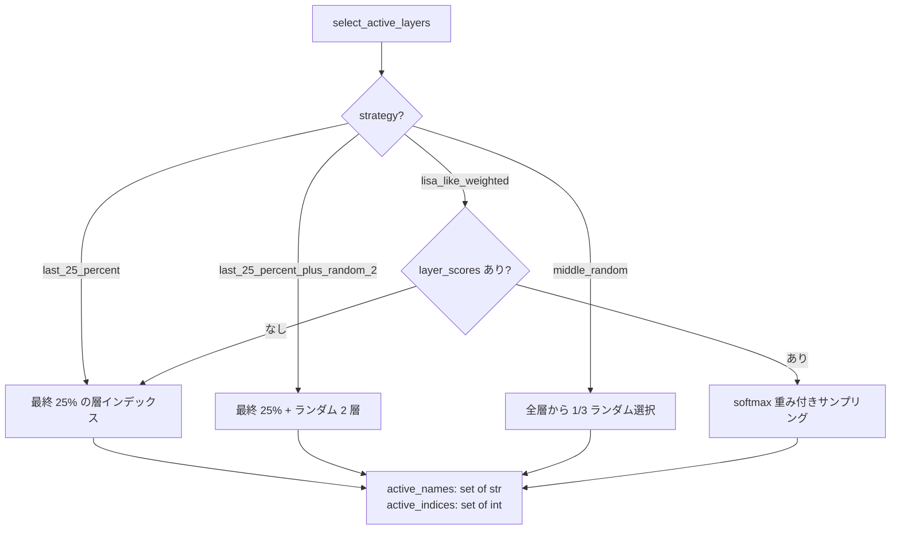
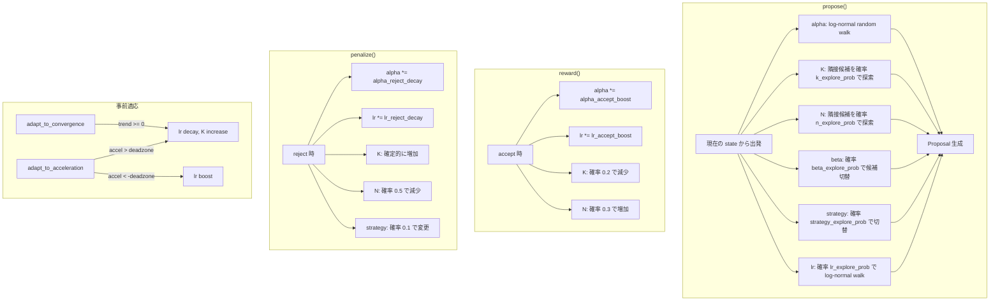
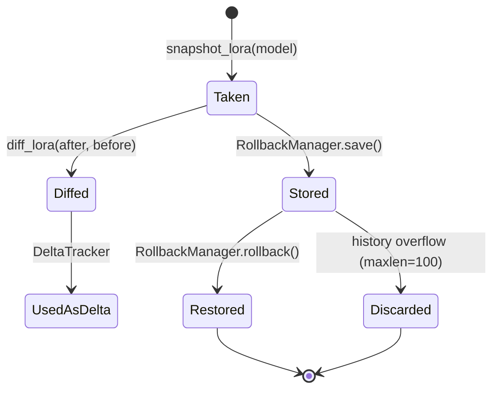
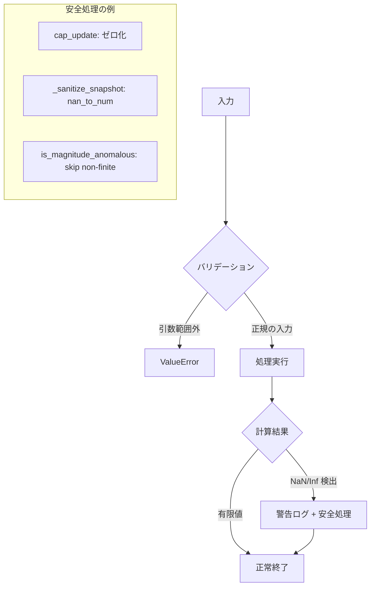

# TG-LoRA データフロー図

**作成日**: 2026-06-10
**関連アーキテクチャ**: [architecture.md](architecture.md)
**関連要件定義**: [requirements.md](requirements.md)

**【信頼性レベル凡例】**:

- 🔵 **青信号**: 既存実装・要件定義書を参考にした確実なフロー
- 🟡 **黄信号**: 既存実装から妥当な推測によるフロー
- 🔴 **赤信号**: 参照資料にない自動推定によるフロー

---

## システム全体のデータフロー 🔵

**信頼性**: 🔵 *README.md Algorithm セクション・全ソースコードより*



## 主要機能のデータフロー

### 機能1: サイクル実行（Pilot → Extrapolate → Accept/Rollback） 🔵

**信頼性**: 🔵 *README.md Algorithm・全モジュール API より*

**関連要件**: REQ-001, REQ-003, REQ-005, REQ-006



**データ変換**:

1. `W0` / `WK`: `dict[str, Tensor]` — LoRA パラメータ名 → CPU Tensor のマッピング
2. `delta`: `dict[str, Tensor]` — `(WK - W0) / K` の平均差分
3. `velocity.state`: `dict[str, Tensor]` — EMA 平滑化された差分
4. `Proposal`: dataclass `(K, N, alpha, beta, lr, active_layer_strategy, relative_update_cap)`
5. `DeltaStats`: dataclass `(total_norm, per_layer_norm, max_component, mean_abs)`

### 機能2: 層選択戦略 🔵

**信頼性**: 🔵 *layer_sampler.py 実装より*

**関連要件**: REQ-009



**入力**: `model`, `strategy`, `random_middle=2`, `layer_scores`, `temperature`
**出力**: `tuple[set[str], set[int]]` — アクティブなパラメータ名の集合と層インデックスの集合

### 機能3: ハイパーパラメータ適応 🔵

**信頼性**: 🔵 *random_walk_controller.py 実装より*

**関連要件**: REQ-006



## データ処理パターン

### 同期処理 🔵

**信頼性**: 🔵 *全モジュール実装より*

全コンポーネントは同期的に動作する。非同期処理やバッチ処理は存在しない。ユーザーの学習ループ内で順次呼び出される設計。

- スナップショット取得・差分計算・外挿適用はすべて `@torch.no_grad()` コンテキストで実行
- velocity 更新は in-place 演算（`mul_`, `add_`）でメモリ効率を確保

### スナップショットのライフサイクル 🔵

**信頼性**: 🔵 *lora_state.py・rollback_manager.py 実装より*



- **snapshot_lora**: `iter_lora_params(model)` → `{name: p.detach().cpu().clone()}`
- **diff_lora**: `{name: after[name] - before[name]}` (オプションで scale 適用)
- **snapshot_lora_delta**: base からの差分のみ保存（メモリ効率化）
- **load_lora_snapshot**: `p.copy_(saved.to(device, dtype))` で in-place 復元

## エラーハンドリングフロー 🔵

**信頼性**: 🔵 *全モジュールの ValueError / RuntimeError 実装より*



- **引数検証**: 全モジュールでコンストラクタ・メソッド引数を検証し `ValueError` を送出
- **NaN/Inf 対処**: `cap_update` は非有限値をゼロ化、`_sanitize_snapshot` は `nan_to_num` で置換
- **ログ**: `logging.getLogger("tg-lora")` で警告・エラーを記録

## 状態管理フロー

### コンポーネント状態管理 🔵

**信頼性**: 🔵 *ControllerState・CycleState dataclass 実装より*

各コンポーネントは独自の状態を管理し、`summary()` / `from_dict()` でシリアライズ可能。

```mermaid
flowchart LR
    subgraph "RandomWalkController"
        CS1[ControllerState<br/>K, N, alpha, beta, lr<br/>layer_scores, counts]
    end

    subgraph "CycleState"
        CS2[cycle, optimizer_steps<br/>full_backward_passes<br/>best_loss, stale_cycles]
    end

    subgraph "Velocity"
        CS3[_state: dict<br/>_magnitude_history: deque]
    end

    subgraph "DeltaTracker"
        CS4[_history: list<br/>_norm_history: deque<br/>_last_stats: DeltaStats]
    end

    subgraph "RollbackManager"
        CS5[_history: list<br/>maxlen=100]
    end

    CS1 -->|summary() → from_dict()| PERSIST[永続化<br/>JSON/checkpoint]
    CS2 -->|summary() → from_dict()| PERSIST
```

### チェックポイント復元 🟡

**信頼性**: 🟡 *summary()/from_dict() 実装から妥当な推測*

- `ControllerState.summary()` → JSON 保存 → `ControllerState.from_dict()` で復元
- `CycleState.summary()` → JSON 保存 → `CycleState.from_dict()` で復元
- `RandomWalkController.restore_state(state)` で保存済み状態を適用
- velocity と rollback 履歴はメモリ上のみ（永続化なし）

## データ整合性の保証 🔵

**信頼性**: 🔵 *rollback_manager.py・cap_update() 実装より*

- **スナップショット整合性**: `detach().cpu().clone()` で GPU 計算グラフから分離された独立コピーを保持
- **外挿安全制約**: `relative_update_cap` で更新量を現在の重みノルムに対する比率に制限
- **ロールバック保証**: `_sanitize_snapshot` で NaN/Inf を排除した状態を履歴に保存
- **差分キー整合性**: `compute_and_record` で after/before のキー不一致を ValueError で検出

## 関連文書

- **アーキテクチャ**: [architecture.md](architecture.md)
- **分析記録**: [interview-record.md](interview-record.md)
- **要件定義**: [requirements.md](requirements.md)

## 信頼性レベルサマリー

- 🔵 青信号: 10 件 (91%)
- 🟡 黄信号: 1 件 (9%)
- 🔴 赤信号: 0 件 (0%)

**品質評価**: 高品質 — 全データフローが既存実装に基づいている
