# TG-LoRA データフロー図

**作成日**: 2026-05-21
**関連アーキテクチャ**: [architecture.md](architecture.md)
**関連要件定義**: [requirements.md](requirements.md)

**【信頼性レベル凡例】**:

- 🔵 **青信号**: 要件定義書・既存設計文書・既存実装を参考にした確実なフロー
- 🟡 **黄信号**: 要件定義書・既存設計文書・既存実装から妥当な推測によるフロー
- 🔴 **赤信号**: 参照資料にない自動推定によるフロー

---

## システム全体のデータフロー 🔵

**信頼性**: 🔵 *既存実装の全体構成・Makefileより*

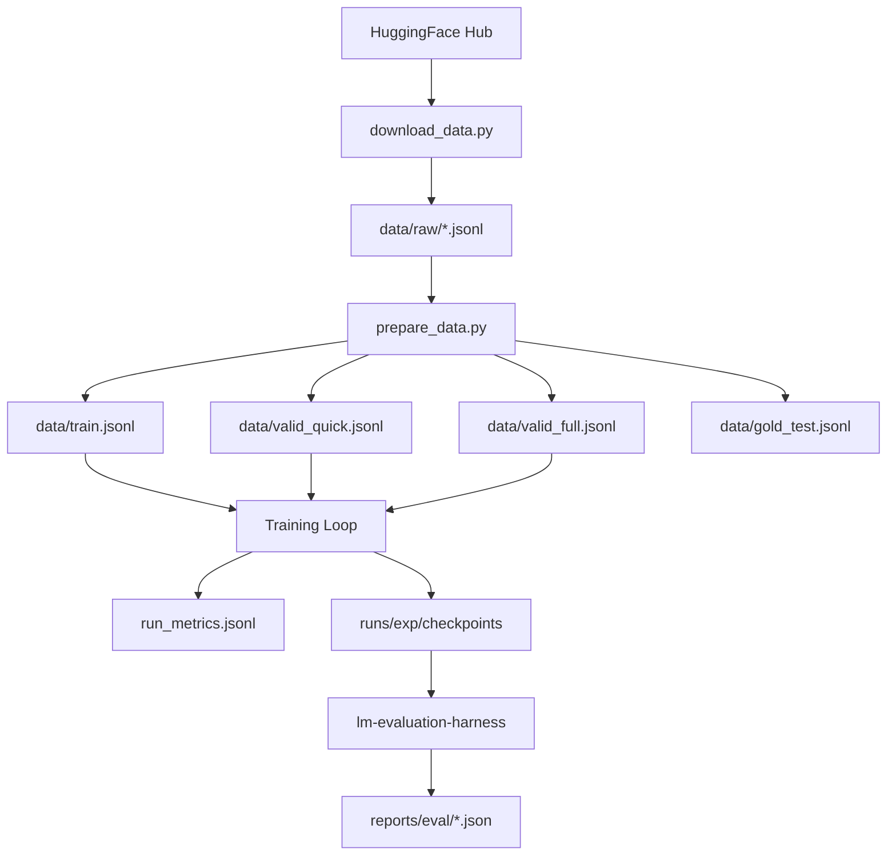

## 主要フロー1: TG-LoRA学習サイクル 🔵

**信頼性**: 🔵 *train_tg_lora.pyのサイクルループ実装・要件REQ-016より*

**関連要件**: REQ-001, REQ-002, REQ-003, REQ-004, REQ-005, REQ-009, REQ-011, REQ-012, REQ-016

```mermaid
sequenceDiagram
    participant Loop as Training Loop
    participant RM as RollbackManager
    participant DT as DeltaTracker
    participant Vel as Velocity
    participant RW as RandomWalkCtrl
    participant LS as LayerSampler
    participant Ext as Extrapolator
    participant Eval as eval_loss
    participant Log as run_metrics

    Loop->>RM: save(model) → W0 snapshot（NaN/Infサニタイズ: REQ-064）
    Loop->>Loop: Pilot: K steps backward
    Note over Loop: 新規optimizer作成<br/>grad_accumステップ反復
    Loop->>RM: save(model) → WK snapshot（NaN/Infサニタイズ: REQ-064）
    Loop->>DT: compute_mean_delta(W0, WK, K)
    DT-->>Loop: dW = (WK - W0) / K
    Loop->>Vel: update(dW, beta)
    Vel-->>Loop: velocity state更新
    Loop->>Vel: cosine_similarity(dW)
    Vel-->>Loop: sim_score
    Loop->>RM: save(model) → pilot snapshot（NaN/Infサニタイズ: REQ-064）
    Loop->>Eval: quick_eval(pilot state)
    Eval-->>Loop: loss_pilot
    Loop->>RW: propose() → {K, N, alpha, beta, strategy}
    RW-->>Loop: hyperparams
    Loop->>LS: select_active_layers(model, strategy)
    LS-->>Loop: active_layer_names
    Loop->>Ext: apply_extrapolation(model, velocity, active_names, alpha, N, cap)
    Note over Ext: W += N × alpha × velocity<br/>cap_update適用（非有限入力→ゼロ: REQ-063）
    Loop->>Loop: NaN/Inf検証（REQ-056）<br/>非有限パラメータ → ロールバック
    Loop->>Eval: quick_eval(extrapolated state)
    Eval-->>Loop: loss_after
    alt loss_after ≤ loss_pilot × (1 + tolerance)
        Loop->>RW: accept() → reward()
        Note over RW: alpha増加<br/>N増加候補
        Loop->>Log: cycle accepted metrics
    else loss_after > threshold
        Loop->>RM: rollback(model) → pilot snapshot
        Loop->>RW: accept() → penalize()
        Note over RW: alpha減少<br/>N減少候補
        Loop->>Log: cycle rejected metrics
    end
    Loop->>RM: pop() → 履歴クリーンアップ
```

**詳細ステップ**:

1. **Snapshot W0**: RollbackManagerで外挿前のLoRA状態を保存（REQ-009）。NaN/Infはサニタイズ（REQ-064）
2. **Pilot Phase**: K回の標準backward passを実行。各サイクルで新規optimizer（AdamW）を作成（REQ-016）
3. **Snapshot WK**: pilot完了後のLoRA状態を保存（NaN/Infサニタイズ: REQ-064）
4. **Delta計算**: `(WK - W0) / K` で平均デルタを計算（REQ-004）。非有限normは履歴に追加しない（REQ-068）
5. **Velocity更新**: EMAでvelocity状態を平滑化（REQ-001）
6. **Quick Eval (pilot)**: valid_quickデータでpilot状態の損失を評価（REQ-032）
7. **Hyperparam提案**: RandomWalkControllerがK, N, α, β, strategyを提案（REQ-011）
8. **Layer選択**: 設定された戦略で外挿対象レイヤーを選択（REQ-006）
9. **外挿適用**: velocity方向に `N × alpha` 歩の重み更新。cap_updateで異常な更新を制限（REQ-002, REQ-003）。非有限入力はゼロ返却（REQ-063）
9b. **NaN/Inf検証**: 外挿後のLoRAパラメータが有限値であることを検証。非有限値検出時は外挿を棄却としてロールバック（REQ-056, EDGE-121）
10. **Quick Eval (extrapolated)**: 外挿後の損失を評価
11. **受理/拒否判定**: 損失比較で外挿を受理するかロールバックするか決定（REQ-012）
12. **適応制御**: 受理時にα増加、拒否時にα減少（REQ-013）
13. **メトリクス記録**: cycle情報、損失、受理率、cosine simをJSONLに記録（NFR-302）

## 主要フロー2: ベースラインQLoRA学習 🔵

**信頼性**: 🔵 *train_baseline_qlora.py実装・要件REQ-015より*

**関連要件**: REQ-015, REQ-017, REQ-018, REQ-019

```mermaid
sequenceDiagram
    participant Loop as Training Loop
    participant TL as trainer_loop
    participant Eval as eval_loss
    participant Log as run_metrics
    participant FS as filesystem

    Loop->>Loop: Initialize optimizer, scheduler
    loop max_steps iterations
        Loop->>TL: forward_backward(batch, model, accum)
        TL-->>Loop: loss (scaled)
        Loop->>TL: optimizer_step(optimizer, scheduler, max_grad_norm)
        Note over TL: grad clipping → weight update<br/>scheduler step → zero_grad
        alt log interval
            Loop->>Log: step metrics (loss, lr, grad_norm)
        end
        alt eval interval
            Loop->>Eval: full_eval(valid_loader)
            Eval-->>Loop: eval_loss
            Loop->>Log: eval metrics
        end
        alt save interval
            Loop->>FS: save checkpoint
        end
    end
    Loop->>FS: save best model
    Loop->>Log: footer (best_loss, total_steps)
```

## 主要フロー3: チェックポイント保存 🔵

**信頼性**: 🔵 *checkpoint.py save_checkpoint実装・Phase 21 DRYリファクタリングより*

**関連要件**: REQ-079

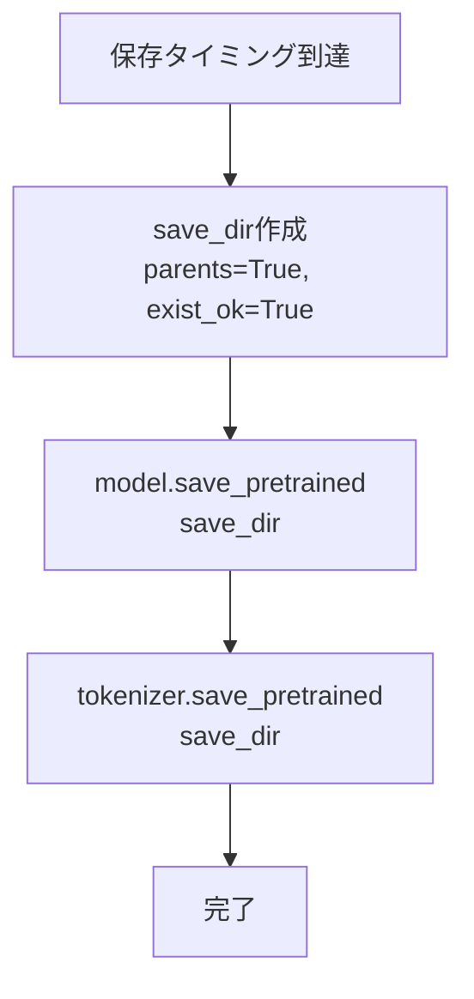

**Phase 23完了**（REQ-081）: readback検証（保存先ディレクトリ存在確認・ファイル数確認）を実装済み。不完全なチェックポイントを検出した場合は警告をログ出力 🔵 *checkpoint.py readback実装・test_checkpoint.py 7テスト・TASK-0051完了より*

## 主要フロー3a: ロールバック例外レジリエンス 🔵

**信頼性**: 🔵 *train_tg_lora.py rollback try-catch実装・Phase 22修正（REQ-076）より*

**関連要件**: REQ-076, REQ-077

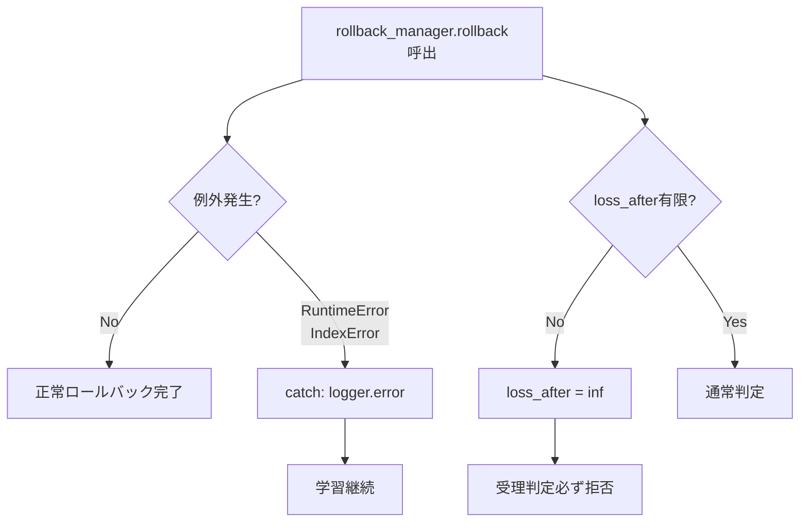

**Phase 23完了**（REQ-084）: モックでrollback()を例外送出に設定し、学習ループが継続またはgracefulに終了するE2Eテストを実装済み 🔵 *test_training_integration.py TestRollbackFailureResilience 2テスト・TASK-0054完了より*

## 主要フロー3b: 学習状態シリアライズ・デシリアライズ 🔵

**信頼性**: 🔵 *checkpoint.py TrainingState実装・Phase 27（REQ-103~105）より*

**関連要件**: REQ-103, REQ-104, REQ-105

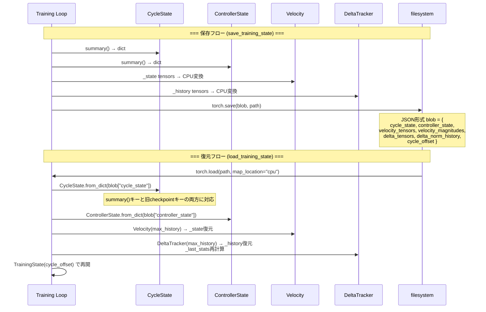

**詳細ステップ**:

1. **CycleState.summary()** → cycles, backward_passes, extrapolation_steps, reduction_rate, best_valid_loss, stale_cycles, acceptance_rate等のdictを出力（REQ-104）
2. **ControllerState.summary()** → K, N, alpha, beta, lr, strategy, layer_scores, boost/decay paramsのdictを出力（REQ-103）
3. **Velocity tensor CPU変換** → GPU tensorをCPUに移動してシリアライズ可能にする
4. **DeltaTracker history CPU変換** → 各履歴エントリのtensorをCPUに移動
5. **torch.save()** → PyTorch形式でblobをディスクに保存
6. **load_training_state()** → `torch.load()` でblobを読み込み、各コンポーネントをfrom_dict()で再構築。CycleStateは`summary()`キーと旧checkpointキーの両方に対応（後方互換）
7. **DeltaTracker最適化** → 最後の履歴エントリから`_compute_stats`で`_last_stats`を再計算

## 主要フロー3c: 運用診断ヘルスチェック 🔵

**信頼性**: 🔵 *scripts/diagnose.py実装・Phase 27（REQ-106）より*

**関連要件**: REQ-106

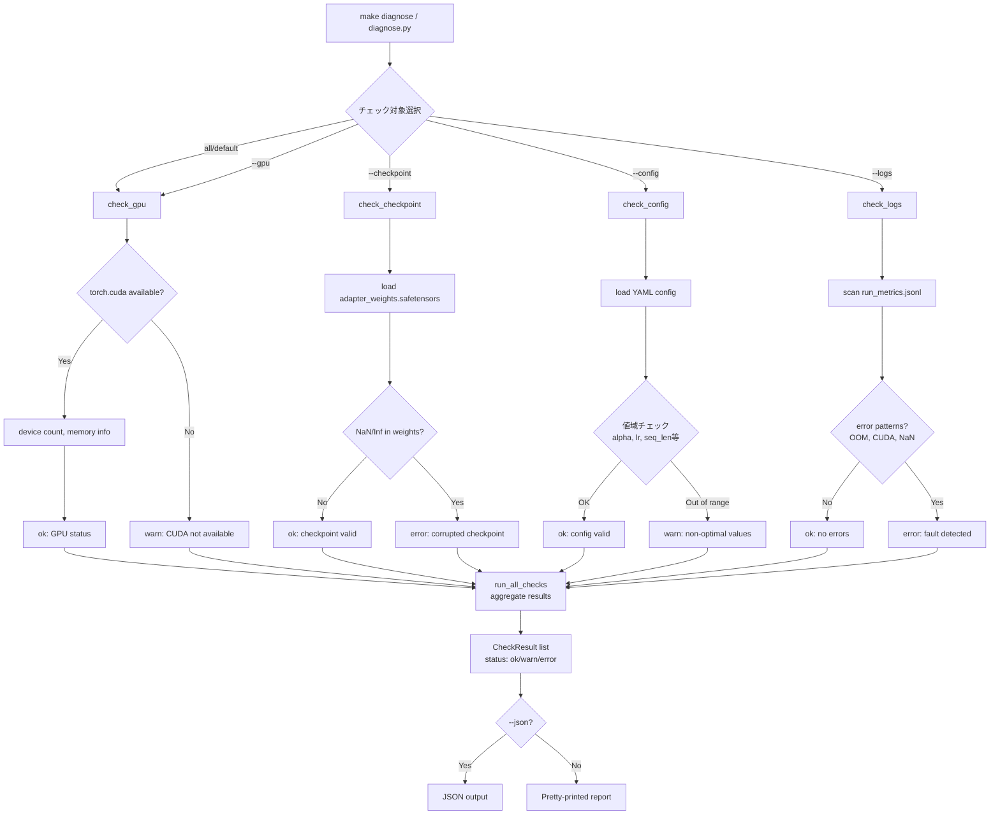

## 主要フロー3d: 障害回復 🔵

**信頼性**: 🔵 *scripts/recover.py実装・Phase 27（REQ-107）より*

**関連要件**: REQ-107

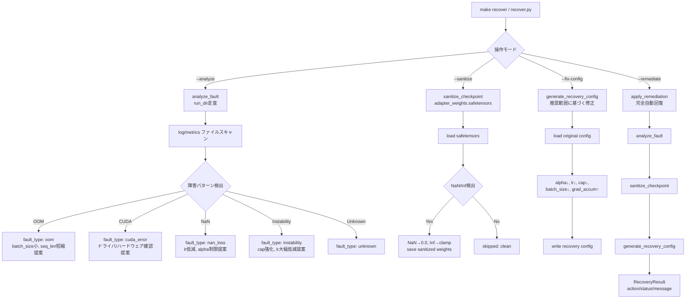

## 主要フロー3e: CI パイプライン 🔵

**信頼性**: 🔵 *Makefile ci target実装・Phase 27（REQ-108）より*

**関連要件**: REQ-108

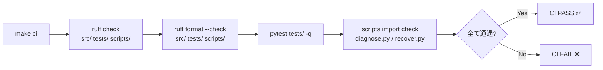

**CI パイプライン構成**:
1. **Lint**: `ruff check` でコード品質チェック
2. **Format**: `ruff format --check` でフォーマット検証
3. **Test**: `pytest tests/ -q` でテストスイート実行（98ファイル, 2098テスト）
4. **Script Import**: diagnose.py/recover.pyの正常import確認（パスエラー早期検出）

## 主要フロー4: データパイプライン 🔵

**信頼性**: 🔵 *download_data.py・prepare_data.py・build_seed_dataset.py実装・要件REQ-025~REQ-027より*

**関連要件**: REQ-025, REQ-026, REQ-027

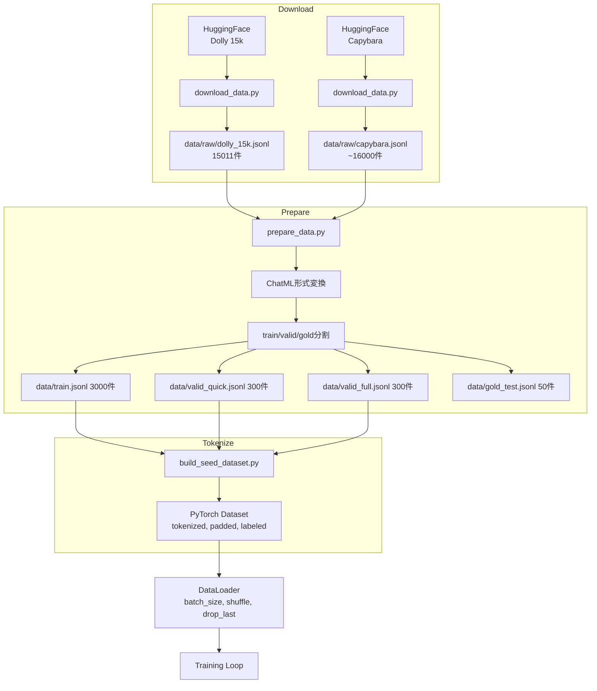

**ChatMLフォーマット** 🔵:

```
<|im_start|>user
{instruction}<|im_end|>
<|im_start|>assistant
{response}<|im_end|>
```

context付き場合:
```
<|im_start|>user
Context: {context}

{instruction}<|im_end|>
<|im_start|>assistant
{response}<|im_end|>
```

## 主要フロー5: 評価パイプライン 🔵

**信頼性**: 🔵 *eval_loss.py・run_eval.sh・run_eval_lora.sh実装・要件REQ-032~REQ-035より*

**関連要件**: REQ-032, REQ-033, REQ-034, REQ-035, REQ-101

### 学習中評価 🔵

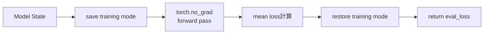

**信頼性**: 🔵 *eval_loss.py context manager実装・要件NFR-103より*

### ベンチマーク評価（LoRAアダプタ） 🔵

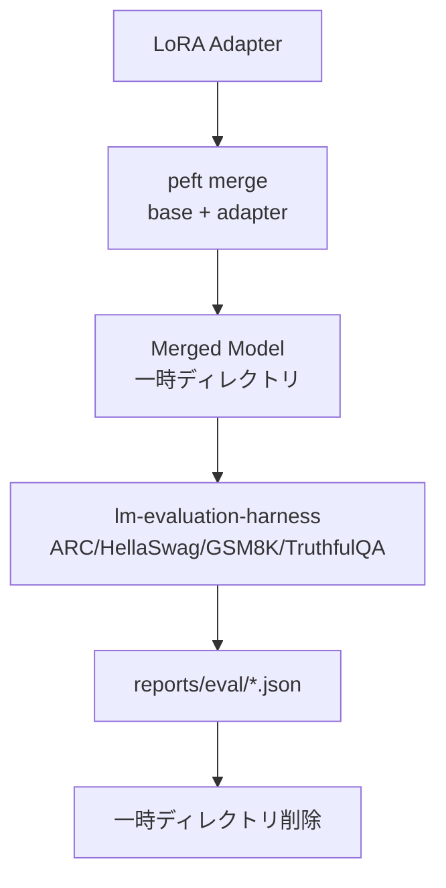

**信頼性**: 🔵 *run_eval_lora.sh 3-phase実装・要件REQ-101より*

### Velocity opsマイクロベンチマーク 🔵

**信頼性**: 🔵 *benchmark_velocity_ops.py実装・要件REQ-147より*

**関連要件**: REQ-147, REQ-148

```mermaid
flowchart TD
    Start["make bench-velocity-ops<br/>or python scripts/benchmark_velocity_ops.py"] --> ParseArgs[引数パース<br/>--iterations / --quick]
    ParseArgs --> EMA["benchmark_velocity_ema()<br/>Velocity.update 1000回反復"]

    subgraph EMA Benchmark
        EMA --> InitVel[Velocity max_history=1000]
        InitVel --> GenDeltas[4層×(64,64)ランダムdelta生成<br/>128パターンをループ再利用]
        GenDeltas --> EMALoop[i % 128 のdeltaで<br/>vel.update(delta, beta=0.9)]
        EMALoop --> EMAResult["velocity_ema_time_ms<br/>velocity_ema_per_iter_ms<br/>velocity_ema_mem_delta_kb"]
    end

    ParseArgs --> CapUp["benchmark_cap_update()<br/>cap_update 1000回反復"]

    subgraph cap_update Benchmark
        CapUp --> GenUpdate["1024×1024 ランダムtensor生成<br/>update + ref"]
        GenUpdate --> CapLoop["update.clone() → cap_update(u, ref)<br/>max_ratio=0.01"]
        CapLoop --> CapResult["cap_update_time_ms<br/>cap_update_per_iter_ms<br/>cap_update_nocap_time_ms"]
    end

    EMAResult --> JSON["JSON出力<br/>stdout"]
    CapResult --> JSON
```

**設計意図**: in-place ops（mul_/add_）のdata_ptr保存（REQ-144~145）の性能メリットを定量的に測定。観測的ベンチマークとしてJSON出力、将来的に--baselineフラグで回帰検出を追加予定。

## 主要フロー6: 比較実験 🔵

**信頼性**: 🔵 *run_comparison.sh・compare_runs.py実装・要件REQ-036~REQ-037より*

**関連要件**: REQ-036, REQ-037

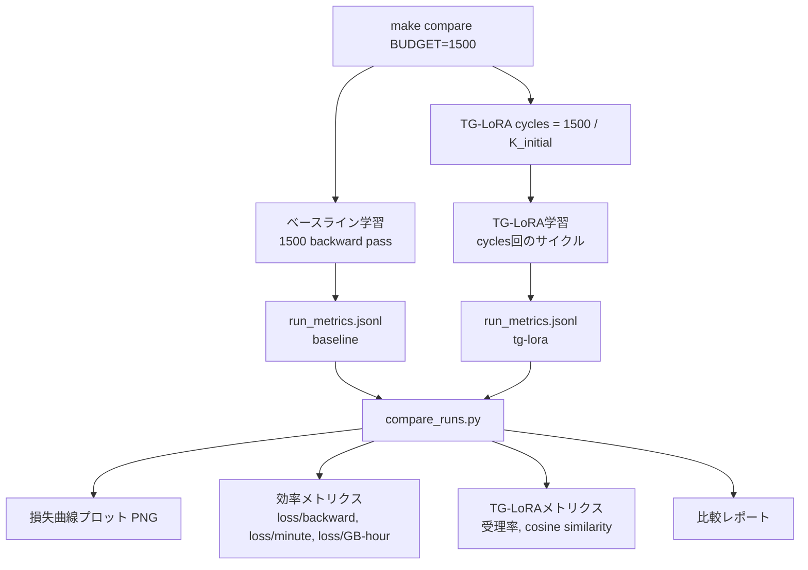

## 主要フロー7: Prefix Feature Cache 🔵

**信頼性**: 🔵 *src/tg_lora/prefix_feature_cache.py・src/training/train_tg_lora.py・要件REQ-126より*

**関連要件**: REQ-125, REQ-126

凍結されたプレフィクス層の隠れ状態を事前計算し、学習・評価時にサフィックス層のみでforward passを実行するフロー。`prefix_feature_cache_experimental: true` で有効化。

### ビルドフェーズ（事前計算） 🔵

**信頼性**: 🔵 *build_prefix_feature_dataset() 実装より*

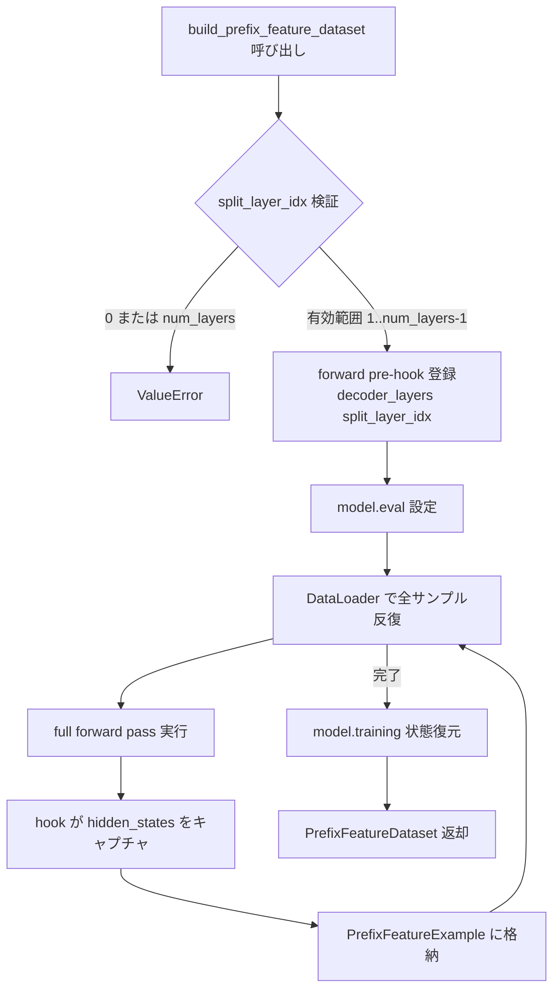

**詳細ステップ**:

1. `split_layer_idx` が `(0, num_layers)` 範囲外の場合 `ValueError`
2. `register_forward_pre_hook` で `decoder_layers[split_layer_idx]` の入力をキャプチャ
3. モデルを eval モードに設定し、非シャッフル DataLoader で全サンプルを反復
4. フル forward pass 実行時、hook が hidden_states を取得
5. `finally` ブロックでモデルの training/eval 状態を復元
6. `max_batches` 設定時は指定バッチ数で打ち切り

### キャッシュ管理フロー（3段階ルックアップ） 🔵

**信頼性**: 🔵 *train_tg_lora.py _maybe_cache_dataset() 実装より*

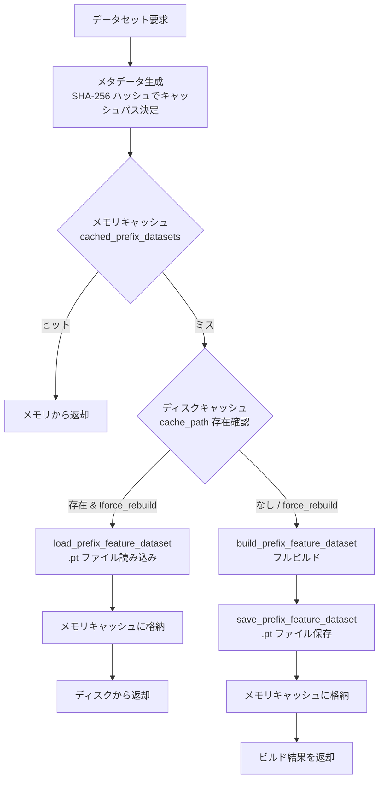

**メタデータによるキャッシュキー決定**: データセットパス・モデル名・seed・max_seq_len・split_layer_idx・lora_r・lora_alpha・lora_dropout・lora_target_modules・trainable_lora_scope を SHA-256 ハッシュし、先頭24文字をキャッシュファイル名に使用。ハイパーパラメータ変更時は自動的にキャッシュミスとなる。

### 推論フェーズ（キャッシュされた隠れ状態からの損失計算） 🔵

**信頼性**: 🔵 *src/training/loss.py compute_loss()・src/tg_lora/activation_cache.py forward_from_hidden_states() 実装より*

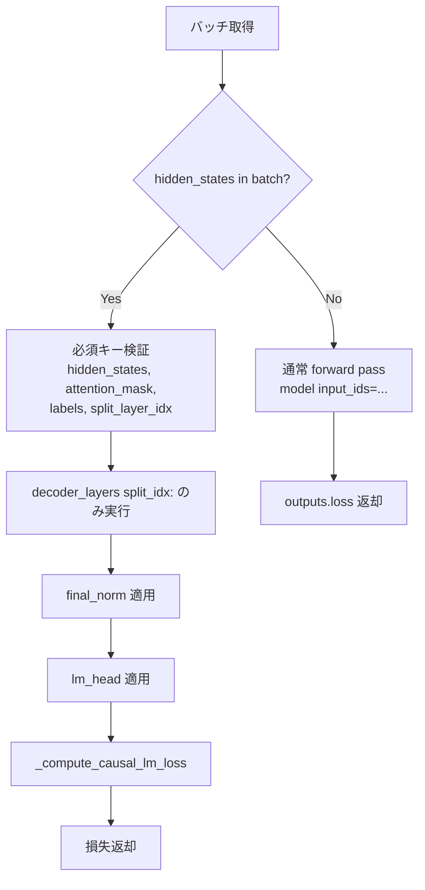

### 学習ループ統合 🔵

**信頼性**: 🔵 *train_tg_lora.py 実装より*

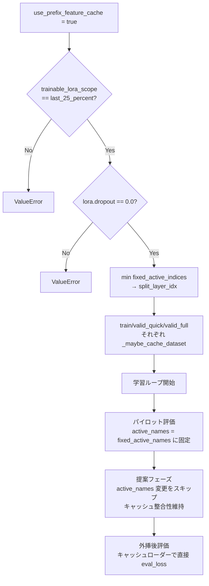

**制約**: キャッシュ有効時は `select_active_layers` をスキップし、アクティブ層を `fixed_active_names` に固定。ランダムウォークによる層選択変更がキャッシュを無効化しないよう保証。

## 主要フロー7a: AsyncCacheBuilder（2-GPU非同期キャッシュビルド） 🔵

**信頼性**: 🔵 *src/training/async_cache_builder.py・src/training/train_tg_lora.py 統合実装・コミット eceddf3/a316624/43a329a/75b8032より*

**関連要件**: REQ-126

2-GPU環境で、学習をブロックせずにバックグラウンドGPU上でPrefix Feature Cacheを並列ビルドするフロー。`prefix_feature_cache_async: true` + `prefix_feature_cache_async_device: "cuda:1"` で有効化。

### 正当性の根拠 🔵

PEFTはLoRAのB行列をゼロで初期化するため、初期化時のLoRA(x) = B @ A @ x = 0となり、モデル出力はベースモデルと同一。新しいモデルコピーは同じPrefix Featureを生成する。

### 非同期ビルドフロー 🔵

**信頼性**: 🔵 *async_cache_builder.py start()/poll()/get_result() 実装より*

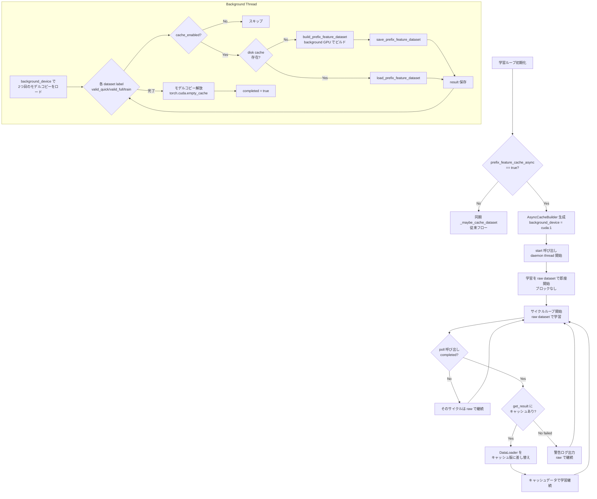

### 設定クロスバリデーション 🔵

**信頼性**: 🔵 *config_schema.py TrainingConfig prefix_feature_cache_async/async_device validators・コミット 43a329aより*

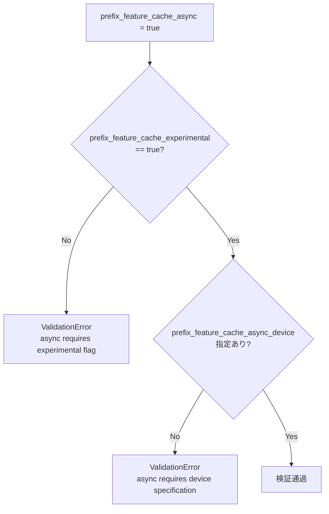

### AsyncCacheBuildResult データ構造 🔵

**信頼性**: 🔵 *async_cache_builder.py AsyncCacheBuildResult dataclass より*

| フィールド | 型 | 説明 |
|-----------|-----|------|
| `label` | str | データセットラベル（valid_quick/valid_full/train） |
| `dataset` | PrefixFeatureDataset or None | ビルド結果（失敗時はNone） |
| `build_seconds` | float | ビルドにかかった秒数（disk hit時は0.0） |
| `source` | str | "built" / "disk" / "error" |
| `cache_path` | Path | キャッシュファイルのパス |
| `error` | Exception or None | エラー情報（成功時はNone） |

## 主要フロー8: --resume障害回復再開 🔵

**信頼性**: 🔵 *train_tg_lora.py resume_path・checkpoint.py TrainingState・要件REQ-162~164より*

**関連要件**: REQ-162, REQ-163, REQ-164, EDGE-183, EDGE-184

`--resume path/to/training_state.pt` で保存済みTrainingStateから学習を再開するフロー。OOM・CUDA error等の障害発生時に自動保存された状態から中断箇所を継続。

```mermaid
flowchart TD
    Start["main() --resume 引数パース"] --> HasResume{resume_path<br/>指定あり?}
    HasResume -->|No| Normal[通常の新規学習開始]
    HasResume -->|Yes| Load["load_training_state(path)<br/>TrainingState復元"]
    Load --> Restore["controller.restore_state()<br/>state値のみ置換<br/>config保持"]
    Restore --> Vel["velocity復元<br/>_state, magnitude_history"]
    Vel --> DT["delta_tracker復元<br/>_history, norm_history"]
    DT --> CS["cycle_state復元<br/>cycle, best_loss, stale_cycles"]
    CS --> Offset["cycle_offset = ts.cycle_offset"]

    Offset --> Loop["サイクルループ開始<br/>total_cycles回"]
    Loop --> Check{cycle < cycle_offset?}
    Check -->|Yes: スキップ| Skip["pbar.update(0)<br/>continue"]
    Check -->|No| NormalCycle["通常サイクル実行<br/>pilot → 外挿 → 受理/拒否"]
    NormalCycle --> Next[次サイクル]
    Skip --> Next
    Next --> Loop

    subgraph "TrainingState構造"
        TSField["cycle_state: CycleState<br/>controller_state: ControllerState<br/>velocity: Velocity<br/>delta_tracker: DeltaTracker<br/>cycle_offset: int"]
    end
```

**TrainingState永続化の内容** 🔵:

| フィールド | シリアライズ方法 | 復元時処理 |
|-----------|---------------|-----------|
| `cycle_state` | `summary()` → dict | `from_dict()` で復元（last_valid_loss含む） |
| `controller_state` | `summary()` → dict | `from_dict()` で復元（K/N/alpha/beta/lr） |
| `velocity._state` | `{k: v.cpu() for k, v}` | `_sanitize_tensors()` → NaN/Inf除去 |
| `velocity._magnitude_history` | list[float] | そのまま復元 |
| `delta_tracker._history` | `[{k: v.cpu() for k, v}]` | `_sanitize_tensors()` → NaN/Inf除去 |
| `delta_tracker._norm_history` | list[float] | そのまま復元 |
| `cycle_offset` | int | 復元時のスキップ基準値 |

**restore_state()の設計ポイント** 🔵:
- controllerのcandidates/bounds/tolerancesはコンストラクタ時の値を保持
- state値（K, N, alpha, beta, lr, counts）のみを置換（EDGE-183）
- `last_accel_action` は0にリセット（再開直後の誤動作防止）

## Velocity加速度適応フロー 🔵

**信頼性**: 🔵 *velocity.py magnitude_acceleration()・random_walk_controller.py adapt_to_acceleration()・要件REQ-153, REQ-165より*

**関連要件**: REQ-153, REQ-154, REQ-155, REQ-165, EDGE-185, EDGE-186

各サイクルでvelocityのmagnitude加速度を計算し、正（不安定）/負（収束）/ゼロ（安定）に応じてlrとKを調整するフロー。

```mermaid
flowchart TD
    Start["サイクル終了後<br/>velocity.update(delta, beta)完了"] --> CalcAcc["magnitude_acceleration()<br/>magnitude_history の二階微分"]

    CalcAcc --> Check{n < 3件?}
    Check -->|Yes| Return0["0.0を返却"]
    Check -->|No| Slopes["recent = history[-window:]<br/>slopes[i] = recent[i] - recent[i-1]"]
    Slopes --> Accel["acceleration = mean(slopes[i] - slopes[i-1])"]
    Accel --> ReturnAcc["acceleration を返却"]

    ReturnAcc --> Adapt["controller.adapt_to_acceleration(acceleration)"]
    Return0 --> Adapt

    Adapt --> RWCheck{enable_random_walk?}
    RWCheck -->|No| ZeroAction["last_accel_action = 0<br/>変更なし"]
    RWCheck -->|Yes| Sign{accelerationの符号}

    Sign -->|> 0: 不安定| Instable["last_accel_action = 1<br/>lr × accel_instability_lr_decay<br/>K を次候補に増加"]
    Sign -->|< -1e-12: 収束| Converge["last_accel_action = -1<br/>lr × accel_convergence_lr_boost"]
    Sign -->|その他| Stable["last_accel_action = 0<br/>変更なし"]

    Instable --> ClampLr["lr clamp [lr_min, lr_max]"]
    Converge --> ClampLr
    Stable --> Mlflow["MLflow: magnitude_acceleration<br/>+ accel_action ログ"]
    ClampLr --> Mlflow
    ZeroAction --> Mlflow
```

**加速度パラメータの設定フロー** 🔵:

**信頼性**: 🔵 *config_schema.py TGLoRAParams・要件REQ-160, REQ-161より*

```mermaid
flowchart TD
    YAML["YAML設定ファイル"] --> Parse["Hydra/OmegaConf パース"]
    Parse --> Validate["Pydantic TGLoRAParams 検証"]

    Validate --> P1{"accel_instability_lr_decay<br/>∈ (0.0, 1.0)?"}
    P1 -->|No| Err1["ValidationError<br/>gt=0.0, lt=1.0"]
    P1 -->|Yes| P2{"accel_convergence_lr_boost<br/>> 1.0?"}
    P2 -->|No| Err2["ValidationError<br/>gt=1.0"]
    P2 -->|Yes| Pass["検証通過"]

    Pass --> Controller["RandomWalkController<br/>accel_instability_lr_decay=...<br/>accel_convergence_lr_boost=..."]

    Controller --> Defaults["デフォルト値:<br/>decay=0.7, boost=1.1"]
```

## データ処理パターン

### 勾配蓄積（Gradient Accumulation） 🔵

**信頼性**: 🔵 *trainer_loop.py forward_backward実装・要件REQ-017より*

```
effective_batch = batch_size × grad_accumulation

for i in range(grad_accumulation):
    loss = forward(batch_i) / grad_accumulation
    loss.backward()  # 勾配蓄積

optimizer_step()  # 蓄積された勾配で1回更新
```

### Velocity EMA更新 🔵

**信頼性**: 🔵 *velocity.py実装・要件REQ-001より*

```
初回: v = dW
以降: v = β × v_prev + (1 - β) × dW

cosine_sim(v, dW) = (v · dW) / (||v|| × ||dW||)
```

### 外挿更新（cap付き） 🔵

**信頼性**: 🔵 *extrapolator.py apply_extrapolation・cap_update実装・要件REQ-002, REQ-003より*

```
update = N × alpha × velocity
capped_update = cap_update(update, reference_param, max_ratio)

# cap_update:
if ||update|| > max_ratio × ||reference||:
    update = update × (max_ratio × ||reference||) / ||update||
```

## エラーハンドリングフロー 🔵

**信頼性**: 🔵 *train_tg_lora.py try/finally・rollback_manager.py・eval_loss.py・trainer_loop.py NumericalInstabilityError実装・Phase 14修正より*

```mermaid
flowchart TD
    A[サイクル開始] --> B[save rollback snapshot<br/>NaN/Infサニタイズ]
    B --> C[外挿適用<br/>cap_update非有限ガード]
    C --> D{例外発生?}
    D -->|No| D2{NaN/Inf検証<br/>REQ-056}
    D -->|Yes| F[finally: rollback]
    D2 -->|有限値| E[損失評価]
    D2 -->|非有限値| I[rollback + penalize]
    E --> G{loss_after OK?}
    G -->|Yes| H[受理]
    G -->|No| I
    F --> J[次サイクル]
    H --> J
    I --> J
```

**確実なロールバック保証** 🔵:
- `try/finally` ブロックで例外時もロールバック実行（要件NFR-102）
- eval_loss context manager でdropout/training mode の状態復元（要件NFR-103）
- rollback履歴の空状態でのpop/clearも安全に処理（要件EDGE-103）
- スナップショット保存時のNaN/Infサニタイズで破損復元を防止（REQ-064）
- 履歴サイズ上限（max_history）でメモリ使用量を制御（REQ-065）

### 設定検証フロー 🔵

**信頼性**: 🔵 *config_schema.py extra='forbid'・Phase 14修正より*

```mermaid
flowchart TD
    A[YAML読込] --> B{dict/mapping?}
    B -->|No| C[ValueError拒否<br/>REQ-062]
    B -->|Yes| D[Pydantic検証]
    D --> E{extra='forbid'<br/>未知フィールド?}
    E -->|Yes| F[ValidationError拒否<br/>REQ-061]
    E -->|No| G{値域制約OK?<br/>REQ-047}
    G -->|No| F
    G -->|Yes| H{列挙型OK?<br/>REQ-058}
    H -->|No| F
    H -->|Yes| I[検証通過]
    I --> J[preflight検証<br/>REQ-046]
    J --> K[学習開始]
```

## 状態管理フロー

### Velocity状態 🔵

**信頼性**: 🔵 *velocity.py実装・要件REQ-203より*

```mermaid
stateDiagram-v2
    [*] --> 未初期化
    未初期化 --> 初期化済み: update(delta, beta)<br/>state = delta
    初期化済み --> 初期化済み: update(delta, beta)<br/>state = β×prev + (1-β)×delta
    初期化済み --> 0.0: cosine_similarity(None)
    初期化済み --> [0,1]: cosine_similarity(delta)
```

### ロールバック履歴 🔵

**信頼性**: 🔵 *rollback_manager.py実装・要件REQ-010より*

```mermaid
stateDiagram-v2
    [*] --> 空
    空 --> 1件: save()
    1件 --> 2件: save()
    2件 --> 1件: rollback() → 復元
    1件 --> 空: pop() / rollback()
    空 --> 空: pop() / clear() → no-op
```

### RandomWalk適応制御 🔵

**信頼性**: 🔵 *random_walk_controller.py実装・要件REQ-013, REQ-013a, REQ-150より*

```mermaid
stateDiagram-v2
    [*] --> Propose: propose()
    Propose --> Accepted: accept()<br/>loss_after ≤ threshold
    Propose --> Rejected: accept()<br/>loss_after > threshold
    Accepted --> Reward: reward()<br/>α増加, N↑候補<br/>lr × lr_accept_boost
    Rejected --> Penalize: penalize()<br/>α減少, N↓候補<br/>lr × lr_reject_decay
    Reward --> ConvergenceCheck: adapt_to_convergence()
    Penalize --> ConvergenceCheck
    ConvergenceCheck --> Propose: 次サイクル<br/>lr clamp [lr_min, lr_max]

    note right of Propose
        propose()内LR探索（REQ-150）:
        random() < lr_explore_prob の場合:
        log_lr = log(state.lr) + N(0, lr_log_sigma)
        new_lr = exp(log_lr), clamp [lr_min, lr_max]
        結果はProposal.lrとして返却
        → train_tg_lora.pyでstate.lrに反映
    end note

    note right of ConvergenceCheck
        convergence_trend >= 0 の場合:
        lr × 0.8 (proactive減少)
        K増加 (探索拡大)
    end note
```

### 適応学習率フロー 🔵

**信頼性**: 🔵 *random_walk_controller.py reward/penalize実装・要件REQ-013a, REQ-054より*

```mermaid
flowchart TD
    Start[サイクル判定結果] --> Result{受理 or 拒否}
    Result -->|受理| Boost[lr_new = lr × lr_accept_boost]
    Result -->|拒否| Decay[lr_new = lr × lr_reject_decay]
    Boost --> Clamp1{lr_new > lr_max?}
    Decay --> Clamp2{lr_new < lr_min?}
    Clamp1 -->|Yes| Max[lr = lr_max]
    Clamp1 -->|No| Keep1[lr = lr_new]
    Clamp2 -->|Yes| Min[lr = lr_min]
    Clamp2 -->|No| Keep2[lr = lr_new]
    Max --> Convergence[adapt_to_convergence]
    Keep1 --> Convergence
    Min --> Convergence
    Keep2 --> Convergence
    Convergence --> Trend{convergence_trend >= 0<br/>AND total_cycles > 2?}
    Trend -->|Yes| Reduce[lr × 0.8<br/>K増加]
    Trend -->|No| NoChange[変更なし]
    Reduce --> Next[次サイクルへ]
    NoChange --> Next
```

**lr_reject_decay = 0.5 の設計意図**: 拒否時にlrを半減させることで、外挿失敗時の急激な保守的シフトを実現。0.7（旧値）に比べ、不安定状態からの回復をより速くする。境界クランプ [lr_min, lr_max] でlrが極端な値にならないことを保証（要件REQ-054）。

### LR探索 log-normalランダムウォーク 🔵

**信頼性**: 🔵 *random_walk_controller.py propose() lr walk実装・train_tg_lora.py line 891 配線・要件REQ-150~152より*

**関連要件**: REQ-150, REQ-151, REQ-152

```mermaid
flowchart TD
    Start["propose() 呼び出し"] --> RWCheck{enable_random_walk?}
    RWCheck -->|No| Static["state.lr をそのまま返却"]
    RWCheck -->|Yes| LrCheck{"random() < lr_explore_prob<br/>AND state.lr > 0?"}
    LrCheck -->|No| KeepLr["new_lr = state.lr"]
    LrCheck -->|Yes| LogNormal["log_lr = log(state.lr)<br/>noise = N(0, lr_log_sigma)<br/>new_lr = exp(log_lr + noise)"]
    LogNormal --> Clamp["new_lr = clamp(new_lr, lr_min, lr_max)"]
    Clamp --> Return["Proposal(lr=new_lr, ...) を返却"]
    KeepLr --> Return

    Return --> TrainLoop["train_tg_lora.py:<br/>controller.state.lr = proposal.lr"]
    TrainLoop --> Optimizer["optimizer = prepare_for_cycle(lr=state.lr)"]
    Optimizer --> NextCycle["次サイクルで探索済みlrが使用される"]

    Static --> Return
```

**設計意図**: lr_explore_prob > 0 の場合、propose()は確率的にlog-normalランダムウォークでlrを探索する。生成されたlrはProposal.lrとして返却され、train_tg_lora.pyでcontroller.state.lrに反映される（REQ-151）。これにより、決定論的なboost/decay単独では到達できないlr領域を探索可能になる。探索後のlrはreward/penalizeでさらに調整され、最終的に[lr_min, lr_max]にクランプされる。lr_explore_prob=0の場合はpropose()がstate.lrをそのまま返すため、探索は無効（REQ-150）。

### 収束適応の独立制御 🔵

**信頼性**: 🔵 *random_walk_controller.py adapt_to_convergence() enable_convergence_adaptation実装より*

`adapt_to_convergence()`は`enable_convergence_adaptation`フラグで`enable_random_walk`とは独立して制御可能。これにより、random walk探索を無効化した確定的実験でも収束適応のみを有効にする構成が可能。

```mermaid
flowchart TD
    Start["adapt_to_convergence() 呼び出し"] --> Check{"enable_convergence_adaptation<br/>== true?"}
    Check -->|No| Skip["早期return: 変更なし"]
    Check -->|Yes| CycleCheck{"total_cycles > 2?"}
    CycleCheck -->|No| Skip
    CycleCheck -->|Yes| Trend{"convergence_trend >= 0<br/>（停滞または悪化）?"}
    Trend -->|No| Healthy["健康: 変更なし"]
    Trend -->|Yes| Stalling["lr × 0.8<br/>K増加候補"]
    Stalling --> Clamp["lr clamp [lr_min, lr_max]"]
```

**設計意図**: `enable_random_walk`と`enable_convergence_adaptation`の分離により、以下の構成が可能:
- `enable_random_walk=false, enable_convergence_adaptation=true`: 確定的なK/N/alpha探索で収束時のみproactive適応
- `enable_random_walk=true, enable_convergence_adaptation=false`: ランダム探索のみで収束適応なし
- 両方true: 完全適応モード（デフォルト）

## 主要フロー9: Accel Param Sweep分析パイプライン 🔵

**信頼性**: 🔵 *scripts/analyze_accel_sweep.py実装・Phase 43-44より*

**関連要件**: REQ-168~170

accel param実験のスイープ結果を分析し、収束軌跡・受理率・効率メトリクスを統合レポートとして出力するフロー。

```mermaid
flowchart TD
    Start["python scripts/analyze_accel_sweep.py<br/>reports/accel_sweep/<timestamp>"] --> Gather["gather_runs()<br/>スイープディレクトリ内の全runを収集"]

    Gather --> Parse["parse_jsonl() で各runのJSONLを1回のみ解析"]
    Parse --> Cache["run._parsed_records にキャッシュ"]

    Cache --> Augment["フッター欠損runの補完<br/>best_valid_loss, final_train_loss等"]

    Augment --> Trajectory["compute_loss_trajectory()<br/>収束軌跡メトリクス計算"]

    subgraph "収束軌跡分析"
        Trajectory --> Slope["線形回帰slope"]
        Trajectory --> Plateau["_detect_plateau()<br/>5連続step改善<閾値"]
        Trajectory --> Speed["convergence_speed<br/>前25%での改善割合"]
        Trajectory --> Half["half_reduction_cycle"]
    end

    Augment --> AcceptRate["_accept_rate()<br/>_parsed_recordsから再利用<br/>（二重解析なし）"]

    Augment --> Pairwise["pairwise比較<br/>各treatment vs no_accel baseline"]

    Pairwise --> Summary["generate_summary()<br/>Markdown レポート生成"]
    Slope --> Summary
    Plateau --> Summary
    Speed --> Summary
    Half --> Summary
    AcceptRate --> Summary

    Summary --> Output["analysis/summary.md<br/>analysis/ranking.json"]
```

### スイープ検証フロー 🔵

**信頼性**: 🔵 *analyze_accel_sweep.py validate_sweep_results/validate_sweep_configs実装より*

```mermaid
flowchart TD
    subgraph "Pre-flight検証"
        CfgVal["validate_sweep_configs()"] --> CfgLoad["各config load_and_validate_config()"]
        CfgLoad --> CfgDiff["制御変数の同一性検証<br/>model/lora/K/N/alpha/beta/lr/seed"]
        CfgDiff --> CfgVar["decay/boostの変動確認<br/>（重複ペア検出）"]
    end

    subgraph "結果検証"
        ResVal["validate_sweep_results()"] --> ParseCheck["JSONLパース成功確認"]
        ParseCheck --> Header["run_header存在確認"]
        ParseCheck --> Footer["run_footer存在確認<br/>（欠損=warning）"]
        ParseCheck --> Steps["step records存在確認"]
        ParseCheck --> NaN["NaN/Inf loss検出"]
        ParseCheck --> Explosion["loss爆発検出<br/>（>10x初期loss）"]
    end

    CfgVar --> Report["errors/warnings レポート"]
    NaN --> Report
    Explosion --> Report
    Header --> Report
    Footer --> Report
    Steps --> Report
```

**設計意図**: JSONL解析はparse_jsonl()を1回のみ呼び出し、結果を`_parsed_records`にキャッシュしてacceptance rate・augmentation・trajectory分析で再利用。二重解析を排除しI/Oを削減。

## 主要フロー10: Paper マルチシードスイート実行 🔵

**信頼性**: 🔵 *run_paper_memory_suite.sh実装・paper_experiment_plan.md Stage 2定義・Phase 50より*

**関連要件**: REQ-179~184

```mermaid
flowchart TD
    Start["make paper-memory<br/>SEEDS='42 43 44'<br/>TARGET_BP=240<br/>MAX_SEQ_LEN=1024"] --> Config["各seed用config準備<br/>seed書き換え<br/>OmegaConf.save()"]

    Config --> SeedLoop["seed 42, 43, 44 を順次実行"]

    subgraph "Seed Loop"
        SeedLoop --> Cold["benchmark_prefix_cache.py<br/>cold run<br/>cache build + baseline/TG実行"]
        Cold --> ColdSummary["seed_N/coldwarm/summary.json"]
        ColdSummary --> Warm["benchmark_prefix_cache.py<br/>warm run<br/>cache load + baseline/TG実行"]
        Warm --> WarmSummary["seed_N/coldwarm/summary.json<br/>（cold + warm 統合）"]
    end

    WarmSummary --> Aggregate["aggregate_summary.json 生成<br/>per_seed rows<br/>aggregate mean/stdev"]
    Aggregate --> Markdown["aggregate_summary.md 生成<br/>Markdown table + 数値"]
    Aggregate --> GateEval["evaluate_paper_gates.py<br/>Gate G0-G4評価"]

    GateEval --> GateReport["stdout: Gate pass/fail report<br/>-o: JSON report"]
    GateEval --> ExitCode{"全Gate pass?"}
    ExitCode -->|Yes| Exit0["exit code 0"]
    ExitCode -->|No| Exit1["exit code 1"]
```

**詳細ステップ**:

1. **Config準備**: baseline.yamlとtg_cache.yamlをseedごとにコピーし、experiment.seedとexperiment.nameをOmegaConfで書き換え
2. **Cold run**: benchmark_prefix_cache.pyでcache build + baseline/TG cold benchmark実行。cold summary.json生成
3. **Warm run**: 既存cacheを利用してbaseline/TG warm benchmark実行。warm summary.jsonにcold+warm統合
4. **Aggregate**: 全seedのsummary.jsonを読み込み、per_seed rows（wall_seconds, gpu_peak_mb, best_valid_loss, loss_red_per_wall_minute等）を生成。aggregate mean/stdevを計算
5. **Markdown**: テーブル形式のMarkdown reportを生成
6. **Gate評価**: evaluate_paper_gates.pyでG0–G4を自動判定

### Stage 2実行フローの決定木 🔵

**信頼性**: 🔵 *paper_experiment_plan.md Decision Gatesより*

```mermaid
flowchart TD
    Stage2["Stage 2: Multi-seed replication<br/>SEEDS='42 43 44'<br/>TARGET_BP=240<br/>MAX_SEQ_LEN=1024"] --> G0{"Gate G0: Hygiene<br/>pass?"}

    G0 -->|Fail| Stop0["修正して再実行<br/>artifact不備"]
    G0 -->|Pass| G1{"Gate G1: Replicated<br/>Internal Efficiency<br/>pass?"}

    G1 -->|Fail| Downgrade["C0に格下げ<br/>手法paper止まり"]
    G1 -->|Pass| Continue3["Stage 3: Memory Frontier"]

    Continue3 --> SeqLenSweep["MAX_SEQ_LEN=1536, 2048, 3072<br/>順次スイープ"]
    SeqLenSweep --> G2{"Gate G2: Memory<br/>Frontier Separation<br/>pass?"}

    G2 -->|Fail| C1["C1: 強いefficiency paper<br/>（革命的claim封印）"]
    G2 -->|Pass| Stage4["Stage 4: External Quality"]

    Stage4 --> G3{"Gate G3: External<br/>Quality Retention<br/>pass?"}
    G3 -->|Fail| Tradeoff["memory/efficiency<br/>tradeoffに弱める"]
    G3 -->|Pass| C2["C2: 革命的paper<br/> strongest claim可能"]
```

## 主要フロー11: Paper Gate評価パイプライン 🔵

**信頼性**: 🔵 *evaluate_paper_gates.py実装・REQ-179~183・Phase 50より*

**関連要件**: REQ-179, REQ-180, REQ-181, REQ-182, REQ-183

```mermaid
flowchart TD
    Input["aggregate_summary.json"] --> Load["_load_summary(path)<br/>JSON読込・構造検証"]
    Load --> G0["Gate G0: Hygiene"]

    subgraph "G0: Hygiene (REQ-180)"
        G0 --> SeedsCheck["seeds非空?"]
        SeedsCheck --> PerSeedCheck["per_seed数==seeds数?"]
        PerSeedCheck --> AggKeys["aggregate必須キー存在?<br/>warm_tg/bl_loss_red<br/>warm_tg/bl_best_valid_loss"]
    end

    G0 --> G1["Gate G1: Replicated Internal Efficiency"]

    subgraph "G1: Internal Efficiency (REQ-181)"
        G1 --> PerSeedTG["全seed TG loss_red > BL?"]
        PerSeedTG --> PerSeedBP["全seed TG bp < BL bp?"]
        PerSeedBP --> AggRatio["aggregate TG/BL ratio ≥ 2.0x?"]
        AggRatio --> QualityLoss["TG quality悪化 < 1%?"]
    end

    G0 --> G2["Gate G2: Memory Frontier (REQ-182)"]
    G1 --> G2

    subgraph "G2: Memory (REQ-182)"
        G2 --> PeakReduction["TG peak memory削減 ≥ 20%?"]
        PeakReduction --> OffloadFreed["runtime offload freed > 0?"]
        OffloadFreed --> FrontierNote["frontier separationは<br/>informational（別sweep必要）"]
    end

    G0 --> G3G4["Gate G3/G4: Informational"]
    G1 --> G3G4
    G2 --> G3G4

    subgraph "G3/G4 (REQ-183)"
        G3G4 --> InfoNote["外部評価・ablation結果<br/>が必要なため<br/>aggregateからは評価不可"]
    end

    SeedsCheck & PerSeedCheck & AggKeys & PerSeedTG & PerSeedBP & AggRatio & QualityLoss & PeakReduction & OffloadFreed & FrontierNote & InfoNote --> Report["Gate判定レポート<br/>JSON + stdout"]
```

**Gate判定の詳細**:

1. **G0 Hygiene**: seeds配列が空でない、per_seedエントリ数がseeds数と一致、aggregateに必須キー（warm_tg/bl_loss_red_per_wall_minute, warm_tg/bl_best_valid_loss）が存在しmeanがNoneでない
2. **G1 Replicated Internal Efficiency**: 4条件のAND判定 — (a)全seedでTG loss_red_per_wall_minute > BL, (b)全seedでTG backward_passes < BL, (c)aggregate TG/BL ratio ≥ 2.0x, (d)TG best_valid_lossの相対悪化 < 1%
3. **G2 Memory Frontier Separation**: (a)aggregate TG peak memory削減率 ≥ 20%, (b)runtime offload freed > 0。frontier separation（baseline OOM vs TG completion）は別スイープが必要である旨をinformational出力
4. **G3 External Quality Retention / G4 Causal Attribution**: 外部評価結果・ablation実験結果が必要なため、aggregate_summary.jsonからは評価不可である旨をinformational出力

## 主要フロー12: Runtime Prefix Offload 🔵

**信頼性**: 🔵 *src/tg_lora/prefix_runtime_offload.py・src/training/train_tg_lora.py:577・要件REQ-193~195より*

**関連要件**: REQ-193, REQ-194, REQ-195, EDGE-198~201

学習開始時にprefix層（decoder layers[0:split_layer_idx] + オプションでinput embeddings）をGPUからCPUに移動し、VRAMを解放するフロー。`prefix_feature_cache_offload_prefix_to_cpu: true` で有効化。

```mermaid
flowchart TD
    Start["学習ループ初期化<br/>prefix cache setup完了後"] --> Guard{"prefix_feature_cache_offload<br/>_prefix_to_cpu == true?"}
    Guard -->|No| Skip["オフロードスキップ"]
    Guard -->|Yes| ConfigCheck{"prefix_feature_cache_experimental<br/>== true?<br/>（Pydantic validator担保）"}
    ConfigCheck -->|No| Err["設定不整合<br/>（config_schema.pyで拒否済み）"]
    ConfigCheck -->|Yes| Validate["split_layer_idx検証<br/>1 ≤ idx ≤ len(decoder_layers)"}
    Validate -->|Invalid| ValErr["ValueError<br/>（EDGE-198/199）"]
    Validate -->|Valid| Find["decoder_layers[:split_layer_idx]<br/>+ input_embeddings（オプション）"]
    Find --> Dedup["seen_modules setで<br/>重複参照を除外（EDGE-200）"]
    Dedup --> Offload["各モジュールをCPUに移動<br/>module.to('cpu')"]
    Offload --> Empty["torch.cuda.empty_cache()"]
    Empty --> Summary["summary返却<br/>offloaded_count, param_count,<br/>embedding_offloaded, split_layer_idx"]
    Summary --> Train["学習ループ継続<br/>（VRAM解放済み）"]
```

**設計ポイント** 🔵:
- Pydantic validator `prefix_runtime_offload_valid` が offload=true + experimental=false を事前拒否（EDGE-201）
- `seen_modules` set で embedding と decoder layer の同一参照を除外（EDGE-200）
- `torch.cuda.empty_cache()` でCUDA memory poolを明示的に解放
- train_tg_lora.py の `_maybe_apply_prefix_runtime_offload()` で呼び出し（577行目）

## 主要フロー13: Parallel Prefix Cache Precomputation 🔵

**信頼性**: 🔵 *scripts/precompute_prefix_cache_parallel.py（435行）・要件REQ-196より*

**関連要件**: REQ-196

複数GPU環境で、1プロセス/1GPUのrank-shardedアプローチによりprefix feature cacheをオフライン事前計算するフロー。DDP/NCCLは使用せず、各プロセスが独立してデータシャードを処理し、最後にキャッシュをマージする。

```mermaid
flowchart TD
    Start["python scripts/precompute_prefix_cache<br/>_parallel.py"] --> Detect["デバイス検出<br/>--devices auto または明示指定"]
    Detect --> Shard["データセットをGPU数でシャード<br/>rank 0..N-1 に分割"]
    Shard --> Fork["各GPUで独立プロセス起動<br/>（mp.spawn または subprocess）"]

    subgraph "GPU i (rank=i)"
        Fork --> Load["モデルをcuda:iにロード<br/>LoRA適用（B行列ゼロ初期化）"]
        Load --> Build["build_prefix_feature_dataset<br/>シャードデータでビルド"]
        Build --> Save["シャードキャッシュ保存<br/>cache_shard_{i}.pt"]
    end

    Fork --> Wait["全プロセス完了待機"]
    Wait --> Merge["シャードマージ<br/>全cache_shard_{i}.ptを統合"]
    Merge --> Canonical["正規キャッシュblob生成<br/>cache.pt に保存"]
    Canonical --> Summary["summary JSON出力<br/>timing, speedup, device_count"]
```

**設計ポイント** 🔵:
- DDP/NCCLを使わない軽量並列化。GPU間通信ゼロ
- 各プロセスがデータシャードを独立処理し、最後にマージ
- `--devices auto` で `torch.cuda.device_count()` から自動検出
- `--force-rebuild` で既存キャッシュを上書き

## 主要フロー14: Benchmark Prefix Cache 🔵

**信頼性**: 🔵 *scripts/benchmark_prefix_cache.py（231行）・要件REQ-197より*

**関連要件**: REQ-197

cold/warm両パスでprefix feature cacheの性能をベンチマークし、GPU peak memory・wall-clock時間・loss reduction per wall-minuteをJSON出力するフロー。

```mermaid
flowchart TD
    Start["python scripts/benchmark_prefix<br/>_cache.py"] --> Config["config読込<br/>--config, --output, --cache-dir"]
    Config --> Cold["Cold pass実行<br/>cache未存在→ビルド<br/>baseline/TG comparison実行"]
    Cold --> ColdMetrics["cold metrics収集<br/>wall_seconds, gpu_peak_mb,<br/>best_valid_loss, loss_red"]
    ColdMetrics --> Warm["Warm pass実行<br/>既存cache読込<br/>baseline/TG comparison実行"]
    Warm --> WarmMetrics["warm metrics収集<br/>同上 + speedup計算"]
    WarmMetrics --> Compare["cold vs warm比較<br/>speedup ratio, memory delta"]
    Compare --> JSON["JSON summary出力<br/>cold_summary, warm_summary,<br/>speedup, memory_savings"]
    JSON --> Done["完了"]
```

**設計ポイント** 🔵:
- cold pass: cache未存在時にビルドし、ビルド時間を含む実行時間を測定
- warm pass: 既存cacheを読み込み、ビルド時間を除外した実行時間を測定
- `run_comparison.sh` インフラストラクチャを再利用
- MLflow logging統合（オプション）

## データ整合性の保証 🔵

**信頼性**: 🔵 *既存実装の保全機構・Phase 14修正より*

- **パラメータ整合性**: snapshot/restoreでテンソルレベルの完全な往復一致を保証（要件TC-016-02）
- **評価状態整合性**: eval_loss context managerでモデルのtraining modeを確実に復元（要件NFR-103）
- **ハイパーパラメータ制約**: alpha が [alpha_min, alpha_max] の範囲外にならないことを保証（要件EDGE-104）
- **更新ノルム制約**: cap_updateで外挿更新の大きさをパラメータノルムの一定比率以下に制限（要件REQ-003）
- **スナップショット整合性**（REQ-064）: save()時のNaN/Infサニタイズ（NaN→0.0, ±Inf→±1e6）で破損状態の復元を防止（RISK-0074）
- **履歴サイズ制約**（REQ-065）: max_history（デフォルト100）によるFIFO破棄でメモリ使用量を制限（RISK-0074）
- **差分統計整合性**（REQ-067）: _compute_stats()が非有限normテンソルをスキップし統計の腐敗を防止
- **差分履歴整合性**（REQ-068）: compute_and_record()がNaN/Inf normをnorm_historyに追加せず異常検出・収束トレンドの腐敗を防止

## 関連文書

- **アーキテクチャ**: [architecture.md](architecture.md)
- **設計分析記録**: [design-interview.md](design-interview.md)
- **要件定義**: [requirements.md](requirements.md)
- **受け入れ基準**: [acceptance-criteria.md](acceptance-criteria.md)

## 信頼性レベルサマリー

- 🔵 青信号: 84件 (100%)
- 🟡 黄信号: 0件 (0%)
- 🔴 赤信号: 0件 (0%)

Phase 50追加: Paperマルチシードスイート実行フロー（Flow 10）+ Gate評価パイプライン（Flow 11）+ Stage 2決定木を追加。Phase 53追加: Runtime Prefix Offload（Flow 12）+ Parallel Cache Precomputation（Flow 13）+ Benchmark Prefix Cache（Flow 14）を追加。Phase 54追加: Frontier Sweep Pipeline（Flow 15）+ Sweep結果分析パイプライン（Flow 16）。Phase 56追加: モデル構造検査パイプライン（Flow 17）+ マルチラン比較ダッシュボード（Flow 18）+ ワンショットPrefix Feature Cache（Flow 19）+ Prefix Cache損益分岐点分析（Flow 20）。Phase 59-61追加: 学習軌跡分析パイプライン（Flow 21）+ 軌跡連動適応制御パイプライン（Flow 22）+ Training Advisor パイプライン（Flow 23）。全て既存実装と要件定義に基づく確実な設計。

## 主要フロー15: Frontier Sweep Pipeline 🔵

**信頼性**: 🔵 *scripts/run_frontier_sweep.sh・scripts/frontier_report.py実装・Phase 54（REQ-198~204）より*

**関連要件**: REQ-198, REQ-199, REQ-200, REQ-201~204

Stage 3 メモリフロンティアスイープの実行・メタデータ収集・フロンティアレポート生成の統合パイプライン。

```mermaid
flowchart TD
    Start["run_frontier_sweep.sh<br/>SEQS='1536 2048 3072'<br/>SEEDS='42 43 44'<br/>TARGET_BP=240"] --> SeqLoop["各 seq_len を順次実行"]

    subgraph "Seq-len Loop"
        SeqLoop --> PaperMem["make paper-memory<br/>MAX_SEQ_LEN=${seq_len}<br/>TARGET_BP=240<br/>SEEDS='42 43 44'"]
        PaperMem --> ExitCode["make_exit_code に終了コード記録"]
        ExitCode --> OomCheck["make_output.log で<br/>OOM パターン検索"]
        OomCheck --> SummaryCheck{"aggregate_summary.json<br/>存在?"}
        SummaryCheck --> Metadata["run_metadata.json 生成<br/>{seq_len, make_exit,<br/>summary_exists, oom_in_log}"]
        SummaryCheck --> Metadata
    end

    Metadata --> AllRuns["全 SEQ_LEN:RUN_DIR ペアを収集"]

    AllRuns --> Report["frontier_report.py<br/>--runs 1536:runs/s1536 2048:runs/s2048 ...<br/>--output frontier_report.json"]

    subgraph "frontier_report.py"
        Report --> ReadMeta["_read_run_meta()<br/>run_metadata.json 優先<br/>フォールバック: make_exit_code"]
        ReadMeta --> SplitLog["_split_oom_log()<br/>baseline/TG OOM行分離"]
        SplitLog --> Status["determine_status()<br/>completed / oom / failed"]
        Status --> Frontier["find_frontier_boundary()<br/>baseline≠completed AND<br/>tg==completed の最小seq_len"]
        Frontier --> MemDelta["memory delta 計算<br/>baseline_peak - tg_peak"]
        MemDelta --> BuildReport["build_frontier_report()<br/>frontier_report.json 出力"]
    end

    BuildReport --> Output["frontier_report.json<br/>+ stdout summary"]
```

**詳細ステップ**:

1. **Seq-len loop**: 各MAX_SEQ_LEN（1536, 2048, 3072）で `make paper-memory` を実行
2. **メタデータ収集**: 終了コード・OOM検知・summary存在確認をrun_metadata.jsonに書き出し
3. **frontier_report.py 呼び出し**: 全runディレクトリを引数にfrontier_report.pyを実行
4. **メタデータ読込**: run_metadata.json（構造化JSON）を優先、フォールバックでmake_exit_codeを読む
5. **OOM行分離**: `_split_oom_log()` でbaseline/TG別にOOM関連行を振り分け
6. **ステータス判定**: exit_code + OOM log + summary存在からcompleted/oom/failedを決定
7. **フロンティア境界検出**: baselineが完了せずTGが完了した最小seq_lenを特定
8. **メモリdelta計算**: baseline_peak_mb - tg_peak_mb でメモリ削減量を算出
9. **レポート出力**: frontier_report.jsonに全run情報・フロンティア境界・平均メモリ節約率を集約

## 主要フロー16: Sweep結果分析パイプライン 🔵

**信頼性**: 🔵 *scripts/summarize_sweep.py・scripts/generate_sweep_dashboard.py・scripts/analyze_prefix_cache_break_even.py実装より*

ハイパーパラメータスイープ結果の要約・ダッシュボード生成・prefix cache損益分岐点分析の統合パイプライン。

```mermaid
flowchart TD
    Start["スイープ実行完了"] --> Summary["summarize_sweep.py<br/>全runのJSONL読込"]
    Summary --> Efficiency["_compute_efficiency()<br/>loss/backward, loss/minute"]
    Summary --> Ranking["ランキング出力<br/>効率順ソート"]
    Summary --> Pairwise["pairwise delta<br/>構成間比較"]
    Ranking --> NextAction["next-action推奨<br/>最良構成の特定"]

    Ranking --> Dashboard["generate_sweep_dashboard.py<br/>HTMLダッシュボード生成"]
    Dashboard --> HTML["自己完結型HTML<br/>delta bars付き比較表"]

    Start --> BreakEven["analyze_prefix_cache<br/>_break_even.py<br/>cache投資回収分析"]
    BreakEven --> ColdCost["cold build コスト算出"]
    ColdCost --> WarmSaving["warm run 節約量算出"]
    WarmSaving --> BEPoint["損益分岐点<br/>何回目の実行で回収するか"]
```

**設計意図**: スイープ実験の結果を多角的に分析し、次の実験方針決定を支援する。summarize_sweep.py は効率メトリクスによるランキング生成、generate_sweep_dashboard.py は視覚的な比較ダッシュボード、analyze_prefix_cache_break_even.py はprefix cacheの投資対効果を定量化する。

## 主要フロー17: モデル構造検査パイプライン 🔵

**信頼性**: 🔵 *scripts/inspect_model.py 実装・Phase 56（REQ-218~219）より*

**関連要件**: REQ-218, REQ-219

HuggingFaceモデルのアーキテクチャ解析によるLoRA互換ターゲットモジュールの自動発見パイプライン。

```mermaid
flowchart TD
    Start["inspect_model.py"] --> Mode{"起動モード"}
    Mode -->|--model NAME| Direct["inspect_from_config()<br/>モデル名直接指定"]
    Mode -->|--config PATH| ViaYaml["inspect_from_yaml()<br/>YAML設定経由"]

    Direct --> LoadCfg["config.json読込<br/>（重みなしモード）"]
    ViaYaml --> ParseYaml["YAMLパース→model名抽出"]
    ParseYaml --> LoadCfg

    LoadCfg --> PrintSummary["_print_config_summary()<br/>hidden_size / num_layers / vocab等"]
    PrintSummary --> LoadModel["AutoModel.from_config()<br/>またはfrom_pretrained()"]
    LoadModel --> Analyze["_analyze_model()<br/>全Linear層を列挙"]
    Analyze --> Classify["名前パターンで分類<br/>q_proj/k_proj/v_proj/o_proj<br/>gate_proj/up_proj/down_proj 等"]
    Classify --> Recommend["target_modules推奨リスト出力"]
```

**詳細ステップ**:

1. **モード選択**: `--model`（直接指定）または `--config`（YAML経由）で起動
2. **設定読込**: config.jsonのみ（重みなし、高速）または重み付きでモデル構造を取得
3. **モデル解析**: AutoModelで全モジュールを走査しLinear層を名前パターンで列挙
4. **分類・推奨**: Linear層名からLoRA適用対象として推奨するtarget_modules一覧を生成

---

## 主要フロー18: マルチラン比較ダッシュボード 🔵

**信頼性**: 🔵 *scripts/compare_runs.py dashboard実装・Phase 56（REQ-220~223）より*

**関連要件**: REQ-220, REQ-221, REQ-222, REQ-223, REQ-037a

複数実験ランの横断比較・ダッシュボード表示・可視化プロット生成・MLflow連携の統合パイプライン。JSONLパース失敗時の構造化parse_warnings収集（REQ-037a）はcompare_experiment_configs.pyの同等パターンと統一。

```mermaid
flowchart TD
    Start["compare_runs.py dashboard"] --> Gather["gather_runs()<br/>全run_metrics.jsonl自動発見<br/>parse_warnings収集"]
    Gather --> Best["find_best_run()<br/>lowest best_valid_loss"]
    Best --> Table["build_comparison_table()<br/>ソート済み比較テーブル"]

    Gather --> Warnings["parse_warnings表示<br/>render_dashboard: Rich Panel<br/>format_json: 警告ありの場合のみ"]
    Table --> Render["render_dashboard()<br/>rich console表示"]
    Table --> JSON["format_json()<br/>--format json出力"]

    Table --> Plots["5種可視化プロット"]
    Plots --> Plot1["plot_acceptance_rate()<br/>受理率推移"]
    Plots --> Plot2["plot_reduction_rate()<br/>Reduction rate推移"]
    Plots --> Plot3["plot_velocity_magnitude()<br/>Velocity magnitude推移"]
    Plots --> Plot4["plot_layer_scores()<br/>Layer score分布"]
    Plots --> Plot5["plot_hyperparams()<br/>ハイパーパラメータ軌跡"]

    Table --> MDReport["generate_markdown_report()<br/>サイクル別サマリー<br/>効率メトリクス・velocity分析"]
    Plots --> MLflow["log_reports_to_mlflow()<br/>レポート+プロット→MLflow artifact"]
    MDReport --> MLflow
```

**設計意図**: 実験結果の比較分析を自動化し、ベスト構成の特定と次実験の方針決定を支援する。dashboardサブコマンドは複数ランの横断比較、5種プロットは学習 dynamics の可視化、Markdownレポートは結果の文書化、MLflow連携は実験管理システムへの統合を提供する。parse_warnings（REQ-037a）はJSONLパース失敗時の警告を構造化リストとして各run辞書に収集し、render_dashboard()でRich Panel表示、format_json()で条件付き出力する。compare_experiment_configs.pyのExperimentSummary.parse_warningsと同一の収集・表示パターンを踏襲。

---

## 主要フロー19: ワンショットPrefix Feature Cache 🔵

**信頼性**: 🔵 *src/tg_lora/prefix_feature_cache.py MappedPrefixFeatureDataset実装・Phase 56（REQ-224~225）より*

**関連要件**: REQ-224, REQ-225

prefix_feature_cache_mode="one_shot"によるSSDバッキングのワンショットキャッシュモード。reuseモード（in-memory）との対比。

```mermaid
flowchart TD
    Start["build_prefix_feature_dataset()"] --> Mode{"prefix_feature_cache_mode"}

    Mode -->|reuse| Eager["load_prefix_feature_dataset(lazy=False)"]
    Mode -->|one_shot| Lazy["load_prefix_feature_dataset(lazy=True)"]

    Eager --> InMem["PrefixFeatureDataset<br/>全データをメモリ保持<br/>高速アクセス"]
    Lazy --> DiskBacked["MappedPrefixFeatureDataset<br/>disk-backed<br/>オンデマンド個別読込"]

    InMem --> Train["学習ループ"]
    DiskBacked --> Train

    subgraph "設定サーフェス"
        Config["configs/<br/>9b_tg_lora_prefix_feature_cache<br/>_one_shot_poc.yaml"]
        Config --> Mode
        Config -->|"enable_random_walk=false<br/>force_top_layers_only=true"| Deterministic["決定論的テスト"]
    end
```

**設計意図**: one_shotモードは大規模データセットでのメモリ使用量を削減し、SSDバッキングでオンデマンド読込を行う。reuseモードは高速なメモリアクセスを提供し、小〜中規模データセットに適する。TrainingConfigのPrefixFeatureCacheMode型（Literal["reuse", "one_shot"]）で制御し、デフォルトは"reuse"。

---

## 主要フロー20: Prefix Cache損益分岐点分析 🔵

**信頼性**: 🔵 *scripts/analyze_prefix_cache_break_even.py 実装・Phase 56（REQ-226~227）より*

**関連要件**: REQ-226, REQ-227

prefix feature cacheのコールドビルドコストがウォーム実行の節約でいつ回収できるかの損益分岐点分析。

```mermaid
flowchart TD
    Start["analyze_prefix_cache_break_even.py"] --> LoadPaper["_load_paper_summary()<br/>paper summary JSON読込"]
    LoadPaper --> Format{"サマリー形式"}

    Format -->|単一ラン| Single["_extract_from_single_run()<br/>cold_build_time / warm_baseline / warm_tg"]
    Format -->|aggregate| Aggregate["_extract_from_aggregate()<br/>全seed平均値"]

    Single --> Analyze["analyze_break_even()"]
    Aggregate --> Analyze

    Analyze --> ColdCost["cold_build コスト算出"]
    ColdCost --> WarmSave["warm実行の節約量算出<br/>warm_baseline - warm_tg"]
    WarmSave --> BE["損益分岐点計算<br/>break_even_cycles"]
    BE --> Output["break_even_cycles<br/>amortization_metrics 出力"]
```

**詳細ステップ**:

1. **サマリー読込**: paper summary JSON（単一ランまたはaggregate）を読込
2. **メトリクス抽出**: cold build time、warm baseline/tg wall-clockを抽出
3. **損益分岐点計算**: cold_build_time / (warm_baseline - warm_tg) で回収に必要な実行回数を算出
4. **結果出力**: break_even_cyclesとamortization_metricsを出力

**設計意図**: prefix feature cacheの投資対効果を定量化し、キャッシュビルドの費用便益を客観的に評価する。単一ランとaggregateの両形式をサポートし、マルチシード実験結果からの分析も可能。

## 主要フロー21: 学習軌跡分析パイプライン 🔵

**信頼性**: 🔵 *src/tg_lora/trajectory.py・scripts/analyze_trajectory.py実装・Phase 59（REQ-232~236）より*

**関連要件**: REQ-232, REQ-233, REQ-234, REQ-235, REQ-236

学習損失履歴から収束予測・異常検知・早期停止推奨を生成するパイプライン。

```mermaid
flowchart TD
    Start["TrajectoryAnalyzer<br/>初期化 (window, convergence_threshold)"] --> AddPoint["add_point(TrajectoryPoint)<br/>cycle, train_loss, valid_loss,<br/>grad_norm, velocity_magnitude"]
    AddPoint --> Window["_points リストに蓄積<br/>window幅でスライディング分析"]

    Window --> Trend["compute_loss_trend()<br/>直近window件の線形回帰傾き"]
    Window --> Volatility["compute_volatility()<br/>平均損失変動幅"]
    Window --> ConvRate["compute_convergence_rate()<br/>相対改善率"]

    ConvRate --> Estimate["estimate_convergence(target_loss)<br/>→ ConvergenceEstimate<br/>converged, remaining_steps,<br/>predicted_final_loss, confidence"]
    Trend --> Anomaly["detect_anomalies()<br/>z-score異常 + トレンド反転"]
    Anomaly --> AnomalyList["異常リスト<br/>['loss_spike_at_N', ...]"]

    Estimate --> EarlyStop["early_stop_advice(patience,<br/>min_improvement)<br/>→ EarlyStopAdvice"]
    EarlyStop --> Decision{"should_stop?"}
    Decision -->|"True"| Stop["STOP推奨<br/>reason, optimal_cycle,<br/>estimated_gain"]
    Decision -->|"False"| Continue["CONTINUE推奨"]

    Stop --> Report["full_report(target_loss, patience)<br/>→ TrajectoryReport"]
    Continue --> Report
    AnomalyList --> Report
    Trend --> Report
    Volatility --> Report
    Report --> Output["TrajectoryReport:<br/>total_points, convergence,<br/>early_stop, loss_trend,<br/>volatility, anomaly_detected"]
```

### analyze_trajectory.py CLI フロー 🔵

**信頼性**: 🔵 *scripts/analyze_trajectory.py実装・REQ-233~235より*

```mermaid
flowchart TD
    Start["analyze_trajectory.py"] --> Mode{"入力モード"}
    Mode -->|"PATH引数"| LoadMetrics["_load_run_metrics(path)<br/>JSON/JSONL読込"]
    Mode -->|"--from-losses"| ParseLosses["_parse_loss_list(s)<br/>カンマ区切りlossリスト"]

    LoadMetrics --> FromDicts["TrajectoryAnalyzer.from_dicts(records)"]
    ParseLosses --> FromLosses["TrajectoryAnalyzer.from_loss_history(losses)"]

    FromDicts --> Validate["最少2データポイント検証"]
    FromLosses --> Validate

    Validate --> BuildReport["_build_report()<br/>analyzer.full_report()"]
    BuildReport --> Print["_print_report()<br/>human-readable出力"]
    BuildReport --> Output{"--output 指定?"}
    Output -->|"Yes"| Save["JSON形式でファイル保存"]
    Output -->|"No"| Stdout["stdoutへ出力"]

    Print --> Recommend["最終推奨: STOP / CONTINUE"]
```

**設計意図**: 学習の進行状況をリアルタイムまたは事後分析で可視化し、収束予測と早期停止の意思決定を支援する。from_loss_history()とfrom_dicts()の2つのファクトリメソッドで柔軟な入力形式に対応。

---

## 主要フロー22: 軌跡連動適応制御パイプライン 🔵

**信頼性**: 🔵 *src/tg_lora/trajectory_controller.py実装・Phase 60（REQ-237~240）より*

**関連要件**: REQ-237, REQ-238, REQ-239, REQ-240

軌跡分析結果に基づいてRandomWalkControllerのパラメータを適応制御し、学習の安定性と効率を自動調整するパイプライン。

```mermaid
flowchart TD
    Start["TrajectoryController<br/>(controller, config, analyzer)"] --> Record["record_cycle(cycle, train_loss,<br/>valid_loss, grad_norm, ...)<br/>→ CycleDecision"]

    Record --> AddPoint["analyzer.add_point()<br/>軌跡データ蓄積"]
    Record --> AcceptReject{"loss_after 有効?"}

    AcceptReject -->|"loss_after ≤ threshold"| Reward["controller.reward()<br/>alpha増加, N↑候補"]
    AcceptReject -->|"loss_after > threshold"| Penalize["controller.penalize()<br/>alpha減少, N↓候補"]

    Reward --> Propose["controller.propose()<br/>次サイクル提案"]
    Penalize --> Propose

    AddPoint --> TrajectoryCheck{"analyzer十分データ?<br/>points ≥ min_points"}
    TrajectoryCheck -->|"No"| Decision["CycleDecision生成<br/>proposal, should_stop=false"]
    TrajectoryCheck -->|"Yes"| FullReport["analyzer.full_report()<br/>→ TrajectoryReport"]

    FullReport --> Insights["_apply_trajectory_insights()"]

    Insights --> AnomalyCheck{"anomaly_detected?"}
    AnomalyCheck -->|"Yes"| ReduceParams["LR decay係数適用<br/>alpha_max縮小"]
    AnomalyCheck -->|"No"| ConvCheck{"converged?"}

    ConvCheck -->|"Yes"| ReduceAlpha["alpha_max縮小"]
    ConvCheck -->|"No"| PlateauCheck{"plateau?"}
    PlateauCheck -->|"Yes"| IncreaseAlpha["alpha_max拡大"]
    PlateauCheck -->|"No"| NoAdj["調整なし"]

    ReduceParams --> Decision2["CycleDecision生成"]
    ReduceAlpha --> Decision2
    IncreaseAlpha --> Decision2
    NoAdj --> Decision2

    Decision2 --> StopCheck{"early_stop_advice<br/>.should_stop?"}
    StopCheck -->|"Yes"| StopDecision["should_stop=true<br/>stop_reason設定"]
    StopCheck -->|"No"| ContinueDecision["should_stop=false"]

    StopDecision --> Output["CycleDecision:<br/>proposal, should_stop,<br/>anomaly_detected,<br/>adaptive_adjustments"]
    ContinueDecision --> Output
```

### TrajectoryController状態直列化 🔵

**信頼性**: 🔵 *trajectory_controller.py export_state/restore_state実装・REQ-239より*

```mermaid
flowchart LR
    Export["export_state()"] --> State["{controller_state,<br/>trajectory_window,<br/>convergence_threshold,<br/>cycle_count}"]
    State --> Save["JSON/PT保存"]

    Save --> Load["restore_state(state)"]
    Load --> Restore["controller復元<br/>analyzer再構築"]
```

**設計意図**: TrajectoryControllerはRandomWalkControllerの適応制御を軌跡分析で補強する。anomaly検出時の保守的シフト、収束時のパラメータ縮小、plateau時の探索拡大の3段階適応を提供し、学習の自律的な安定化を実現する。

---

## 主要フロー23: Training Advisor パイプライン 🔵

**信頼性**: 🔵 *src/tg_lora/training_advisor.py・scripts/advise_training.py実装・Phase 61（REQ-251~258）より*

**関連要件**: REQ-251, REQ-252, REQ-253, REQ-254, REQ-255, REQ-256, REQ-257, REQ-258

CycleMonitorとTrajectoryAnalyzerの統合監視シグナルから優先順位付きアクションを生成する包括的学習アドバイザパイプライン。

```mermaid
flowchart TD
    Start["TrainingAdvisor(config)"] --> Eval["evaluate(cycle, train_loss,<br/>valid_loss, grad_norm, ...)"]

    Eval --> TrackBest["best_loss更新<br/>valid_loss優先"]
    Eval --> NaNCheck{"train_loss有限?"}

    NaNCheck -->|"No (NaN/Inf)"| Critical["overall_health = critical<br/>action: rollback + reduce_lr<br/>priority: critical"]
    NaNCheck -->|"Yes"| Monitor["monitor.update(cycle_data)<br/>→ HealthReport"]

    Monitor --> Divergence{"divergence detected?"}
    Divergence -->|"Yes"| SpikeAction["action: reduce_lr<br/>priority: high"]
    Divergence -->|"No"| Stagnation{"stagnation detected?"}

    Stagnation -->|"Yes"| StagAction["action: increase_k<br/>priority: high"]
    Stagnation -->|"No"| Trajectory["analyzer.add_point()<br/>（有限lossのみ）"]

    Trajectory --> TrajCheck{"points ≥ trajectory_window?"}
    TrajCheck -->|"No"| BasicActions["基本アクション生成"]
    TrajCheck -->|"Yes"| TrajReport["analyzer.full_report()"]

    TrajReport --> AnomalyAction{"anomaly_detected?"}
    AnomalyAction -->|"Yes"| AnomAction["action: reduce_lr + adjust_alpha<br/>priority: medium"]
    AnomalyAction -->|"No"| TrendAction{"loss_trend < 0<br/>（下降トレンド）?"}

    TrendAction -->|"Yes"| DownAction["action: increase_lr<br/>priority: low"]
    TrendAction -->|"No"| ConvergedAction{"converged?"}
    ConvergedAction -->|"Yes"| ConvAction["action: save_checkpoint<br/>priority: medium"]
    ConvergedAction -->|"No"| PlateauAction{"plateau?"}
    PlateauAction -->|"Yes"| PlatAction["action: adjust_alpha<br/>priority: medium"]
    PlateauAction -->|"No"| NoAction["action: no_action"]

    Critical --> Health["_determine_health()"]
    SpikeAction --> Health
    StagAction --> Health
    AnomAction --> Health
    DownAction --> Health
    ConvAction --> Health
    PlatAction --> Health
    NoAction --> Health
    BasicActions --> Health

    Health --> Summary["_build_summary()"]
    Summary --> Report["AdvisoryReport:<br/>overall_health, actions,<br/>summary, cycle_health,<br/>trajectory_summary, timestamp"]

    Report --> TopAction["top_action()<br/>最高優先度アクション返却"]
```

### advise_training.py CLI フロー 🔵

**信頼性**: 🔵 *scripts/advise_training.py実装・REQ-257~258より*

```mermaid
flowchart TD
    Start["advise_training.py<br/>run_metrics.jsonl"] --> Args["引数パース<br/>--json, -o, --patience,<br/>--spike-threshold,<br/>--trajectory-window"]
    Args --> Load["_load_jsonl(path)<br/>JSONL読込（不正行スキップ）"]
    Load --> Extract["_extract_cycle_records()<br/>type==cycle_step/step フィルタ"]
    Extract --> ValidateRecords{"cycle records > 0?"}
    ValidateRecords -->|"No"| Exit1["exit code 1<br/>no cycle records"]
    ValidateRecords -->|"Yes"| AcceptRate["_compute_acceptance_rate()<br/>tg_lora_accepted フラグ集計"]

    AcceptRate -> Advice["generate_advice_from_history()<br/>TrainingAdvisor.evaluate()反復"]
    Advice --> CriticalCheck{"overall_health<br/>== critical?"}
    CriticalCheck -->|"Yes"| Exit2["exit code 2"]
    CriticalCheck -->|"No"| Exit0["exit code 0"]

    Exit2 --> Output{"出力モード"}
    Exit0 --> Output
    Output -->|"--json"| JSON["_report_to_dict()<br/>JSON出力"]
    Output -->|"text"| Text["_format_report_text()<br/>human-readable出力"]
    Output -->|"-o"| File["ファイル出力"]
```

**設計意図**: TrainingAdvisorはCycleMonitor（発散・停滞検知）とTrajectoryAnalyzer（収束・異常検知）の2つの独立監視システムを統合し、優先度付きアクションリストとして意思決定を支援する。CLIはrun_metrics.jsonlからの事後分析を提供し、学習中のリアルタイム分析と事後分析の両方をカバーする。

---

## 主要フロー24: PSA (Prior-based Subspace Amplification) パイプライン 🔵

**信頼性**: 🔵 *src/tg_lora/psa.py PSAPrior実装・Phase 62（REQ-265~269）より*

**関連要件**: REQ-265, REQ-266, REQ-267, REQ-268, REQ-269

```mermaid
flowchart TD
    Start["PSAPrior(history_length=6, gain=0.5)"] --> Init["初期化<br/>delta_history=[] priors={}"]

    Init --> Cycle["学習サイクル開始"]
    Cycle --> Backward["backward() → 勾配計算"]
    Backward --> Delta["record_delta(delta)<br/>リングバッファに格納"]

    Delta --> ShouldUpdate{"should_update(step)?<br/>step % update_interval == 0<br/>かつ step ≥ warmup_steps"}
    ShouldUpdate -->|"No"| Amplify{"step ≥ warmup_steps?"}
    ShouldUpdate -->|"Yes"| Extract["extract_priors()<br/>power iteration for PC1<br/>L2正則化適用"]

    Extract --> Amplify
    Amplify -->|"Yes"| GainMap["compute_gain_map(model)<br/>out_proj×1.2, v_proj×1.1<br/>MLP×0.7"]
    Amplify -->|"No"| Skip["増幅スキップ"]

    GainMap --> AmplifyGrad["amplify_gradients()<br/>G_amplified = G + γ⟨G,v_PSA⟩v_PSA<br/>in-place勾配増幅"]
    AmplifyGrad --> OptStep["optimizer.step()"]

    OptStep --> RegimeCheck{"RegimeDetector<br/>TRANSITION検知?"}
    RegimeCheck -->|"Yes"| Reset["consume_reset_signal()<br/>reset_priors()<br/>prior再構築"]
    RegimeCheck -->|"No"| NextCycle["次サイクル"]
    Reset --> NextCycle
    NextCycle --> Cycle
```

**詳細ステップ**:

1. `record_delta(delta)`: 各ステップのLoRA重み差分をリングバッファ（max history_length）に格納
2. `should_update(step)`: `update_interval`（デフォルト3）間隔かつ`warmup_steps`（デフォルト4）以降でprior更新タイミングを判定
3. `extract_priors()`: 各テンソルについてdelta履歴からpower iterationでPC1方向を抽出。L2正則化（RNA理論）で前回priorからの急激な方向転換を防止
4. `compute_gain_map(model)`: テンソル名に基づくlayer-type-specific gain scaling（out_proj×1.2, v_proj×1.1, MLP×0.7, その他1.0）
5. `amplify_gradients()`: G_amplified = G + gamma * <G, v_PSA> * v_PSAで勾配をin-place増幅。2x norm clampで爆発防止
6. RegimeDetectorがTRANSITION検知時、`consume_reset_signal()`→`reset_priors()`でpriorをクリアし新フェーズで再構築

---

## 主要フロー25: RegimeDetector フロー 🔵

**信頼性**: 🔵 *src/tg_lora/regime.py RegimeDetector実装・Phase 62（REQ-272~273）より*

**関連要件**: REQ-272, REQ-273

```mermaid
flowchart TD
    Start["RegimeDetector(window=8,<br/>plateau_eps=1e-4, transition_z=2.0)"] --> Init["loss_history=[]"]

    Init --> Update["update(loss)<br/>loss velocity記録"]
    Update --> Enough{"len(loss_history)<br/>≥ min_history?"}
    Enough -->|"No"| Stable1["STABLE返却"]
    Enough -->|"Yes"| Velocity["velocity計算<br/>loss差分のスライディング窓"]

    Velocity --> ZScore["velocity z-score計算"]
    ZScore --> Check{"|z| > transition_z?"}
    Check -->|"Yes"| Transition["TRANSITION<br/>should_reset_priors=True"]
    Check -->|"No"| PlateauCheck{"|mean_velocity|<br/>< plateau_eps?"}

    PlateauCheck -->|"Yes"| Plateau["PLATEAU"]
    PlateauCheck -->|"No"| Stable2["STABLE"]

    Transition --> Consume["consume_reset_signal()<br/>ワンショット消費<br/>should_reset=False"]
    Plateau --> Return["Regime返却"]
    Stable1 --> Return
    Stable2 --> Return
    Consume --> Return

    Return --> NextCycle["次サイクルでupdate()"]
```

**設計意図**: 統計的アプローチ（ML不使用）で学習フェーズ遷移を検知。loss velocityのz-scoreに基づく3状態分類。consume_reset_signal()のワンショット消費パターンは、複数コンシューマー間での誤動作を防止する。

---

## 主要フロー26: Activation Fingerprint レジームフロー 🔵

**信頼性**: 🔵 *src/tg_lora/activation_regime.py ActivationFingerprintTracker実装・Phase 62（REQ-274~275）より*

**関連要件**: REQ-274, REQ-275

```mermaid
flowchart TD
    Start["ActivationFingerprintTracker<br/>window=50, stable=0.95, chaotic=0.5"] --> Hook["register_hook(module)<br/>PyTorch forward hook登録"]

    Hook --> Forward["forward pass"]
    Forward --> Capture["hook: activation取得<br/>4096要素capでメモリ制御"]
    Capture --> Step["step()"]

    Step --> Cosine["cosine_similarity<br/>連続ステップ間活性化"]
    Cosine --> Window["スライディング窓に追加"]

    Window --> Classify{"cos > stable_threshold?"}
    Classify -->|"cos > 0.95"| StableRegime["STABLE"]
    Classify -->|"cos < 0.5"| ChaoticRegime["CHAOTIC"]
    Classify -->|"その他"| TransRegime["TRANSITION"]

    StableRegime --> Inventory["regime_inventory<br/>各レジーム割合"]
    ChaoticRegime --> Inventory
    TransRegime --> Inventory

    Inventory --> Null["compute_regime_null_baseline()<br/>時系列シャッフル<br/>ヌルベースライン計算"]
    Null --> Report["regime統計レポート"]
```

**設計意図**: forward-only診断（追加backwardなし）。PyTorch forward hookで活性化をキャプチャし、連続ステップ間cosine similarityでレジーム分類。GOAL §7「全メトリクスにヌルベースライン必須」鉄則に準拠。

---

## 主要フロー27: LAWA (LAtest-Window Weight Averaging) ベースライン 🔵

**信頼性**: 🔵 *src/tg_lora/weight_averaging.py LAWAAverager実装・Phase 62（REQ-276~277）より*

**関連要件**: REQ-276, REQ-277

```mermaid
flowchart TD
    Start["LAWAAverager(window_size=5,<br/>start_cycle=10)"] --> Init["buffer=[]"]

    Init --> Cycle["サイクル完了"]
    Cycle --> Record["record(model, cycle)<br/>snapshot_lora() でLoRA重み保存"]
    Record --> Ready{"cycle ≥ start_cycle<br/>かつ len(buffer) > 0?"}

    Ready -->|"No"| Continue["次サイクル"]
    Ready -->|"Yes"| Average["average_snapshot()<br/>スライディング窓の算術平均"]

    Average --> EvalDecision{"評価タイミング?"}
    EvalDecision -->|"Yes"| EvalWith["evaluate_with_lawa()<br/>context manager"]

    EvalWith --> Save["元の重み保存"]
    Save --> Swap["平均重みに差し替え"]
    Swap --> RunEval["eval_fn() 実行"]
    RunEval --> Restore["元の重み復元"]
    Restore --> Report["評価結果"]

    EvalDecision -->|"No"| Continue
    Continue --> Cycle
```

**設計意図**: GOAL §3.3でmandatoryとされるベースライン。evaluate_with_lawa()はcontext managerとして実装され、評価後の重み復元を例外安全に保証する。

---

## 主要フロー28: Layer Delta Analysis パイプライン 🔵

**信頼性**: 🔵 *src/tg_lora/layer_delta_analysis.py実装・Phase 62（REQ-278~279）より*

**関連要件**: REQ-278, REQ-279

```mermaid
flowchart TD
    Start["LoRA ΔWテンソル群"] --> PerTensor["analyze_tensor_deltas(deltas, names)"]

    PerTensor --> Rank1["compute_rank1_dominance(mat)<br/>PC1分散比率"]
    PerTensor --> Stability["compute_direction_stability(mat)<br/>前半/後半PC1方向cosine"]
    PerTensor --> MP["marchenko_pastur_expected_rank1()<br/>ランダムヌル期待値"]

    Rank1 --> Classify["classify_layer_type(name)"]
    Stability --> Classify
    MP --> Classify

    Classify --> Types["ATTENTION_OUT<br/>ATTENTION_V<br/>ATTENTION_OTHER<br/>DELTANET<br/>MLP<br/>UNKNOWN"]
    Types --> Group["group_by_layer_type()"]

    Group --> ZScore["Marchenko-Pasturヌルベースライン<br/>に対するz-score計算"]
    ZScore --> Report["per-tensor分析結果<br/>+ layer-type別集約レポート"]
```

**設計意図**: GOAL §7「ヌルベースライン必須」「per-tensor分析必須」鉄則に準拠。Marchenko-Pastur理論による統計的有意性判定で、PC1 dominanceが偶然か構造的かを区別する。Qwen3.5/3.6の命名規約に対応したレイヤー分類。
